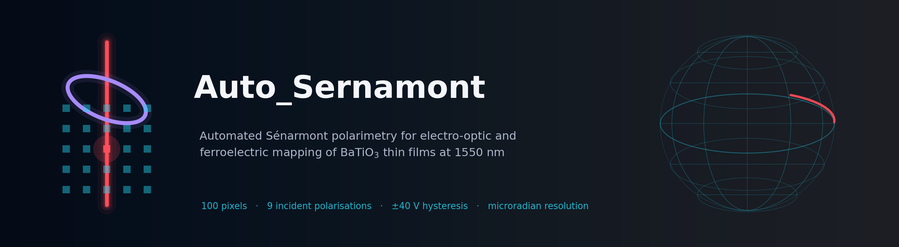
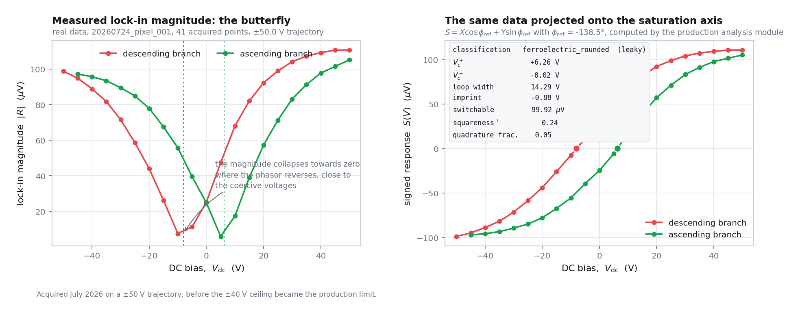
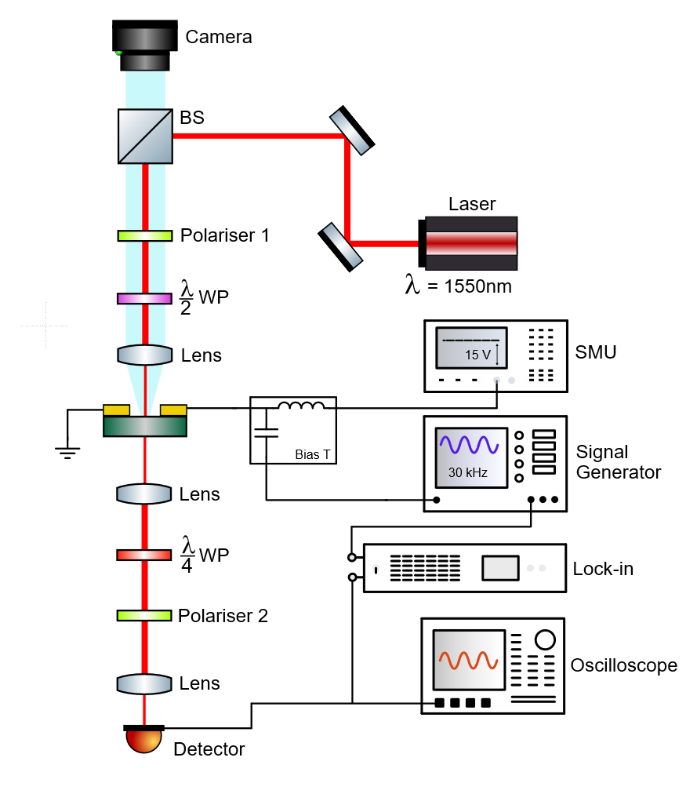

<div align="center">



[](LICENSE)
[](https://www.python.org/)
[](../../actions/workflows/tests.yml)
[](../../stargazers)
[](../../commits/main)
[](docs/)

### **[Documentation](docs/)** · **[Physics](docs/physics/)** · **[The instrument](docs/experiment/)** · **[The code](docs/software/)** · **[Quick start](docs/guide/quickstart.md)** · **[References](docs/references.md)**

</div>

---

A voltage applied across a barium titanate thin film changes its refractive
indices, and that rotates the polarisation of light passing through it by
**tens of microradians** at most: up to about $10^{-4}$ rad at 9 Vpp on a
responsive pixel, and microradians on a weak one. This repository is the
instrument-ready system for measuring that rotation, pixel by pixel, across a
10 × 10 electrode array, and for tracing the ferroelectric switching loop at
each site.

It drives a real bench end to end and unattended: three motorised polarisation
optics, a two-axis translation stage, a 100-channel electrode switching matrix,
a source-measure unit, a function generator, an oscilloscope and a lock-in
amplifier.

---

## Documentation

The manual is the point of this repository. Start wherever you need to.

### Physics

*What is measured, and why*

- [Overview](docs/physics/index.md)
- [The Pockels effect](docs/physics/01-electro-optics.md)
- [Polarisation formalism](docs/physics/02-polarisation.md)
- [Null-slope readout](docs/physics/03-senarmont-readout.md)
- [Angular dependence](docs/physics/04-incident-polarisation.md)
- [Ferroelectric switching](docs/physics/05-ferroelectrics.md)
- [The material](docs/physics/06-material.md)
- [Theory of the instrument](docs/physics/07-instrument-theory.md)

### The instrument

*The bench itself*

- [Overview](docs/experiment/index.md)
- [The optical beamline](docs/experiment/beamline.md)
- [Instruments and interfaces](docs/experiment/instruments.md)
- [The BaTiO₃ chip](docs/experiment/chip.md)
- [The switching matrix](docs/experiment/switch-matrix.md)

### The code

*How it is built*

- [Overview](docs/software/index.md)
- [Architecture](docs/software/architecture.md)
- [Motion control](docs/software/motion-control.md)
- [Instrument control](docs/software/instrument-control.md)
- [Numerical methods](docs/software/algorithms.md)
- [The data pipeline](docs/software/data-pipeline.md)

### Operating

*How to run it*

- [Overview](docs/guide/index.md)
- [Installation](docs/guide/installation.md)
- [Quick start](docs/guide/quickstart.md)
- [Operator manual](docs/guide/operating.md)
- [Troubleshooting](docs/guide/troubleshooting.md)

**Reference:** [CLI](docs/reference/cli.md) · [Data schema](docs/reference/data-schema.md) · [Glossary](docs/reference/glossary.md) · [Bibliography](docs/references.md)

---

## What it produces

<div align="center">

<br><em>Real acquired data from one pixel, projected and classified by the production analysis module. Left: the lock-in magnitude, which collapses where the phasor reverses. Right: the same points projected onto the saturation phase axis, giving the ferroelectric loop. See <a href="docs/physics/05-ferroelectrics.md">Ferroelectric switching</a>.</em>
</div>

<br>

| Scope | Output |
| --- | --- |
| **Per pixel** | effective Pockels response, best incident polarisation, normalised electro-optic rotation, null quality, voltage linearity, a full hysteresis loop with coercive voltages, imprint, squareness and switching-field statistics, and poling kinetics |
| **Per chip** | 21 metric heatmaps, a loop-type map, a loop gallery, cross-metric correlations and composition trends |
| **Always** | a `run_config.json` recording every setting, and a quality flag on every acquired row |

---

## At a glance

| Parameter | Value | Parameter | Value |
| --- | --- | --- | --- |
| Wavelength | 1550 nm | Chip | 10 × 10 pairs, ≈7 µm gap |
| Incident polarisations | 9, spaced 22.5° | AC drive | 9 Vpp at 30 kHz |
| DC range | ±40 V, 1 mA compliance | Rotation noise floor | ≈ 15 nrad per reading, calculated |
| Chip map | ≈ 4.5 to 5 min per pixel | Hysteresis loop | 45 points, ≈ 29 min |

---

## Quick start

> **Windows is required for measurement.** The stage and the laser are driven
> through Thorlabs Kinesis .NET assemblies. The analysis modules and the whole
> test suite run anywhere.

```bash
git clone https://github.com/adambickerdike/Auto_Sernamont.git
cd Auto_Sernamont
pip install -r requirements.txt        # or requirements-test.txt for the tests alone
```

```bash
python pockels/pockels_fast_map_gui.py            # the operator GUI
python pockels/pockels_fast_map_gui.py --cli ...  # the same worker, headless
python -m unittest discover -s tests -p "test_*.py"   # no hardware, but needs pyserial (installed above)
```

Before a real run, work through [Quick start](docs/guide/quickstart.md) in
full: laser safety, power-on order, the optical calibration, and the
single-pixel shakedown that must pass before you commit a campaign of roughly
7 to 8 hours for a full chip.

---

## The instrument in one picture

<div align="center">

</div>

Light from a 1550 nm diode laser is folded into the vertical optical column by
two turning mirrors and a beamsplitter, whose upward port feeds an alignment
camera. Going down: a fixed polariser defines the polarisation frame, a
motorised half-wave plate sets the incident polarisation angle, and a lens
focuses the beam into one electrode gap. Below the chip, a quarter-wave plate
cancels the film's static birefringence so that a motorised analyser can
extinguish the beam, and sitting ±45° from that null puts the measurement on
the steepest part of the transmission curve.

A bias tee sums the DC poling voltage and the 30 kHz drive onto one conductor,
which the switching matrix routes to exactly one electrode pair. The detector
feeds an oscilloscope for the slow DC level and a lock-in amplifier for the
30 kHz phasor.

Full walk-through: [The optical beamline](docs/experiment/beamline.md) and
[Theory of the instrument](docs/physics/07-instrument-theory.md).

---

## Repository layout

```text
Auto_Sernamont/
├── pockels/       the measurement package, flat so sibling imports work
├── tests/         23 test files, no hardware required, all passing
├── firmware/      the Arduino switching-matrix sketch
├── docs/          the manual
├── assets/        schematic, GDS layout, computed figures, curated example data
└── tools/         figure generation and Windows USB setup
```

Measurement output folders are created at the repository root and are
git-ignored. They are data, not code. The only data committed is the handful of
small CSVs in `assets/data/` that the documentation figures are built from.

---

## Citation and licence

If this system or its analysis contributed to your work, please cite it. See
[`CITATION.cff`](CITATION.cff). Released under the [MIT Licence](LICENSE).

The literature this work builds on is collected in the
[bibliography](docs/references.md), with a note on each entry saying what the
repository uses it for.

**Standing caveats**, stated plainly because reviewers will ask. The effective
coefficient is geometry-specific and never an intrinsic tensor element. An
electro-optic loop is not a polarisation loop, because domains are weighted by
their overlap with the optical mode. Loop shape depends on the dwell, so the
dwell must be quoted. An incident-polarisation scan alone cannot separate
$r_{42}$ from $r_{13}$ and $r_{33}$. The electrostatic factor $\alpha$ is
specific to one electrode geometry. Each of these is developed properly in the
[physics documentation](docs/physics/).

<div align="center">
<br>
<sub>Every number in this documentation was checked against the code.</sub>
</div>
