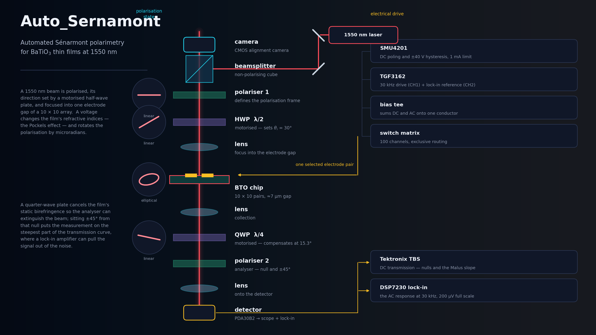
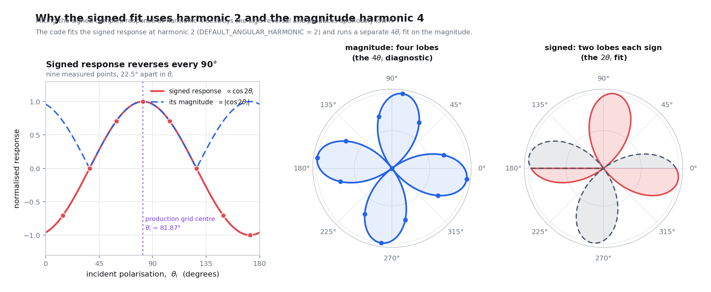
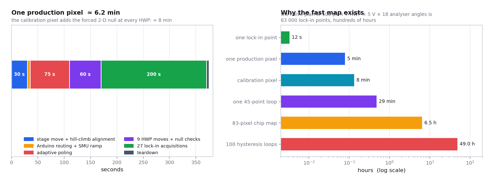

<div align="center">


# PockelsMap

**Automated Sénarmont polarimetry for electro-optic and ferroelectric mapping of BaTiO₃ thin films at 1550 nm**

[](LICENSE)
[](https://www.python.org/)
[](../../actions/workflows/tests.yml)
[](../../stargazers)
[](../../commits/main)
[](docs/)

**[Documentation](docs/) · [Quick start](docs/guide/quickstart.md) · [Physics](docs/physics/) · [The instrument](docs/experiment/) · [The code](docs/software/)**

</div>

---

<div align="center">

</div>

---

## What this is

A voltage applied across a barium titanate thin film changes its refractive
indices — the **Pockels effect** — and rotates the polarisation of light passing
through it by a few **microradians**. This repository is the complete,
instrument-ready system for measuring that rotation, pixel by pixel, across a
10 × 10 electrode array, and for tracing the ferroelectric switching loop at
each site.

It is not a simulation and not a toolkit. It is the software that drives a real
bench: three motorised polarisation optics, a two-axis stage, a 100-channel
electrode switching matrix, a source-measure unit, a function generator, an
oscilloscope and a lock-in amplifier — end to end, unattended, for hours.

<table>
<tr>
<td width="50%" valign="top">

**What it measures**

- effective Pockels response of every pixel
- the best incident polarisation at each pixel
- normalised, throughput-independent electro-optic rotation — the compositional observable
- null leakage and transmission quality
- AC-voltage linearity of the response
- full DC hysteresis loops with a complete signed-loop metric set and loop-type classification
- per-pixel poling kinetics (τ, β)

</td>
<td width="50%" valign="top">

**At a glance**

| | |
|---|---|
| Wavelength | 1550 nm |
| Chip | 10 × 10 pairs, ≈7 µm gap |
| Incident polarisations | 9, spaced 22.5° |
| AC drive | 9 Vpp @ 30 kHz |
| DC range | ±40 V, 1 mA compliance |
| Resolution | microradian rotation |
| Chip map | ≈ 4.5–5 min per pixel |
| Hysteresis loop | 45 points, ≈ 29 min |

</td>
</tr>
</table>

---

## Contents

1. [The measurement in one picture](#the-measurement-in-one-picture)
2. [Quick start](#quick-start)
3. [The physics](#the-physics)
4. [The instrument](#the-instrument)
5. [The chip and the switching matrix](#the-chip-and-the-switching-matrix)
6. [The software](#the-software)
7. [What you get out](#what-you-get-out)
8. [Repository layout](#repository-layout)
9. [Documentation](#documentation)
10. [Citation, licence, references](#citation-licence-references)

---

## The measurement in one picture

<div align="center">

</div>

Light from a 1550 nm diode laser is folded into the vertical optical column by
two turning mirrors and a non-polarising beamsplitter — the upward port feeds an
alignment camera that watches the chip surface. Going down: a fixed polariser
defines the polarisation frame, a motorised **half-wave plate** sets the
incident polarisation angle $\theta_i$, and a lens focuses the beam into one
≈7 µm electrode gap of the BaTiO₃ chip.

A bias tee sums the SMU's DC poling voltage and the function generator's
30 kHz AC drive onto a single conductor, which the switching matrix routes to
exactly one electrode pair. Below the chip, a collection lens, a motorised
**quarter-wave plate** and a motorised **analyser** convert the field-induced
polarisation change into an intensity change at a photodiode — read as a slow
DC level by the oscilloscope and as a 30 kHz phasor by the lock-in amplifier.

---

## Quick start

> **Windows is required for measurement** — the stage and laser are driven
> through Thorlabs' Kinesis **.NET** assemblies. The analysis modules and the
> entire test suite run anywhere.

```bash
git clone https://github.com/adambickerdike/PockelsMap.git
cd PockelsMap
pip install numpy scipy matplotlib pyvisa pyserial pythonnet clr_loader opencv-python
```

```bash
# the operator GUI
python pockels/pockels_fast_map_gui.py

# the same worker, headless
python pockels/pockels_fast_map_gui.py --cli --chip-id BTNO_0087 --pixels 1 --require-lockin

# no hardware needed: the full test suite
cd tests && for f in test_*.py; do python "$f"; done
```

**Before your first real run**, read [Quick start](docs/guide/quickstart.md) in
full — laser safety, power-on order, the optical calibration and the
single-pixel shakedown that must pass before you commit a 7-hour campaign.

---

## The physics

### The Pockels effect

In a material without a centre of inversion, an applied field perturbs the
index ellipsoid *linearly* in the field:

$$\Delta\!\left(\frac{1}{n^2}\right)_i = \sum_{j=1}^{3} r_{ij} E_j$$

Tetragonal BaTiO₃ (point group $4mm$) has three independent coefficients, and
the shear term $r_{42} \sim 10^3$ pm/V is more than an order of magnitude
larger than lithium niobate's workhorse $r_{33} \approx 30$ pm/V. That is the
prize — if the film can be grown well and its domains controlled. Accumulated
over the film thickness $t$, the field-induced retardation is

$$\Gamma = \frac{\pi\, n^3\, r_\mathrm{eff}\, E\, t}{\lambda}, \qquad E = \frac{\alpha\, V_\mathrm{device}}{g}$$

where $\alpha$ is a device-specific electrostatic correction for the coplanar
electrode geometry — **never** a transferable constant.

### Null-slope detection

With the quarter-wave plate compensating the film's static birefringence, the
transmission past the analyser is Malus-like in the offset $\psi$ from the
null, and its **slope** is what carries the signal:

$$I(\psi) = I_\mathrm{floor} + I_0\sin^2\psi, \qquad \frac{dI}{d\psi} = I_0\sin 2\psi$$

<div align="center">

</div>

Three consequences drive the entire design: the readout sits at $\psi = \pm45°$
where the slope is maximal; the **sign flips** between the two sides, which
rejects anything that is not a polarisation rotation; and at the null the
electro-optic signal vanishes, so that reading measures the contaminating
background alone. Those three points are the **triplet readout** taken at every
incident polarisation.

### Where the light actually is

Every polarisation state in the beamline is computed, not sketched — the
figures below come from the same Jones calculus the analysis uses.

<div align="center">

<br><em>The polarisation ellipse at each station, with azimuth ψ, ellipticity angle χ and axial ratio.</em>
</div>

<div align="center">

<br><em>The same journey on the Poincaré sphere. Every retarder is a rigid rotation about its own equatorial axis, through an angle equal to its retardance.</em>
</div>

<div align="center">

<br><em>Why the readout sits ±45° from the null: on the sphere the analyser axis is then 90° from the state, which is where the projection is first-order in the modulation.</em>
</div>

### Angular dependence — and a bug worth knowing about

The **signed** electro-optic response reverses sign every 90° of incident
polarisation, so it is a $2\theta_i$ quantity whose *magnitude* is four-lobed:

$$\delta(\theta_i) = C_0 + C_c\cos 2\theta_i + C_s\sin 2\theta_i \qquad (C_0, C_c, C_s \in \mathbb{C})$$

<div align="center">

</div>

Fitting the *signed complex* response at harmonic 4 destroys that sign reversal
and was the cause of the misleadingly low angular $R^2$ in early runs. The code
fits the signed response at harmonic 2 and runs a separate $4\theta_i$ fit on
the magnitude for the polar diagnostic.

### Ferroelectric switching, seen optically

Because the linear electro-optic response is **odd** in the spontaneous
polarisation, reversing the domain state flips the lock-in phasor by ~180° at
roughly constant magnitude. The raw magnitude therefore traces a *butterfly*;
the physical S-shaped loop is recovered by projecting the phasor onto the
saturation phase axis.

<div align="center">

</div>

<div align="center">

</div>

Full treatment: **[Physics documentation →](docs/physics/)**

---

## The instrument

| Subsystem | Hardware | Role |
|---|---|---|
| Source | Thorlabs KLS1550 + KCube | 1550 nm, ~7 mW, software power setpoint |
| Polarisation | 3 × Thorlabs Elliptec ELL14 | HWP (incident angle), QWP (compensation), analyser (readout) |
| Positioning | 2 × Thorlabs KCubeStepper | 25 mm travel, 5 µm tolerance, 20 µm backlash compensation |
| Alignment | USB camera + OpenCV | gap centroid detection, CV-guided pre-positioning |
| DC detection | Tektronix TBS | calibrated slow DC voltmeter: nulls, Malus slope, alignment |
| AC detection | Signal Recovery DSP7230 | 30 kHz phasor, 500 ms TC, fixed 200 µV full scale |
| Drive | Aim-TTi TGF3162 | CH1 = 1–9 Vpp drive, CH2 = 0.5 Vpp lock-in reference |
| Bias | Aim-TTi SMU4201 | ±40 V poling and hysteresis, 1 mA compliance |
| Routing | Arduino Nano + 7 × TLC59282 + 100 × AQV258AX | exclusive 100-channel electrode switching |

The lock-in range is held **fixed** for a whole chip map — automatic
sensitivity and auto-phase are never used, because a range change mid-map would
break the calibration that makes pixels comparable.

**[Instrument documentation →](docs/experiment/)**

---

## The chip and the switching matrix

<table>
<tr>
<td width="46%" valign="top">

</td>
<td width="54%" valign="top">

The GDS layout: 100 coplanar electrode pairs on a 2.5 mm pitch in the centre,
fanned out through routing traces to bond pads on all four edges. Each pair is
separated by an in-plane gap of about 7 µm — the beam is focused into that gap,
and the field between the electrodes is what drives the electro-optic response.

Coplanar electrodes are the right choice for a few-hundred-nanometre film: no
transparent top contact is needed, the in-plane field couples to the large
$r_{42}$ shear coefficient, and it is the geometry real integrated BTO
modulators use. The price is a non-uniform fringing field — hence the FEM
correction $\alpha$ that gates any absolute coefficient.

</td>
</tr>
</table>

One measurement chain has to reach one hundred electrode pairs, exclusively and
safely. Four Arduino pins shift 112 bits into a chain of constant-current
drivers, which energise exactly one optically isolated PhotoMOS relay:

<div align="center">

</div>

Solid-state relays are not a convenience here: no contact bounce, galvanic
isolation, and a very low off-state leakage — which matters when the same wires
are used to measure sub-milliamp leakage currents through the film.

**[Switching-matrix documentation →](docs/experiment/switch-matrix.md)** ·
**[Firmware](firmware/switch_matrix/switch_matrix.ino)**

---

## The software

```text
  GUI process  ──spawn──▶  worker process
  (Tkinter)                (owns every instrument session)
      │   ◀──stdout──          │
      │   ◀──run files──       │   writes CSV/JSON incrementally
      └───flag files──▶        │   polls stop / skip / probe flags
```

Two processes, not two threads: Tkinter must own the main thread, a driver
crash must not take the UI with it, and the identical code path has to run
headless with `--cli`. Everything between them is **files** in the run
directory — they survive a crash, you can read them by hand, and the GUI can
monitor a headless run by pointing at its folder.

Four principles explain most of the code:

| Principle | How it shows up |
|---|---|
| Never lose acquired data | incremental CSV writes; analysis inside `try/except`; failed pixels saved as *partial* |
| Never leave the hardware energised | shutdown in `finally` blocks and context managers, with **verified** outputs |
| Fail closed on physics, open on telemetry | a missing SMU voltage readback aborts the point; an unsupported lock-in config readback does not abort the run |
| Physics must be testable without hardware | the analysis modules import no drivers and are covered by 22 test files |

Motion is deliberately two-speed. Calibration moves are chunked (≤ 4°), backlash
compensated (0.3° undershoot, always approaching from below) and verified to
0.08°. The thousands of routine moves in a chip map take the fast direct path —
still read back, still corrected once, but at 0.5° tolerance — and a move that
cannot be verified **stops the run** rather than silently corrupting an angle.

<div align="center">

</div>

**[Software documentation →](docs/software/)**

---

## What you get out

```text
pockels_fast_map/20260915_143012_BTNO_0087_shakedown/
├── run_config.json                    every setting the run was given
├── lockin_configuration.json          exactly what the lock-in was set to
├── fast_map_all_pixels.csv            one row per pixel — start here
├── pockels_pixels/pixel_046/
│   ├── fast_map.csv                   ~140 columns, one row per lock-in point
│   ├── fast_map_summary.json          best conditions, fits, gate status
│   ├── fast_map_angular_polar.png     the four-lobed angular certificate
│   ├── poling_kinetics.csv            τ and β, for free
│   └── dc_hysteresis/sweep/
│       ├── dc_hysteresis.csv          per-point optical + electrical record
│       ├── dc_hysteresis_metrics.json coercive voltages, imprint, squareness …
│       └── dc_hysteresis_loops.png    signed loop, butterfly, I(V), P_dc
├── hysteresis_maps/                   21 chip heatmaps + loop-type map + gallery
└── compositional_report/              correlations, trends, clustering
```

Raw lock-in volts are **not** the observable. They absorb laser power,
coupling, detector gain and null depth. The analysis divides all of that out
and reports a **normalised rotation** — which is directly comparable between
pixels, which is what a compositional study needs, and which requires no
absolute calibration at all.

The absolute coefficient is gated on purpose:

$$|r_\mathrm{eff}| = \frac{2\lambda g}{\pi n^3 \alpha t}\left|\frac{d\delta_\mathrm{rms}}{dV_\mathrm{device,rms}}\right|$$

is emitted **only** when the geometry is confirmed, every input is measured
($\lambda, t, g, \alpha, n$, the device/source voltage transfer at $f_\mathrm{mod}$,
and the detector AC/DC gain ratio), the voltage linearity passes $R^2 \ge 0.98$,
null leakage is ≤ 5 % and the QWP retardance is within 90° ± 10°. Otherwise the
run records exactly which gate failed. A plausible number with an unvalidated
$\alpha$ is worse than no number.

**[Analysis documentation →](docs/software/data-pipeline.md)** ·
**[Data schema →](docs/reference/data-schema.md)**

---

## Repository layout

```text
PockelsMap/
├── pockels/              the measurement package (flat: sibling imports)
│   ├── pockels_fast_map_gui.py        GUI + measurement worker (--cli)
│   ├── Pockels_Calibration_2026.py    hysteresis engine, deep campaign
│   ├── stage_calibration.py           stage, scope, camera, alignment
│   ├── pockels_measurement_analysis.py   pure: normalisation, fits, gating
│   ├── pockels_hysteresis_analysis.py    pure: loops, metrics, classification
│   ├── elliptec_serial.py  ·  Lock_In_Mag_Phase_Track.py
│   ├── smu4201_iv_sweep.py ·  arduino_switch_matrix.py  ·  kls1550.py
│   └── _bootstrap.py                  pins imports and the working directory
├── tests/                22 test files, no hardware, all passing
├── firmware/             the Arduino switching-matrix sketch
├── docs/                 the full manual (25 pages)
├── assets/               schematic, GDS layout, computed figures, brand
└── tools/                figure generation, Windows USB stability setup
```

---

## Documentation

<table>
<tr><th align="left">Physics</th><th align="left">The instrument</th></tr>
<tr><td valign="top">

- [Overview](docs/physics/index.md)
- [The Pockels effect](docs/physics/01-electro-optics.md)
- [Polarisation formalism](docs/physics/02-polarisation.md)
- [Null-slope readout](docs/physics/03-senarmont-readout.md)
- [Angular dependence](docs/physics/04-incident-polarisation.md)
- [Ferroelectric switching](docs/physics/05-ferroelectrics.md)

</td><td valign="top">

- [Overview](docs/experiment/index.md)
- [The optical beamline](docs/experiment/beamline.md)
- [Instruments and interfaces](docs/experiment/instruments.md)
- [The BaTiO₃ chip](docs/experiment/chip.md)
- [The switching matrix](docs/experiment/switch-matrix.md)

</td></tr>
<tr><th align="left">The software</th><th align="left">Operating &amp; reference</th></tr>
<tr><td valign="top">

- [Overview](docs/software/index.md)
- [Architecture](docs/software/architecture.md)
- [Motion control](docs/software/motion-control.md)
- [Instrument control and timing](docs/software/instrument-control.md)
- [The data pipeline](docs/software/data-pipeline.md)

</td><td valign="top">

- [Operating guide](docs/guide/index.md)
- [Installation](docs/guide/installation.md)
- [Quick start](docs/guide/quickstart.md)
- [Operator manual](docs/guide/operating.md)
- [Troubleshooting](docs/guide/troubleshooting.md)
- [CLI reference](docs/reference/cli.md) · [Data schema](docs/reference/data-schema.md) · [Glossary](docs/reference/glossary.md)

</td></tr>
</table>

---

## Citation, licence, references

If this system or its analysis contributed to your work, please cite it — see
[`CITATION.cff`](CITATION.cff).

Released under the [MIT Licence](LICENSE).

**Standing caveats**, stated plainly because reviewers will ask: $r_\mathrm{eff}$
is a *geometry-specific effective* coefficient and never an intrinsic tensor
element; an electro-optic loop is not a P–E loop, because domains are weighted
by their overlap with the optical mode; loop shape is rate-dependent, so the
dwell must be quoted; an HWP map alone cannot separate $r_{42}$ from
$r_{13}/r_{33}$; and $\alpha$ is device-specific.

**References**

- S. Abel, *PhD thesis* (2014), §3.3–3.4 — null-slope electro-optic metrology (eqs. 3.8–3.9).
- E. Picavet *et al.*, *Adv. Funct. Mater.* **34**, 2403024 (2024) — single-point quadrature $r_\mathrm{eff}$ method.
- F. Eltes *et al.*, *Nat. Photonics* (2022) — alternating-field erase, the basis of the domain-reset envelope.
- AMETEK Signal Recovery DSP7230 manual — lock-in command set and settling behaviour.

<div align="center">
<br>
<sub>Built for the BaTiO₃ electro-optic programme. Every number in this documentation was checked against the code.</sub>
</div>
