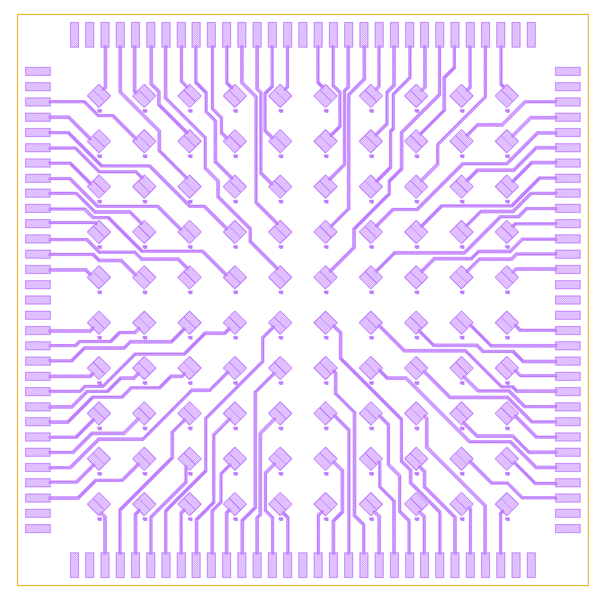
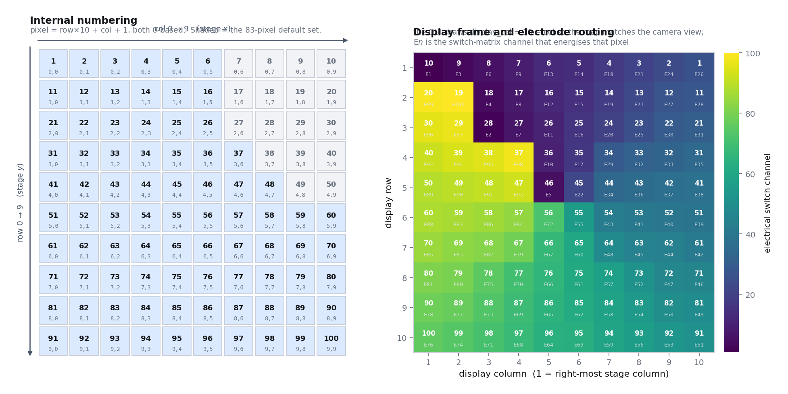

# The BaTiO₃ Chip

The sample: a barium titanate thin film carrying a 10 × 10 array of coplanar
electrode pairs. This page covers the array geometry, why the electrodes are
coplanar rather than sandwiched and what that costs, how pixels are numbered
(and why the on-screen map is mirrored), and the full pixel → electrical switch
mapping.

For the electro-optic physics the chip is there to expose, see
[electro-optics](../physics/01-electro-optics.md).

---

## 1. What the chip is

| Property | Value |
| --- | --- |
| Material | BaTiO₃ (BTO) thin film, typically with a compositional gradient across the die |
| Film thickness | a few hundred nanometres — **must be measured per chip** for any absolute coefficient |
| Layout | 10 × 10 grid of coplanar electrode pairs, numbered 1…100 |
| Pitch | **2.5 mm** nominal (10 points across 25 mm of stage travel) |
| Electrode gap | **~7 µm** in-plane (`CV_GAP_WIDTH_UM = 7.0`, the width the camera's matched filter expects) |
| Wavelength used | 1550 nm, where BaTiO₃ is transparent |

The whole die sits on the XY stage. The 2.5 mm pitch is not a property of the
chip so much as of the measurement: the grid is built by `build_grid()` as ten
evenly spaced points across the full 25 mm travel in each axis, with the row
index `j` outer and the column index `i` inner.

---

## 2. The electrode geometry

Each pixel is a **coplanar pair**: two metal electrodes patterned side by side
on top of the film, separated by a gap of order 7 µm. The beam is focused into
that gap. Applying a voltage $V$ across the pair produces an in-plane electric
field in the film in the region the light passes through.

### 2.1 Why coplanar rather than a sandwich

A "sandwich" (vertical) geometry — electrode above the film, electrode below —
is the textbook arrangement, and it is *not* used here, for three reasons:

1. **The film is only a few hundred nanometres thick.** A vertical field needs
   an electrode above *and* below the optical path, which means a transparent
   top contact and a conducting substrate. Transparent conductors at 1550 nm are
   lossy, and the loss would sit directly in the beam.
2. **The in-plane field is the geometry that couples to $r_{42}$.** For a
   $c$-axis-textured BaTiO₃ film, the large shear coefficient $r_{42}$ is
   accessed by an in-plane field, which is exactly what a coplanar pair
   produces. A vertical field would probe a different, smaller combination of
   coefficients.
3. **It is what real devices look like.** Integrated BaTiO₃ modulators use
   coplanar electrodes flanking a waveguide. Measuring the same geometry means
   the number transfers to a device, rather than being a materials-only figure.

### 2.2 The cost of that choice

The field between two coplanar electrodes is **not** uniform and is **not**
$V/g$. It fringes: strongest right at the electrode edges, weaker and more
curved in the middle of the gap, and it decays with depth into the film. The
field that matters is the one averaged over the optical mode, and that is

$$E = \alpha \, \frac{V}{g}$$

where $g$ is the gap and $\alpha$ is a dimensionless, device-specific
electrostatic correction obtained from a **finite-element model of the actual
electrode geometry**.

> **Warning** — $\alpha$ is the single largest source of systematic uncertainty
> in any *absolute* $r_\mathrm{eff}$ this instrument produces. It is why the
> software **refuses to report** $r_\mathrm{eff}$ until you supply a measured
> $\alpha$ for your geometry. Everything the map measures *relatively* — which
> pixels respond, how the response varies with $\theta_i$, how loops differ
> across the die — is unaffected by $\alpha$, because it is one common factor.

---

## 3. The mask: 100 pixels, 200 bond pads



**What you are looking at.** This is the GDS drawing of the metal layer — one
lithographic layer, so everything drawn in violet is the same metal. The orange
rectangle is the die boundary.

- **The centre** holds the 10 × 10 array of measurement sites. Each site is
  drawn as a diamond (a square rotated 45°) with a small square feature at one
  corner: the diamond is one electrode of the pair, the small feature is the
  other, and the ~7 µm gap between them is where the beam goes. At this zoom the
  gap is thinner than the line weight — you are seeing the pads, not the gap.
- **The periphery** is a ring of rectangular **bond pads**, arranged along all
  four edges of the die. These are large because they have to be probed or
  wire-bonded; they are the electrical interface to the outside world.
- **The fan-out** is everything in between: the diagonal and stepped tracks
  carrying each electrode out to its own pad. The routing is split into four
  quadrants, each fanning outward toward the nearest edge, which is why the
  drawing looks four-fold symmetric. Within a quadrant, tracks run diagonally
  at 45° and then turn orthogonally to meet the pad row square-on — a standard
  fan-out discipline that keeps track-to-track spacing roughly constant and
  avoids acute-angle corners, which are hard to pattern reliably and are
  field-concentration points.

**The consequence you have to live with.** Routing 100 electrode pairs out to
the die edge means the *electrical* ordering of the bond pads has nothing to do
with the *spatial* ordering of the pixels. A pad near one corner may serve a
pixel in the middle of the array. That mismatch is exactly what the
pixel → switch mapping in §5 encodes, and it is why that mapping is a
hand-derived wiring table rather than a formula.

---

## 4. Pixel numbering and the display flip



**Reading the figure.** The **left panel** is the internal frame: pixel numbers
in bold with their 0-based `(row, col)` beneath, running left-to-right and
top-to-bottom, with the pixels outside the 83-pixel default selection greyed
out. The **right panel** is the same chip as the GUI draws it — columns
mirrored, so display column 1 is the *right-most* stage column — with each cell
also labelled `E<n>`, the switch-matrix channel that energises that pixel, and
coloured by that channel number. The colour field is visibly scrambled, which
is the fan-out of §3 made visible: spatial neighbours are not electrical
neighbours.

### 4.1 Internal numbering

Pixels are numbered **row-major**, with 0-based internal row and column
indices:

$$\mathrm{pixel} = 10 \times \mathrm{row} + \mathrm{col} + 1,
\qquad \mathrm{row}, \mathrm{col} \in \{0, \dots, 9\}$$

and inversely `row = (pixel - 1) // 10`, `col = (pixel - 1) % 10`. This is the
`j` (row, outer) / `i` (column, inner) convention used by `build_grid()`, by
the per-pixel output directories, and by every CSV column that names a pixel.

### 4.2 The display mapping

The GUI does **not** draw the map in that order. It draws

```python
display_row = stage_row + 1        # 1-based, same order
display_col = 10 - stage_col       # 1-based, MIRRORED left-to-right
```

and converts clicks back with `_pixel_for_display_position()`:

```python
stage_row = display_row - 1
stage_col = 10 - display_col
pixel     = stage_row * 10 + stage_col + 1
```

**Why.** The camera views the chip through the beamsplitter along the optical
axis, and that view is mirrored left-to-right relative to the stage coordinate
frame. Without the flip, clicking the cell that looks like the bright pixel on
the camera image would command the stage to the pixel on the *other* side of
the die. The flip exists so that "what you see on the heat map" and "what you
see through the camera" are the same picture.

> **Warning** — this is a genuine trap when reading data by hand. A heat-map
> cell in display column 1 is internal column 9, i.e. pixel `10*row + 10`. If
> you are relating a published figure to a pixel number, apply
> `display_col = 10 − stage_col` — and note that the mapping is its own inverse,
> so applying it twice gets you back where you started.

Worked examples:

| Pixel | Internal (row, col) | Display (row, col) |
| --- | --- | --- |
| 1 | (0, 0) | (1, 10) |
| 10 | (0, 9) | (1, 1) |
| 46 | (4, 5) | (5, 5) |
| 85 | (8, 4) | (9, 6) |
| 100 | (9, 9) | (10, 1) |

### 4.3 The default pixel selection

Production runs do not necessarily measure all 100. The default selection is

```text
1-6,11-16,21-26,31-37,41-48,51-100      → 83 pixels
```

which omits pixels known to be unusable on the current chip. At roughly
4.5–5 minutes per production pixel, 83 pixels is a 6–7 hour campaign.

---

## 5. The pixel → electrical switch mapping

Because of the fan-out (§3), pixel *n* is not wired to switch *n*. The mapping
below is the wiring table for the current chip and current harness. It is a
**permutation**: all 100 pixels map to all 100 switches, each exactly once, and
the loader `install_current_switch_mapping()` asserts precisely that before the
software will run.

Read the table as *pixel number → electrical switch number*, laid out in the
internal (row, column) geometry of the array — so the table looks like the
chip, and you can see at a glance that the switch numbers are spatially
scrambled.

<details>
<summary><b>Full pixel → electrical switch map (100 entries)</b></summary>

| internal row `j` | col 0 | col 1 | col 2 | col 3 | col 4 | col 5 | col 6 | col 7 | col 8 | col 9 |
| --- | --- | --- | --- | --- | --- | --- | --- | --- | --- | --- |
| **0** | 1 → **26** | 2 → **24** | 3 → **21** | 4 → **18** | 5 → **14** | 6 → **13** | 7 → **9** | 8 → **6** | 9 → **3** | 10 → **1** |
| **1** | 11 → **28** | 12 → **27** | 13 → **23** | 14 → **19** | 15 → **15** | 16 → **12** | 17 → **8** | 18 → **4** | 19 → **100** | 20 → **99** |
| **2** | 21 → **31** | 22 → **30** | 23 → **25** | 24 → **20** | 25 → **16** | 26 → **11** | 27 → **7** | 28 → **2** | 29 → **97** | 30 → **96** |
| **3** | 31 → **35** | 32 → **33** | 33 → **32** | 34 → **29** | 35 → **17** | 36 → **10** | 37 → **98** | 38 → **95** | 39 → **94** | 40 → **92** |
| **4** | 41 → **38** | 42 → **37** | 43 → **36** | 44 → **34** | 45 → **22** | 46 → **5** | 47 → **93** | 48 → **91** | 49 → **90** | 50 → **89** |
| **5** | 51 → **39** | 52 → **40** | 53 → **41** | 54 → **43** | 55 → **55** | 56 → **72** | 57 → **84** | 58 → **86** | 59 → **87** | 60 → **88** |
| **6** | 61 → **42** | 62 → **44** | 63 → **45** | 64 → **48** | 65 → **60** | 66 → **67** | 67 → **79** | 68 → **82** | 69 → **83** | 70 → **85** |
| **7** | 71 → **46** | 72 → **47** | 73 → **52** | 74 → **57** | 75 → **61** | 76 → **66** | 77 → **70** | 78 → **75** | 79 → **80** | 80 → **81** |
| **8** | 81 → **49** | 82 → **50** | 83 → **54** | 84 → **58** | 85 → **62** | 86 → **65** | 87 → **69** | 88 → **73** | 89 → **77** | 90 → **78** |
| **9** | 91 → **51** | 92 → **53** | 93 → **56** | 94 → **59** | 95 → **63** | 96 → **64** | 97 → **68** | 98 → **71** | 99 → **74** | 100 → **76** |

Source of truth: `PIXEL_TO_ELECTRICAL_SWITCH` in
[`pockels/arduino_switch_matrix.py`](../../pockels/arduino_switch_matrix.py),
mirrored as `CURRENT_PIXEL_TO_PIN` in `pockels_full_automation.py`, as
`PIXEL_TO_PIN` in `stage_calibration.py`, and as the
`PIXEL_TO_ELECTRICAL_SWITCH[]` array in the firmware.

</details>

**Spot checks.** The fast-map GUI verifies two entries at import time —
**pixel 46 → switch 5** and **pixel 85 → switch 62** — and raises
`"Fast-map switch mapping is stale"` if either disagrees, refusing to start.
The reasoning, and the reason the automation sends raw `E<switch>` commands
rather than logical pixel numbers, is on the
[switch matrix page](switch-matrix.md#10-the-triple-copy-mapping-hazard).

---

## 6. Why map 100 pixels at all

A single measurement of $r_\mathrm{eff}$ on one spot of one film is a weak
result: you cannot tell a genuine material property from a local defect, a
thickness fluctuation, or a lucky domain configuration.

The chips this instrument was built for carry a **compositional gradient**
across the die — deliberately, so that a single growth run produces a range of
compositions on one substrate. Mapping 100 sites therefore turns one chip into
a **composition series**:

- **Composition vs response.** With position acting as a proxy for
  composition, the 100-pixel map becomes $r_\mathrm{eff}$ (or the raw lock-in
  response) versus composition, measured under identical optical conditions on
  the same day with the same alignment procedure — which removes most of the
  systematic differences that make chip-to-chip comparisons so unreliable.
- **Ferroelectric behaviour vs composition.** The hysteresis loops measured at
  each pixel classify differently across the die — loop shape, coercive
  voltage, and whether a pixel switches at all — and the classification is the
  interesting result, not a nuisance.
- **Statistics and outlier rejection.** With 83–100 sites, a single anomalous
  pixel is visibly an outlier instead of being mistaken for the answer.
- **Yield and uniformity.** Dead, shorted and open pixels are found and
  recorded by the per-point electrical audit rather than being discovered
  halfway through an analysis.

That is also why the alignment is re-run at **every** pixel rather than trusting
the nominal 2.5 mm grid: compositional drift across the chip changes where the
best beam-on-gap position sits, pixel to pixel.

---

## 7. Related pages

| Page | What it adds |
| --- | --- |
| [The 100-Channel Switching Matrix](switch-matrix.md) | how exactly one of these electrode pairs gets connected to the drive line |
| [The Optical Beamline](beamline.md) | how the beam is focused into the 7 µm gap, and the alignment tolerance that follows |
| [Instruments](instruments.md) | the SMU and function generator that supply the DC and AC drive |
| [Electro-optics](../physics/01-electro-optics.md) | $r_{42}$, $\alpha$, and what $r_\mathrm{eff}$ actually means |
| [Glossary](../reference/glossary.md) | pixel, pin, switch, channel — the four words this page is careful to keep distinct |

---

<div align="center">

[← Instruments](instruments.md) &nbsp;·&nbsp; [Documentation home](../index.md) &nbsp;·&nbsp; [Repository](../../README.md) &nbsp;·&nbsp; [The switching matrix →](switch-matrix.md)

</div>
