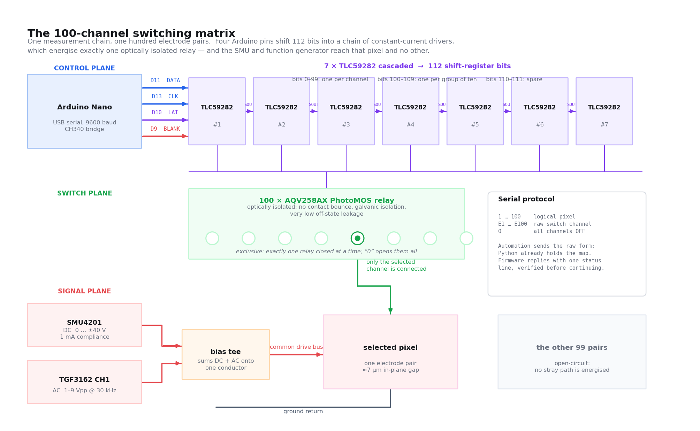

# The 100-Channel Switching Matrix

The electronics that connect the single drive line (DC from the SMU plus AC
from the function generator, summed in a bias tee) to exactly **one** of the
chip's 100 electrode pairs, and to no other. This page documents the circuit,
the firmware, the wire protocol, the boot handshake, and the one mapping hazard
that can silently invalidate a whole campaign.

Firmware: [`firmware/switch_matrix/switch_matrix.ino`](../../firmware/switch_matrix/switch_matrix.ino).
Host driver: [`pockels/arduino_switch_matrix.py`](../../pockels/arduino_switch_matrix.py).

---

## 1. Why a switch matrix at all

There are 100 electrode pairs on the chip and exactly **one** measurement
chain: one SMU, one function generator, one bias tee, one coaxial line. The
alternative to a switching matrix is re-probing by hand 100 times, which
destroys any hope of an unattended overnight campaign and guarantees that the
electrical contact differs from pixel to pixel.

The requirement is not merely "connect a pixel". It is **exclusivity**:

- **No stray path may be energised.** If two pairs were connected at once, the
  drive would split between them, the field in the measured gap would be wrong
  by an unknown factor, and an *unmeasured* pixel would be quietly poled, which
  changes its domain state and corrupts a measurement you have not taken yet.
- **Off must mean off.** The SMU measures current at the microamp level to
  detect leakage, shorts and open contacts. Ninety-nine parallel leakage paths
  through nominally-open switches would swamp that measurement.
- **The state must be knowable.** Every error path, every exception, every
  operator abort must leave the matrix open, because the failure the system
  cannot tolerate is voltage left on a pixel nobody is watching.

---

## 2. The hardware



**Following the signal path in the figure.** The drawing is split into three
planes, and the whole design is the statement that the top two never touch the
bottom one electrically.

- **Control plane.** The host PC sends an ASCII command over USB at 9600 baud
  to the **Arduino Nano** (a CH340 USB bridge). The firmware updates a
  112-entry boolean array and bit-bangs it out of four GPIO pins
  (`D11 DATA`, `D13 CLK`, `D10 LAT`, `D9 BLANK`) into a chain of **seven
  TLC59282 constant-current shift registers**. Each device's `SOUT` feeds the
  next device's input, so the seven behave as one 112-bit register.
- **Switch plane.** Every used register output sinks current through the input
  LED of one **AQV258AX PhotoMOS relay**. At most one relay is closed at any
  moment (the filled circle in the figure), and `0` opens them all.
- **Signal plane.** The **SMU4201** (DC, 0…±40 V, 1 mA compliance) and
  **TGF3162 CH1** (AC, 1 to 9 Vpp at 30 kHz) are summed by the **bias tee**
  onto a single common drive bus. The closed relay connects that bus to one electrode
  of the **selected pixel**; the pixel's other electrode is the ground return.
  The other 99 pairs are left open-circuit, so no stray path is energised.

The control plane commands the switch plane with photons, and the switch plane
is the only thing that touches the signal plane, which is why a logic-side
fault cannot put voltage on the chip, and a chip-side transient cannot reach
the PC.

| Part | Count | Role |
| --- | --- | --- |
| Arduino Nano (often a CH340 clone) | 1 | serial command interpreter, shift-register driver |
| TLC59282 constant-current LED-driver shift register | 7 | 16 outputs each → **112 output bits**, cascaded |
| AQV258AX PhotoMOS solid-state relay | one per used output | the actual switching element |

### 2.1 What the 112 bits are used for

Seven 16-output registers give 112 bits. The firmware uses them as:

| Bit indices | Count | Meaning |
| --- | --- | --- |
| `0 … 99` | 100 | one per **electrical switch**, the per-pixel relays |
| `100 … 109` | 10 | one per **group**: `NUM_GROUPS = 10`, asserted for the group containing the active switch |
| `110 … 111` | 2 | unused |

(The figure's "100 used" refers to the hundred *channel* bits, the ones that
correspond one-to-one with electrode pairs. The ten group bits are internal
bookkeeping and never appear in the protocol.)

The group bits come from `updateHardware()`: whenever channel `i` is on, it
also sets `bitStream[100 + i/10]`. So the 100 channels are organised as ten
banks of ten, and the firmware asserts exactly one bank enable alongside
exactly one channel. That mirrors a two-level arrangement in the harness, and
it has a pleasant safety consequence: a single stuck or corrupted channel bit
cannot on its own complete a path to a pixel, because the corresponding bank
must also be enabled.

### 2.2 Why optically isolated solid-state relays

AQV258AX is a **PhotoMOS** relay: an LED shines onto a photovoltaic diode
stack, whose output drives the gates of a back-to-back MOSFET pair. There is no
coil, no armature and no metal contact. For this application that matters for
four reasons:

1. **No contact bounce.** A mechanical relay's contacts chatter for
   milliseconds when they close. On a line carrying a 30 kHz drive into a
   ferroelectric capacitor, bounce means a burst of uncontrolled partial
   connections, electrically noisy and capable of applying a poorly-defined
   voltage transient to a pixel.
2. **Galvanic isolation.** The control side (5 V logic, USB ground, the PC) and
   the switched side (up to ±40 V from the SMU) share no conductive path. The
   only coupling is a photon. That keeps the drive circuit's ground out of the
   logic ground, which matters when you are also trying to measure microvolts
   on a lock-in sharing the same bench.
3. **Low off-state leakage.** This is the decisive one. The measurement reads
   **sub-milliamp** currents and uses them to judge whether a pixel is shorted,
   open or leaky. Ninety-nine relays sit in parallel across that measurement,
   all nominally off; if each leaked appreciably, their sum would masquerade as
   device leakage. A MOSFET-output SSR's off-state leakage is orders of
   magnitude below a measurement made at the microamp level.
4. **Life and repeatability.** A 100-pixel campaign switches thousands of
   times. Solid-state parts have no wear-out mechanism at these rates, and the
   contact resistance does not drift pixel to pixel the way a tarnishing
   mechanical contact would.

The cost is a non-zero on-state resistance and a switching time measured in
hundreds of microseconds to milliseconds rather than microseconds, neither of
which matters when the very next thing the software does is dwell for seconds.

---

## 3. Pin assignment

```cpp
const int PIN_BLANK = 9;   // D9  - Disables outputs when HIGH
const int PIN_LAT   = 10;  // D10 - Latch pin
const int PIN_DATA  = 11;  // D11 - Serial Data In
const int PIN_CLK   = 13;  // D13 - Serial Clock
```

| Pin | Name | What it does in a shift-register chain |
| --- | --- | --- |
| **D9** | `BLANK` | Output enable, active low. While HIGH, every register output is forced off regardless of what the register contains. This is what makes power-on safe: the register's contents at reset are undefined, so you must be able to hold the outputs off until you have shifted in a known pattern. |
| **D10** | `LAT` | Latch. The chain has two stages: a shift register you clock data into, and an output latch that actually drives the pins. A rising edge on `LAT` copies shift register → latch, so all 112 outputs change **simultaneously**. Without it you would see the pattern ripple through, briefly energising channels you never asked for. |
| **D11** | `DATA` | Serial data in, to the first register in the chain. |
| **D13** | `CLK` | Serial clock. Each rising edge shifts `DATA` into the first register and shifts each register's last bit into the next one along. 112 clocks fill the whole chain. |

> **Note** D11 and D13 are the ATmega328P's hardware SPI `MOSI` and `SCK`
> pins, and D10 is `SS`. The firmware does **not** use the SPI peripheral; it
> bit-bangs with `digitalWrite()`. The pin choice still leaves that upgrade
> available. Bit-banging is fine here because `digitalWrite()` on an AVR takes
> several microseconds, comfortably longer than the register's minimum clock
> period, so no explicit delays are needed; and because the update happens once
> per pixel, not once per sample.

**Power-on ordering in `setup()`.** Read it as a safety sequence:

```cpp
digitalWrite(PIN_BLANK, HIGH);   // outputs OFF first, before anything else
digitalWrite(PIN_LAT, LOW);
digitalWrite(PIN_CLK, LOW);
digitalWrite(PIN_DATA, LOW);

updateHardware();                // shift in the known all-off pattern and latch it
digitalWrite(PIN_BLANK, LOW);    // only NOW enable the outputs
```

Outputs are blanked, a known all-off pattern is shifted in and latched, and
only then are the outputs enabled. At no point can an undefined power-on
register state reach a relay.

---

## 4. The shift-out sequence: `updateHardware()`

```cpp
void updateHardware() {
  bool bitStream[NUM_SHIFT_BITS] = {false};

  // Map channels and enable the required Group relay
  for (int i = 0; i < NUM_SWITCHES; i++) {
    bitStream[i] = channelStates[i];

    if (channelStates[i] == true) {
      int groupIndex = i / 10;
      bitStream[100 + groupIndex] = true;
    }
  }

  // Shift out data
  digitalWrite(PIN_LAT, LOW);
  for (int i = NUM_SHIFT_BITS - 1; i >= 0; i--) {
    digitalWrite(PIN_CLK, LOW);
    digitalWrite(PIN_DATA, bitStream[i] ? HIGH : LOW);
    digitalWrite(PIN_CLK, HIGH);
  }

  // Latch data
  digitalWrite(PIN_CLK, LOW);
  digitalWrite(PIN_LAT, HIGH);
  digitalWrite(PIN_LAT, LOW);
}
```

Step by step:

1. **Build a fresh 112-bit picture from scratch.** `bitStream` is a local array
   initialised entirely to `false` on every call. The hardware is never
   *modified*; it is always *rewritten* from the authoritative
   `channelStates[]`. There is no incremental state to drift out of sync.
2. **Copy the 100 channel states** into bits 0…99.
3. **Assert the bank enable** for whichever channel is on: `bitStream[100 +
   i/10] = true`. With exclusive switching at most one channel is ever on, so at
   most one bank bit is ever set.
4. **Drop `LAT` low** so the outputs hold their previous, already-latched state
   while the new pattern is clocked in. The chip keeps driving the old
   configuration throughout the shift, so there is no glitch window.
5. **Clock out 112 bits, highest index first.** Writing `bitStream[111]` first
   means it is pushed furthest along the cascade and ends up in the last
   register; `bitStream[0]`, written last, remains in the first register. The
   loop drives `CLK` low, sets `DATA`, then drives `CLK` high, so data is always
   stable before the rising edge that captures it.
6. **Latch.** `CLK` is returned low and `LAT` is pulsed high then low. That
   rising edge transfers all 112 bits to the outputs at once: one relay opens
   and another closes in the same instant, with no intermediate state in which
   two pixels are connected.

---

## 5. Exclusive switching and the toggle

```cpp
void switchToElectricalSwitch(int electricalSwitch, int logicalPin) {
  bool alreadyActive = channelStates[electricalSwitch - 1];

  for (int i = 0; i < NUM_SWITCHES; i++) {   // 1. everything OFF in memory
    channelStates[i] = false;
  }

  if (!alreadyActive) {                      // 2. turn on ONLY the request
    channelStates[electricalSwitch - 1] = true;
    ...
  } else {
    Serial.println("-> Matrix Disabled (All channels OFF).");
  }

  updateHardware();                          // 3. push to hardware
}
```

Two behaviours to internalise:

- **Exclusivity is structural, not conventional.** The firmware clears *all*
  100 states before setting one. It is not possible to express "two channels
  on" in this protocol, so no host bug, dropped byte or race can produce it.
- **Re-selecting the active channel toggles it off.** Sending `E5` twice leaves
  the matrix fully open and prints `-> Matrix Disabled (All channels OFF).`
  This is convenient at the interactive prompt and a trap for automation.

> **Warning** Because of the toggle, "select pixel N" is only idempotent if
> you know the current state. The automation never relies on that:
> `routed_arduino_channel()` always calls `turn_all_off()` **before**
> `switch_to_channel()`, so the subsequent select can never be interpreted as a
> toggle-off. The Python wrapper also mirrors the toggle in
> `self.active_channel` (`0 if self.active_channel == channel else channel`) so
> it can answer "what is on?" without a round trip.

---

## 6. The wire protocol

9600 baud, 8N1, newline-terminated ASCII in both directions. The firmware reads
with `Serial.readStringUntil('\n')` and trims whitespace.

| Send | Meaning | Reply |
| --- | --- | --- |
| `1` … `100` | **logical pixel**, which the firmware looks up in its own `PIXEL_TO_ELECTRICAL_SWITCH[]` array | `-> Logical Pin <n> -> Electrical Switch <s>` |
| `E1` … `E100` (or lower-case `e`) | **raw electrical switch**, no lookup | `-> Electrical Switch <s>` |
| `0` | all channels off | `-> ALL channels have been turned OFF.` |
| anything else | rejected | `Error: ...` |

**Why the automation uses the raw `E` form.** Python already holds the
pixel → switch map, and it needs it anyway: to log which switch was used, to
validate the map at import, and to let `stage_calibration.py` route pixels
without depending on which firmware build happens to be flashed. Sending the
*resolved* switch number means the firmware's copy of the map is not in the
measurement path at all: there is exactly **one** map in play per run, the
Python one, and it is the one written into the run metadata. Using the `1..100`
form would silently introduce a second map, and if the two disagreed you would
have no way of telling from the data which one had been applied.

The `1..100` form remains useful for a human at the interactive console
(`python arduino_switch_matrix.py`), where "pixel 46" is the natural unit.

---

## 7. Connecting: the boot handshake

Opening the serial port asserts DTR, which **resets the ATmega**. On the CH340
clone Nanos this setup uses, the old bootloader then sits for roughly 1.5 to 2 s
before user code runs. The banner is printed only once, at the end of
`setup()`, and if you miss it you have no way to know whether the firmware is
alive.

```python
BOOT_RESET_WAIT_S     = 3.0                     # let the bootloader finish
BOOT_BANNER_TIMEOUT_S = 10.0                    # then wait for the banner
BANNER_READY_TOKEN    = "Signal Matrix Ready"   # the token to look for
```

The connect sequence in `ArduinoSwitchMatrix.__init__()`:

```text
1. open the port            (this is what resets the MCU)
2. START THE READER THREAD    immediately, before any wait
3. sleep BOOT_RESET_WAIT_S (3 s)   give the bootloader a head start
4. _await_banner(): block up to BOOT_BANNER_TIMEOUT_S (10 s) on an Event that
   the reader thread sets the moment it sees "Signal Matrix Ready"
5. +0.3 s so the trailing banner lines do not interleave with later output
```

**Why the reader thread starts first, and why the earlier version was wrong.**
An earlier implementation flushed the input buffer *before* waiting for the
banner. That looks like good hygiene: clear out junk, then listen. But on a
slow clone the timing works against you. The banner can arrive while the host
is still in its fixed wait, land in the OS serial buffer, and then be **thrown
away by the very flush that was supposed to make listening reliable**. The host
then waits ten seconds for a banner that has already been and gone, and
concludes the firmware is dead when it is running perfectly.

Starting the reader thread first inverts the dependency: from the instant the
port is open, every byte the Nano sends is captured into a queue and scanned
for the token, so it does not matter *when* during the 3 s wait the banner
appears. Buffer clearing still happens, but in `_send()`, immediately before
writing a command, where discarding stale replies is exactly what you want and
where no banner can be in flight.

If the banner never arrives the driver prints a warning and **continues
anyway** (`wait_for_banner` is advisory), because a missing banner does not
prove a dead board. `banner_seen()` still records the fact, and the interactive
console prints `NO BANNER (firmware may not be running)` in its header.

---

## 8. Acknowledgement verification

With `verify_commands=True`, every command is checked against the firmware's
own reply rather than being fired and forgotten:

```python
if payload == "0":
    expected = "-> ALL channels have been turned OFF."
elif payload.startswith("E") and payload[1:].isdigit():
    channel  = int(payload[1:])
    expected = ("-> Matrix Disabled (All channels OFF)."
                if self.active_channel == channel
                else f"-> Electrical Switch {channel}")
```

The wrapper then waits up to **2 s** for that exact line. Three outcomes:

| Outcome | Result |
| --- | --- |
| the expected line arrives | the command is confirmed applied |
| a line starting `Error:` arrives | `SerialException("Switch-matrix command rejected: …")` |
| nothing matching within 2 s | `SerialException("Switch-matrix acknowledgement timeout …")` |

Note that the expected reply for `E<n>` depends on the mirrored state, because
of the toggle: if the wrapper believes that channel is already active, the
correct acknowledgement is the *disabled* message. Verification therefore
checks the host's model of the matrix against the firmware's, not just that
"something came back".

A background reader thread failure is latched in `_reader_error` and re-raised
on the next `_send()`, so a dead serial link surfaces as an exception at the
next routing attempt rather than as silent success.

---

## 9. Safety guarantees

| Guarantee | Where |
| --- | --- |
| All channels off on **every** error path | `turn_all_off()` calls throughout the measurement code |
| All channels off **between pixels** | the per-pixel teardown |
| All channels off on **close** | `close()` sends `"0"` best-effort *before* releasing the port |
| All channels off on **exception, including `KeyboardInterrupt`** | `routed_arduino_channel()`'s `finally` block |
| Never energised by an undefined power-on state | `BLANK` HIGH until a known pattern is latched (§3) |
| Never two channels at once | exclusivity is structural in the firmware (§5) |

The context manager is the pattern the measurement code uses everywhere:

```python
with routed_arduino_channel(matrix, channel, settle_s, require_off=...):
    ...          # apply SMU / AC, measure
# channel is guaranteed off on exit, including on exception
```

It turns everything off, selects the channel, waits `settle_s`, yields, and in
its `finally` turns everything off again. If the final all-off itself fails and
`require_off` is set, it **raises**, with one deliberate exception: during a
`KeyboardInterrupt` it does not re-raise over the operator's abort, but it still
reports the failure.

---

## 10. The triple-copy mapping hazard

The pixel → electrical switch map (see [the chip page](chip.md#5-the-pixel--electrical-switch-mapping))
exists in **three** places:

| Copy | File | Used by |
| --- | --- | --- |
| `PIXEL_TO_ELECTRICAL_SWITCH` | [`pockels/arduino_switch_matrix.py`](../../pockels/arduino_switch_matrix.py) | `switch_to_pin()` in the host driver |
| `PIXEL_TO_PIN` / `CURRENT_PIXEL_TO_PIN` | `stage_calibration.py`, `pockels_full_automation.py` | the measurement code's routing |
| `PIXEL_TO_ELECTRICAL_SWITCH[]` | [`firmware/switch_matrix/switch_matrix.ino`](../../firmware/switch_matrix/switch_matrix.ino) | the `1..100` logical-pixel command |

**Why this is the worst failure mode in the system.** A stale map does not
crash, does not warn, and does not look wrong in the data. It applies the
voltage to a *different pixel* from the one the stage is looking at. Every
number in the resulting file is a real measurement of the wrong thing. You
would get a beautifully self-consistent map of a chip that does not exist, and
nothing in the output would betray it.

Three defences:

1. **A structural check.** `install_current_switch_mapping()` verifies that the
   map defines pins 1…100 and uses electrical switches 1…100 **exactly once
   each**, i.e. that it really is a permutation, and raises otherwise. That
   catches a duplicated or dropped entry from an editing mistake.
2. **Two spot checks at import.** `pockels_fast_map_gui` asserts two entries
   against the current wiring and **refuses to start** if either disagrees:

   ```python
   auto.install_current_switch_mapping()
   if stage.pixel_to_channel(46) != 5 or stage.pixel_to_channel(85) != 62:
       raise RuntimeError("Fast-map switch mapping is stale: "
                          "expected pixel 46 -> 5 and pixel 85 -> 62.")
   ```

   Pixel 46 → 5 and pixel 85 → 62 are not special; they are two entries far
   apart in the table, chosen so that an accidental re-paste of an older map
   changes at least one of them.
3. **Removing the firmware copy from the measurement path.** Because the
   automation sends `E<switch>`, the firmware's array is never consulted during
   a run (§6). It matters only for manual console use.

> **Warning** If you rewire the harness or fit a different chip, all three
> copies must be updated together, and the two spot-check values in
> `pockels_fast_map_gui` must be updated to match the new map. Do not "fix" the
> assertion by deleting it; it is the last line of defence against measuring
> the wrong pixel for six hours.

---

## 11. Related pages

[The chip and the full mapping table](chip.md) ·
[Instruments](instruments.md#8-source-measure-unit-aim-tti-smu4201) for the SMU and function generator on the other side of the bias tee ·
[Instrument control](../software/instrument-control.md) ·
[Troubleshooting](../guide/troubleshooting.md) ·
[Glossary](../reference/glossary.md)

---

<div align="center">

[← The BaTiO₃ chip](chip.md) &nbsp;·&nbsp; [Documentation home](../index.md) &nbsp;·&nbsp; [Repository](../../README.md) &nbsp;·&nbsp; [The software →](../software/index.md)

</div>
