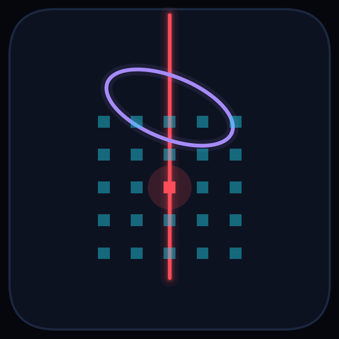

# Auto_Sernamont Documentation

**Everything needed to run the measurement, understand the physics, and maintain the code.**

[Repository home](../README.md)

---

## Start here

| If you are… | Read, in this order |
| --- | --- |
| **A new operator who needs data** | [Installation](guide/installation.md) → [Quick start](guide/quickstart.md) → [Operator manual](guide/operating.md) → [Troubleshooting](guide/troubleshooting.md) |
| **A physicist who needs to interpret the data** | [Physics overview](physics/index.md) → [Null-slope readout](physics/03-senarmont-readout.md) → [Ferroelectrics](physics/05-ferroelectrics.md) → [The material](physics/06-material.md) → [Data pipeline](software/data-pipeline.md) |
| **Rebuilding or repairing the bench** | [The experiment](experiment/index.md) → [Instruments](experiment/instruments.md) → [Switching matrix](experiment/switch-matrix.md) → [Motion control](software/motion-control.md) |
| **Changing the code** | [Software overview](software/index.md) → [Architecture](software/architecture.md) → [Motion control](software/motion-control.md) → [CLI reference](reference/cli.md) |
| **In a hurry** | [Quick start](guide/quickstart.md) and [Glossary](reference/glossary.md) |

---

## The whole manual

### 🔬 Physics: *what is being measured, and why*

| Page | Covers |
| --- | --- |
| [Overview](physics/index.md) | what the measurement measures and the reading order |
| [The Pockels effect](physics/01-electro-optics.md) | index ellipsoid, the electro-optic tensor, BaTiO₃ point group 4mm, retardation, the coplanar field and why α is device-specific |
| [Polarisation formalism](physics/02-polarisation.md) | Jones vectors and matrices, Stokes parameters, the Poincaré sphere, the polarisation ellipse, and the Jones chain of this instrument |
| [The null-slope readout](physics/03-senarmont-readout.md) | why the birefringence must be compensated, Malus and its derivative, why ±45°, the triplet, the complex model and the operating-point certificate |
| [Angular dependence](physics/04-incident-polarisation.md) | the signed 2θ model and four-lobed magnitude, what a polar plot does and does not prove, and why arbitrary encoder zeros do not matter |
| [Ferroelectric switching](physics/05-ferroelectrics.md) | domains, poling and its kinetics, butterfly versus signed loop, the metric set, the loop taxonomy, rate dependence, domain reset |
| [The material](physics/06-material.md) | perovskite BaTiO₃, the polar distortion, domains, where the electro-optic coefficients actually come from, polarisation rotation, and what epitaxial strain and a buffer layer do to them |
| [Theory of the instrument](physics/07-instrument-theory.md) | the end-to-end forward model of this bench: the Jones product, the harmonic content, the transfer function factor by factor, a noise budget with real numbers, the systematics, and the error propagation |

### 🔧 The experiment: *the bench itself*

| Page | Covers |
| --- | --- |
| [Overview](experiment/index.md) | a guided tour of the block diagram |
| [The optical beamline](experiment/beamline.md) | every element in order: what it is, the physics, why it is there, what breaks without it |
| [Instruments and interfaces](experiment/instruments.md) | laser, rotators, stage, scope, lock-in, function generator and SMU: command sequences, settings and quirks |
| [The BaTiO₃ chip](experiment/chip.md) | the array, the coplanar electrode geometry, the GDS layout, pixel numbering and the display frame |
| [The switching matrix](experiment/switch-matrix.md) | shift registers, PhotoMOS relays, the serial protocol, the boot handshake, and the mapping hazard |

### 💻 The software: *how it is built*

| Page | Covers |
| --- | --- |
| [Overview](software/index.md) | design principles, module map, dependency direction |
| [Architecture](software/architecture.md) | the two-process model, file-based IPC, the five phases of a run, the measurement decision tree, failure policy |
| [Motion control](software/motion-control.md) | the Elliptec protocol and encoder arithmetic, backlash, verification, fault recovery, the stage, the alignment search algorithms |
| [Instrument control and timing](software/instrument-control.md) | the anatomy of one lock-in point, why phasors average in X/Y, gating sequences, adaptive poling, the timing budget |
| [Numerical methods](software/algorithms.md) | the coding theory: phasor statistics, least squares, pattern search, golden section, robust statistics, curve fitting, and the range controller, each with its source |
| [The data pipeline](software/data-pipeline.md) | what is computed automatically, the quality-flag system, the offline scripts, loading the data in Python |

### 📋 Operating: *how to actually run it*

| Page | Covers |
| --- | --- |
| [Overview](guide/index.md) | who this is for, and the golden rules |
| [Installation](guide/installation.md) | the Windows requirement, dependencies, Kinesis, USB stability, verification |
| [Quick start](guide/quickstart.md) | cold lab → your first measured pixel |
| [Operator manual](guide/operating.md) | the full SOP and every GUI field |
| [Troubleshooting](guide/troubleshooting.md) | symptom → cause → fix, and the diagnostic recipes |

### 📖 Reference

| Page | Covers |
| --- | --- |
| [CLI reference](reference/cli.md) | every flag, generated from the argument parsers |
| [Data schema](reference/data-schema.md) | every output file, column by column |
| [Glossary](reference/glossary.md) | symbols, terms and abbreviations |
| [Bibliography](references.md) | the numbered reference list the physics pages cite, with a note on each entry saying what this repository uses it for |

---

## The system in one paragraph

A 1550 nm laser is polarised, its polarisation direction is set by a motorised
half-wave plate, and it is focused through one pixel of a 10 × 10 grid of
electrode pairs patterned on a barium titanate thin film. A voltage applied
across the ≈7 µm electrode gap changes the film's refractive indices through
the **Pockels effect**, which rotates the light's polarisation by a few
microradians. A motorised quarter-wave plate cancels the film's *static*
birefringence so that a motorised analyser can extinguish the beam almost
completely; sitting ±45° away from that extinction point puts the measurement
on the steepest part of the transmission curve, where a polarisation change
turns into the largest possible intensity change. An AC voltage at 30 kHz
modulates the polarisation, a photodiode converts light to voltage, and a
lock-in amplifier extracts the tiny 30 kHz component of that voltage, rejecting
everything else. Repeat for nine incident polarisations and up to 100 pixels,
add DC voltage sweeps to trace ferroelectric switching loops, and the result is
a map of the electro-optic response and the ferroelectric behaviour across the
whole chip.

---

## Conventions used throughout

| Convention | Meaning |
| --- | --- |
| $\theta_i$ | incident polarisation angle in the calibrated lab frame |
| $\psi$ | analyser offset **from the null**, the readout variable |
| $\delta$, $\Gamma$ | electro-optic rotation and retardance, $\Gamma = 2\delta$ in this geometry |
| "pixel" | one of the 100 electrode pairs, numbered 1 to 100 |
| "the triplet" | the three readings taken at each incident polarisation: local null, +45°, −45° |
| "the null" | the QWP/analyser pair that extinguishes the beam through the sample |
| Voltages | drive amplitudes in $V_\mathrm{pp}$; DC bias in V; $V_\mathrm{rms} = V_\mathrm{pp}/2\sqrt{2}$ |
| British spelling | polarisation, normalised, analyser |

Full definitions: [Glossary](reference/glossary.md).

The conventions above are enforced, not merely documented. `python tools/check_docs.py` from the repository root verifies that no dash is used as punctuation, that every relative link and anchor resolves, and that every citation has a matching reference entry. It runs in CI on every push. Project-level instructions for anyone, or anything, editing this repository are in [`CLAUDE.md`](../CLAUDE.md).

---

Every number in this documentation was checked against the code in <a href="../pockels/"><code>pockels/</code></a>.

