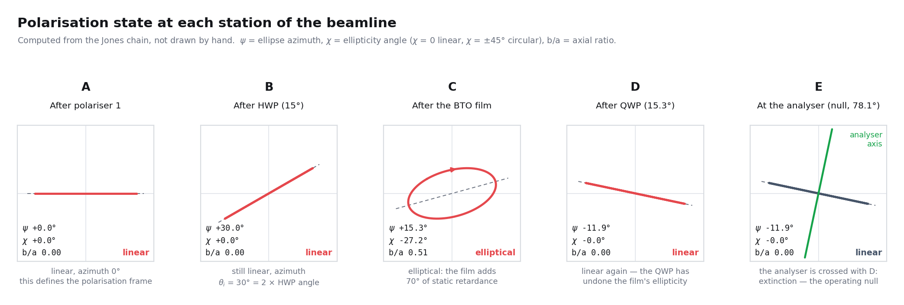
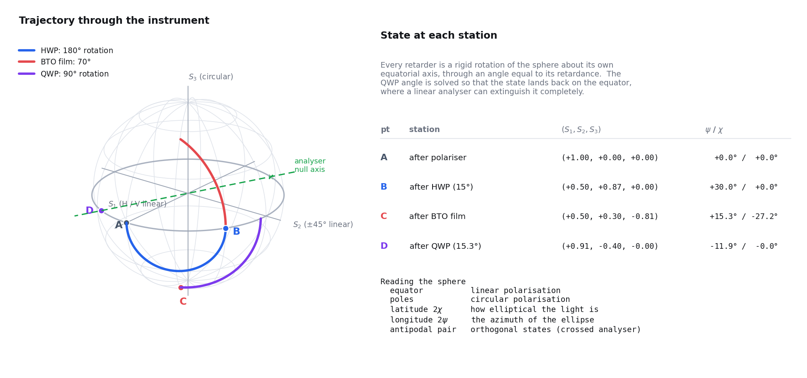

# Polarisation Formalism

**What this page is for:** to fix the language, completely. Jones calculus,
the coherency matrix, the Stokes parameters and the Poincaré sphere are four
descriptions of one thing, and each makes a different part of this instrument
obvious. Nothing here is asserted that can be derived, and the page ends by
writing the complete Jones product of the actual beamline and expanding it to
first order in the electro-optic retardance, which is the object every later
calculation perturbs.

If you already know Jones and Stokes, skip to
[§14 The Jones chain of this instrument](#14-the-jones-chain-of-this-instrument).

> **Symbol warning.** On this page $\psi$ is the **azimuth of the polarisation
> ellipse**, the standard usage. On
> [03: The Null-Slope Sénarmont Readout](03-senarmont-readout.md) and
> throughout the code, $\psi$ is the **analyser offset from the null**. They
> are different angles. Where both appear here the analyser angle is written
> $\psi_A$.

**Contents**

| § | Topic |
| --- | --- |
| [1](#1-why-the-field-has-two-components) | why the field has two components |
| [2](#2-the-jones-vector) | the Jones vector |
| [3](#3-the-global-phase-and-why-the-state-space-is-a-sphere) | the global phase, and why the state space is a sphere |
| [4](#4-jones-matrices-derived) | Jones matrices, derived |
| [5](#5-the-coherency-matrix) | the coherency matrix |
| [6](#6-the-stokes-parameters) | the Stokes parameters |
| [7](#7-the-pauli-connection) | the Pauli connection |
| [8](#8-degree-of-polarisation) | degree of polarisation |
| [9](#9-the-polarisation-ellipse) | the polarisation ellipse |
| [10](#10-the-poincaré-sphere) | the Poincaré sphere |
| [11](#11-mueller-calculus-and-when-jones-is-not-enough) | Mueller calculus |
| [12](#12-a-retarder-is-a-rotation-rodrigues-written-out) | a retarder is a rotation |
| [13](#13-orthogonality-is-antipodality) | orthogonality is antipodality |
| [14](#14-the-jones-chain-of-this-instrument) | the Jones chain of this instrument |
| [15](#15-a-worked-example-in-the-instruments-own-numbers) | a worked example |

---

## 1. Why the field has two components

Everything below rests on one fact from Maxwell's equations, so it is worth
one paragraph rather than an assumption.

In a source-free, linear, non-magnetic medium, take a monochromatic plane wave
travelling along $z$,

$$
\mathbf{E}(\mathbf{r}, t) \;=\; \mathrm{Re}\!\left\{ \mathbf{E}_0\,
e^{i(kz - \omega t)} \right\},
\tag{1}
$$

with $\mathbf{E}_0 \in \mathbb{C}^3$. Gauss' law in a source-free medium is
$\nabla\cdot\mathbf{D} = 0$, and for the plane wave of (1) that becomes

$$
\mathbf{k}\cdot\mathbf{D}_0 \;=\; 0 .
\tag{2}
$$

The displacement field is therefore strictly transverse to the wavevector. In
an isotropic medium $\mathbf{D} = \varepsilon\mathbf{E}$, so $\mathbf{E}$ is
transverse too and has exactly two independent components, $E_x$ and $E_y$.

In an anisotropic medium $\mathbf{D} = \varepsilon\mathbf{E}$ with
$\varepsilon$ a tensor, so $\mathbf{E}$ need not be exactly perpendicular to
$\mathbf{k}$; the angle between them is the walk-off angle, and it is of order
the fractional birefringence [[3]](../references.md#ref-3). For barium titanate
at 1550 nm that is a fraction of a degree over a film a few hundred nanometres
thick, so the two-component description is used throughout and the walk-off is
neglected. The point is that this is an approximation with a stated size, not
a definition.

> **Note.** The convention used on this page is $e^{-i\omega t}$, so that the
> physical field is $\mathrm{Re}\left\{\mathbf{J}e^{-i\omega t}\right\}$. Texts
> using $e^{+i\omega t}$ differ from what follows by complex conjugation
> throughout, which flips the sign of $S_3$ and hence the handedness
> convention. The instrument never depends on an absolute handedness, because
> every angle is referred to a measured null
> ([04 §7](04-incident-polarisation.md#7-the-reference-frame-argument)).

---

## 2. The Jones vector

The two surviving components, written as a column, are the **Jones vector**
[[10]](../references.md#ref-10):

$$
\mathbf{J} \;=\; \begin{pmatrix} E_x \\ E_y \end{pmatrix}
\;=\; \begin{pmatrix} A_x \\ A_y\, e^{i\phi} \end{pmatrix} e^{i\phi_x},
\qquad \phi \;=\; \phi_y - \phi_x ,
\tag{3}
$$

with $A_x, A_y \ge 0$ the real amplitudes and $\phi$ the **relative phase**.
Only $\phi$ and the amplitude ratio $A_y/A_x$ fix the polarisation state; the
prefactor $e^{i\phi_x}$ is a global phase and the overall scale is an
intensity.

| State | Jones vector | Condition |
| --- | --- | --- |
| Linear horizontal (H) | $(1,\,0)^\mathsf{T}$ | $A_y = 0$ |
| Linear vertical (V) | $(0,\,1)^\mathsf{T}$ | $A_x = 0$ |
| Linear at $\theta$ | $(\cos\theta,\,\sin\theta)^\mathsf{T}$ | $\phi = 0$ |
| Linear $+45^\circ$ | $\tfrac{1}{\sqrt2}(1,\,1)^\mathsf{T}$ | $\phi = 0$, $A_x = A_y$ |
| Right circular | $\tfrac{1}{\sqrt2}(1,\,i)^\mathsf{T}$ | $\phi = +90^\circ$, $A_x = A_y$ |
| Left circular | $\tfrac{1}{\sqrt2}(1,\,-i)^\mathsf{T}$ | $\phi = -90^\circ$, $A_x = A_y$ |
| Elliptical | general | everything else |

The intensity a photodiode sees is

$$
I \;=\; \mathbf{J}^\dagger \mathbf{J} \;=\; \lvert E_x\rvert^2 + \lvert E_y\rvert^2 ,
\tag{4}
$$

up to detector responsivity and transimpedance gain
([`../experiment/instruments.md`](../experiment/instruments.md)).

---

## 3. The global phase, and why the state space is a sphere

This short section is the reason for every factor of two later on, so it is
worth doing properly rather than waving at.

A Jones vector has four real numbers in it: $A_x$, $A_y$, $\phi_x$, $\phi_y$.
Two of them are not polarisation.

1. **The overall amplitude** $\sqrt{A_x^2+A_y^2}$ is an intensity. Divide it
   out and what is left is a unit vector in $\mathbb{C}^2$, that is, a point on
   the three-sphere $S^3$.
2. **The global phase** $e^{i\phi_x}$ is a choice of time origin. The vectors
   $\mathbf{J}$ and $e^{i\alpha}\mathbf{J}$ trace the *same* ellipse in the
   same sense; only the instant at which the tip is at a given point differs,
   and no intensity measurement of any kind can distinguish them.

So the space of polarisation states is the unit sphere $S^3$ with all points
that differ by a phase identified. That quotient is the complex projective
line $\mathbb{CP}^1$, and the map

$$
S^3 \;\longrightarrow\; \mathbb{CP}^1 \;\cong\; S^2
\tag{5}
$$

is the Hopf fibration: an ordinary two-sphere, each of whose points is a whole
circle of Jones vectors differing by a global phase. **That two-sphere is the
Poincaré sphere** [[9]](../references.md#ref-9).

Two consequences follow immediately, and both are used constantly.

- **Two real parameters describe a fully polarised state.** They can be taken
  as the amplitude ratio and the relative phase, or as the azimuth and
  ellipticity of §9, or as a latitude and longitude on the sphere.
- **The map from Jones vectors to sphere points is two-to-one in angle.**
  Rotating a linear polarisation by $180^\circ$ multiplies its Jones vector by
  $-1$, which is a global phase, so it returns to the *same* state. A
  coordinate on the sphere that is single-valued must therefore advance by
  $360^\circ$ when the physical azimuth advances by $180^\circ$. That is where
  the $2\psi$ comes from. The same argument applied to a full-wave retarder,
  whose Jones matrix is $-\mathbf{I}$, gives the algebraic version: the
  polarisation group is $\mathrm{SU}(2)$, which double covers the rotation
  group $\mathrm{SO}(3)$ of the sphere.

---

## 4. Jones matrices, derived

Every passive, non-depolarising, spatially uniform optical element is a
$2\times2$ complex matrix acting on $\mathbf{J}$ [[10]](../references.md#ref-10).
Elements compose by matrix multiplication **in reverse order of traversal**:
the first optic the light meets stands rightmost, because it acts first.

### 4.1 Rotation, and the similarity transform

The operator that rotates a two-component vector by $\theta$ about the
propagation axis is

$$
R(\theta) \;=\; \begin{pmatrix} \cos\theta & -\sin\theta \\ \sin\theta & \cos\theta \end{pmatrix},
\qquad R(\theta)^{-1} = R(-\theta) = R(\theta)^\mathsf{T}.
\tag{6}
$$

Suppose an element has matrix $M$ when its own axis lies along $x$, and we
want its matrix when that axis has been rotated to angle $\theta$. Act in
three steps: rotate the incoming field *into* the element's frame with
$R(-\theta)$, apply $M$ there, rotate the result back with $R(+\theta)$.
Hence the similarity transform

$$
\boxed{\;M(\theta) \;=\; R(\theta)\, M\, R(-\theta). \;}
\tag{7}
$$

Equation (7) generates every element below. It is worth noticing that it is a
*conjugation*, so it preserves eigenvalues: rotating a waveplate changes where
its axes point but never its retardance.

### 4.2 The linear polariser

In its own frame an ideal linear polariser transmits $x$ and blocks $y$, so it
is the orthogonal projector $P_0 = \mathrm{diag}(1,0)$. Applying (7),

$$
P(\theta) \;=\; R(\theta) \begin{pmatrix}1&0\\0&0\end{pmatrix} R(-\theta)
\;=\;
\begin{pmatrix} \cos^2\theta & \sin\theta\cos\theta \\ \sin\theta\cos\theta & \sin^2\theta \end{pmatrix}
\;=\; \hat{\mathbf{n}}\,\hat{\mathbf{n}}^\mathsf{T},
\tag{8}
$$

with $\hat{\mathbf{n}} = (\cos\theta, \sin\theta)^\mathsf{T}$. The last form
makes the two defining properties obvious: $P^2 = P$ (a projector applied
twice does nothing new) and $\mathrm{tr}\,P = 1$ (one surviving dimension out
of two).

Acting on linear light at $\theta_\mathrm{in}$,

$$
P(\theta)\begin{pmatrix}\cos\theta_\mathrm{in}\\ \sin\theta_\mathrm{in}\end{pmatrix}
= \cos(\theta - \theta_\mathrm{in})\,\hat{\mathbf{n}},
\qquad
I = \cos^2(\theta - \theta_\mathrm{in}) ,
\tag{9}
$$

which is **Malus' law**. It reappears in null-referenced form as
$I(\psi) = I_\mathrm{floor} + I_0\sin^2\psi$ on the next page.

### 4.3 The general elliptical retarder

A retarder is any element that is **unitary** (it loses no light) and
**non-trivial** (it is not a multiple of the identity). Unitarity means it has
two orthonormal eigenvectors $\hat{\mathbf{j}}_{+}$ and
$\hat{\mathbf{j}}_{-}$, with eigenvalues of unit modulus. Writing the
eigenvalues symmetrically as $e^{\mp i\delta/2}$ defines the **retardance**
$\delta$ as the phase the slow eigenstate accumulates relative to the fast
one, and fixes the global phase so that $\det W = 1$:

$$
W \;=\; e^{-i\delta/2}\,\hat{\mathbf{j}}_{+}\hat{\mathbf{j}}_{+}^{\dagger}
\;+\; e^{+i\delta/2}\,\hat{\mathbf{j}}_{-}\hat{\mathbf{j}}_{-}^{\dagger}.
\tag{10}
$$

Now use completeness,
$\hat{\mathbf{j}}_{+}\hat{\mathbf{j}}_{+}^{\dagger} +
\hat{\mathbf{j}}_{-}\hat{\mathbf{j}}_{-}^{\dagger} = \mathbf{I}$, and define

$$
N \;=\; \hat{\mathbf{j}}_{+}\hat{\mathbf{j}}_{+}^{\dagger}
      - \hat{\mathbf{j}}_{-}\hat{\mathbf{j}}_{-}^{\dagger},
\qquad N^2 = \mathbf{I},\quad \mathrm{tr}\,N = 0 .
\tag{11}
$$

Then (10) collapses to

$$
\boxed{\;
W(\delta, N) \;=\; \cos\!\frac{\delta}{2}\,\mathbf{I}
\;-\; i\,\sin\!\frac{\delta}{2}\; N .
\;}
\tag{12}
$$

Every traceless, Hermitian, involutive $N$ can be written
$N = \hat{\mathbf{n}}\cdot\boldsymbol{\sigma}$ for a real unit vector
$\hat{\mathbf{n}}$ and the Pauli matrices of §7. So **a retarder is
completely specified by a unit vector and an angle**. That is already the
Poincaré-sphere statement, obtained without yet mentioning the sphere; §12
turns it into a rotation.

### 4.4 The rotated retarder, written out

For a **linear** retarder the eigenstates are linear, so with the fast axis
along $x$, $\hat{\mathbf{j}}_{+} = (1,0)^\mathsf{T}$ and
$N = \mathrm{diag}(1,-1) = \sigma_1$. Equation (12) gives
$W(\delta) = \mathrm{diag}\!\left(e^{-i\delta/2}, e^{+i\delta/2}\right)$,
which up to the global phase $e^{i\delta/2}$ is the familiar
$\mathrm{diag}\!\left(1, e^{i\delta}\right)$.

Rotating the fast axis to angle $\theta$ with (7):

$$
W(\delta,\theta) \;=\; R(\theta)\,W(\delta)\,R(-\theta) =
\begin{pmatrix}
\cos^2\theta + e^{i\delta}\sin^2\theta & (1 - e^{i\delta})\sin\theta\cos\theta \\
(1 - e^{i\delta})\sin\theta\cos\theta & \sin^2\theta + e^{i\delta}\cos^2\theta
\end{pmatrix},
\tag{13}
$$

in the $\mathrm{diag}(1,e^{i\delta})$ convention, or equivalently in the
determinant-one convention

$$
W(\delta,\theta) \;=\; \cos\!\frac{\delta}{2}\,\mathbf{I}
\;-\; i\sin\!\frac{\delta}{2}\left[\cos 2\theta\,\sigma_1 + \sin 2\theta\,\sigma_2\right].
\tag{14}
$$

The step from (13) to (14) is a one-line Pauli identity that is the origin of
every factor of two on this page:

$$
R(\theta)\,\sigma_1\,R(-\theta) \;=\;
\begin{pmatrix}\cos 2\theta & \sin 2\theta \\ \sin 2\theta & -\cos 2\theta\end{pmatrix}
\;=\; \cos 2\theta\,\sigma_1 + \sin 2\theta\,\sigma_2 .
\tag{15}
$$

**Rotating an element by $\theta$ in the laboratory rotates its axis by
$2\theta$ on the sphere.** That is the whole content of "longitude is twice
the azimuth", and it is now derived rather than declared.

### 4.5 The two special cases that run this experiment

**Half-wave plate**, $\delta = \pi$. From (14), $\cos(\pi/2) = 0$, so up to the
global phase $-i$,

$$
H(\theta) \;=\; \cos 2\theta\,\sigma_1 + \sin 2\theta\,\sigma_2
\;=\; \begin{pmatrix} \cos 2\theta & \sin 2\theta \\ \sin 2\theta & -\cos 2\theta \end{pmatrix}.
\tag{16}
$$

$H$ is real, symmetric, with $H^2 = \mathbf{I}$ and $\det H = -1$: it is a
**reflection of the polarisation about the fast axis**. Feed it linear light
at $\theta_\mathrm{in}$ and it returns linear light at
$2\theta - \theta_\mathrm{in}$, so rotating the plate by $\Delta$ rotates the
polarisation by $2\Delta$. That factor of two is why a $180^\circ$ scan of
incident polarisation costs only $90^\circ$ of motor travel
([04 §1](04-incident-polarisation.md#1-why-the-response-depends-on-the-incident-polarisation)).

**Quarter-wave plate**, $\delta = \pi/2$. From (14),

$$
Q(\theta) \;=\; \frac{1}{\sqrt2}\Big(\mathbf{I} - i\left[\cos 2\theta\,\sigma_1 + \sin 2\theta\,\sigma_2\right]\Big).
\tag{17}
$$

It converts linear to elliptical and, crucially here, elliptical back to
**linear** when its axis is set correctly. That is the compensator
([03 §4](03-senarmont-readout.md#4-what-the-qwp-does-geometrically)).

### 4.6 Summary table

| Element | Jones matrix | Determinant | Character |
| --- | --- | --- | --- |
| Rotation of frame by $\theta$ | $R(\theta)$, eq. (6) | $+1$ | orthogonal |
| Ideal linear polariser at $\theta$ | $P(\theta)$, eq. (8) | $0$ | rank-one projector, lossy |
| General retarder | $W(\delta, \hat{\mathbf{n}})$, eq. (12) | $+1$ | unitary, $\mathrm{SU}(2)$ |
| Linear retarder at $\theta$ | $W(\delta,\theta)$, eq. (14) | $+1$ | unitary |
| Half-wave plate at $\theta$ | $H(\theta)$, eq. (16) | $-1$ (as written) | reflection |
| Quarter-wave plate at $\theta$ | $Q(\theta)$, eq. (17) | $+1$ | unitary |

> **Note on conventions.** Equations (13) and (14) differ by the global phase
> $e^{i\delta/2}$, and (16) has had a factor $-i$ dropped. None of this is
> visible to a detector, by §3. It matters only if you multiply matrices from
> two different sources and expect the determinants to agree.

---

## 5. The coherency matrix

Jones vectors describe one perfectly coherent, fully polarised wave. Real
beams are ensembles. The bridge is the **coherency matrix**
[[11]](../references.md#ref-11), the time or ensemble average of the outer
product:

$$
\mathbf{C} \;=\; \left\langle \mathbf{J}\mathbf{J}^\dagger \right\rangle
\;=\;
\begin{pmatrix}
\left\langle E_x E_x^{*}\right\rangle & \left\langle E_x E_y^{*}\right\rangle \\[2pt]
\left\langle E_y E_x^{*}\right\rangle & \left\langle E_y E_y^{*}\right\rangle
\end{pmatrix}.
\tag{18}
$$

Three properties do all the work.

| Property | Statement | Meaning |
| --- | --- | --- |
| Hermitian | $\mathbf{C}^\dagger = \mathbf{C}$ | four real numbers, not eight |
| Positive semi-definite | $\mathbf{v}^\dagger\mathbf{C}\mathbf{v}\ge 0$ | no negative intensities |
| Trace | $\mathrm{tr}\,\mathbf{C} = \left\langle \lvert E_x\rvert^2 + \lvert E_y\rvert^2\right\rangle$ | the total intensity |

A single Jones vector gives $\mathbf{C} = \mathbf{J}\mathbf{J}^\dagger$, which
is rank one and has $\det\mathbf{C} = 0$. Averaging over an incoherent mixture
of different states adds coherency matrices, and the sum is generally rank
two. **The determinant is therefore a direct measure of how unpolarised the
beam is**, which §8 makes quantitative.

The intensity transmitted by an element with Jones matrix $T$ is
$\mathrm{tr}\!\left(T\,\mathbf{C}\,T^\dagger\right)$, and the coherency matrix
transforms as $\mathbf{C} \to T\,\mathbf{C}\,T^\dagger$. This is the same
algebra as a density matrix in quantum mechanics, and the analogy is exact:
fully polarised light is a pure state, unpolarised light is the maximally
mixed state, and the degree of polarisation is the purity.

---

## 6. The Stokes parameters

Stokes' insight [[8]](../references.md#ref-8) was to parameterise
$\mathbf{C}$ by four quantities that are **each a difference of intensities
you can actually measure**. In terms of the fields,

$$
S_0 = \left\langle\lvert E_x\rvert^2\right\rangle + \left\langle\lvert E_y\rvert^2\right\rangle, \qquad
S_1 = \left\langle\lvert E_x\rvert^2\right\rangle - \left\langle\lvert E_y\rvert^2\right\rangle,
\tag{19}
$$

$$
S_2 = 2\,\mathrm{Re}\!\left\langle E_x^{*}E_y\right\rangle, \qquad
S_3 = 2\,\mathrm{Im}\!\left\langle E_x^{*}E_y\right\rangle .
\tag{20}
$$

### The six-intensity operational definition

The definition that matters on a bench needs only a rotatable linear polariser
and, for the last pair, a quarter-wave plate in front of it
[[12]](../references.md#ref-12). Let $I(\theta)$ be the intensity transmitted
by a linear polariser at $\theta$, and $I_R$, $I_L$ the intensities through a
right- and left-circular analyser:

$$
S_0 = I(0^\circ) + I(90^\circ), \qquad
S_1 = I(0^\circ) - I(90^\circ),
\tag{21}
$$

$$
S_2 = I(45^\circ) - I(135^\circ), \qquad
S_3 = I_R - I_L .
\tag{22}
$$

Six intensities, four parameters, and therefore **two redundancy checks**:

$$
S_0 \;=\; I(0^\circ) + I(90^\circ) \;=\; I(45^\circ) + I(135^\circ) \;=\; I_R + I_L .
\tag{23}
$$

Those checks are the reason the Stokes vector is the natural language for
instrument diagnostics. If the three estimates of $S_0$ in (23) disagree, the
polariser is not ideal, the detector is not linear, or the beam moved between
measurements, and you know that before interpreting anything.

| Parameter | Positive means | Measured as |
| --- | --- | --- |
| $S_0$ | total intensity | any of the three sums in (23) |
| $S_1$ | more horizontal than vertical | $I(0^\circ) - I(90^\circ)$ |
| $S_2$ | more $+45^\circ$ than $-45^\circ$ | $I(45^\circ) - I(135^\circ)$ |
| $S_3$ | more right- than left-circular | $I_R - I_L$ |

For a fully polarised beam the four are not independent:

$$
S_1^2 + S_2^2 + S_3^2 \;=\; S_0^2 .
\tag{24}
$$

---

## 7. The Pauli connection

The relation between §5 and §6 is one equation, and it is worth writing out
because it makes several later results immediate. Define

$$
\sigma_0 = \begin{pmatrix}1&0\\0&1\end{pmatrix},\quad
\sigma_1 = \begin{pmatrix}1&0\\0&-1\end{pmatrix},\quad
\sigma_2 = \begin{pmatrix}0&1\\1&0\end{pmatrix},\quad
\sigma_3 = \begin{pmatrix}0&-i\\i&0\end{pmatrix}.
\tag{25}
$$

These are the Pauli matrices in the ordering conventional in polarisation
optics; $\sigma_1$ here is the particle physicist's $\sigma_z$, $\sigma_2$ is
$\sigma_x$ and $\sigma_3$ is $\sigma_y$. They satisfy
$\mathrm{tr}\left(\sigma_j\sigma_k\right) = 2\delta_{jk}$ and, for
$j,k \in \{1,2,3\}$,

$$
\sigma_j\sigma_k \;=\; \delta_{jk}\,\sigma_0 \;+\; i\,\varepsilon_{jkl}\,\sigma_l .
\tag{26}
$$

Then

$$
\boxed{\;
S_k \;=\; \mathrm{tr}\!\left(\mathbf{C}\,\sigma_k\right)
\;=\; \left\langle \mathbf{J}^\dagger \sigma_k \mathbf{J}\right\rangle,
\qquad
\mathbf{C} \;=\; \frac{1}{2}\sum_{k=0}^{3} S_k\,\sigma_k .
\;}
\tag{27}
$$

Written out,

$$
\mathbf{C} \;=\; \frac{1}{2}
\begin{pmatrix}
S_0 + S_1 & S_2 - iS_3 \\
S_2 + iS_3 & S_0 - S_1
\end{pmatrix}.
\tag{28}
$$

Check (27) against (19) and (20): $\mathbf{J}^\dagger\sigma_1\mathbf{J} =
\lvert E_x\rvert^2 - \lvert E_y\rvert^2$;
$\mathbf{J}^\dagger\sigma_2\mathbf{J} = E_x^{*}E_y + E_y^{*}E_x =
2\mathrm{Re}(E_x^{*}E_y)$; and
$\mathbf{J}^\dagger\sigma_3\mathbf{J} = i\left(E_y^{*}E_x - E_x^{*}E_y\right)
= 2\mathrm{Im}(E_x^{*}E_y)$. All three agree.

From (28), one line gives the central identity of §8:

$$
\det \mathbf{C} \;=\; \frac{1}{4}\left(S_0^2 - S_1^2 - S_2^2 - S_3^2\right) \;\ge\; 0 .
\tag{29}
$$

---

## 8. Degree of polarisation

$$
\mathrm{DOP} \;=\; \frac{\sqrt{S_1^2 + S_2^2 + S_3^2}}{S_0}
\;=\; \sqrt{\,1 - \frac{4\det\mathbf{C}}{\left(\mathrm{tr}\,\mathbf{C}\right)^2}}
\;\in\; [0,1].
\tag{30}
$$

The second form follows directly from (29). The eigenvalues of $\mathbf{C}$
are $\lambda_\pm = \tfrac{1}{2}S_0\left(1 \pm \mathrm{DOP}\right)$, so the
coherency matrix always splits uniquely into a fully polarised part and a
completely unpolarised part:

$$
\mathbf{C} \;=\; \underbrace{\mathrm{DOP}\cdot \mathbf{C}_\mathrm{pure}}_{\text{a single Jones state}}
\;+\; \underbrace{\left(1-\mathrm{DOP}\right)\cdot\tfrac{1}{2}S_0\,\mathbf{I}}_{\text{unpolarised}} .
\tag{31}
$$

$\mathrm{DOP} = 1$ is fully polarised (on the sphere of §10), $0$ is
unpolarised (at its centre), and anything between is partially polarised
(inside).

**Why this matters here.** The DOP should stay very close to 1 all the way to
the analyser. A measurably reduced DOP means something is depolarising the
beam: scattering from a damaged pixel, a spot straddling an electrode edge,
stray light. Equation (31) says exactly what goes wrong. The unpolarised part
is isotropic on the sphere, so **no setting of any lossless polarisation optic
can extinguish it**; a fraction $\tfrac{1}{2}(1-\mathrm{DOP})S_0$ reaches the
detector whatever the analyser does. It is an irreducible null floor, and it
is the difference between a null that can be improved by re-nulling and one
that cannot ([`../guide/troubleshooting.md`](../guide/troubleshooting.md)).

---

## 9. The polarisation ellipse

Traced over one optical cycle, the tip of the real electric field sweeps an
ellipse. With $\mathbf{J} = \left(A_x,\, A_y e^{i\phi}\right)^\mathsf{T}$ and
the $e^{-i\omega t}$ convention of §1,

$$
E_x(t) = A_x\cos\omega t, \qquad E_y(t) = A_y\cos\left(\omega t - \phi\right).
\tag{32}
$$

Eliminating $t$ between them gives the ellipse in its implicit form
[[11]](../references.md#ref-11):

$$
\left(\frac{E_x}{A_x}\right)^2 + \left(\frac{E_y}{A_y}\right)^2
- 2\,\frac{E_x E_y}{A_x A_y}\cos\phi \;=\; \sin^2\phi .
\tag{33}
$$

Two angles describe it completely.

| Symbol | Name | Definition | Range |
| --- | --- | --- | --- |
| $\psi$ | **azimuth** | angle of the ellipse's major axis from $x$ | $0 \le \psi < 180^\circ$ |
| $\chi$ | **ellipticity angle** | $\tan\chi = \pm b/a$, minor over major semi-axis, signed by handedness | $-45^\circ \le \chi \le 45^\circ$ |

$\chi = 0$ is linear, $\chi = \pm45^\circ$ is circular, and the sign of $\chi$
is the handedness.

### 9.1 Deriving the azimuth

Rotate into a trial frame at angle $\psi$, so that
$E_\xi = E_x\cos\psi + E_y\sin\psi$ and
$E_\eta = -E_x\sin\psi + E_y\cos\psi$. That frame is the **principal** frame
exactly when the two components are in quadrature, that is when
$\mathrm{Re}\left(E_\xi^{*}E_\eta\right) = 0$. Expanding,

$$
\mathrm{Re}\!\left(E_\xi^{*}E_\eta\right)
= -\left(\lvert E_x\rvert^2 - \lvert E_y\rvert^2\right)\sin\psi\cos\psi
 + \mathrm{Re}\!\left(E_x^{*}E_y\right)\left(\cos^2\psi - \sin^2\psi\right)
$$
$$
= -\tfrac{1}{2}S_1\sin 2\psi \;+\; \tfrac{1}{2}S_2\cos 2\psi .
\tag{34}
$$

Setting (34) to zero gives

$$
\boxed{\;\tan 2\psi \;=\; \frac{S_2}{S_1}. \;}
\tag{35}
$$

The $2\psi$ appears because the condition is quadratic in the field: an
ellipse is unchanged by $\psi \to \psi + 180^\circ$, so its azimuth can only
ever be determined modulo $180^\circ$, and the natural variable is $2\psi$.

### 9.2 Deriving the ellipticity

In the principal frame the components are in quadrature by construction,
$E_\xi = a\,e^{i\alpha}$ and $E_\eta = \pm i\,b\,e^{i\alpha}$ with $a \ge b \ge
0$. Then in that frame $S_3' = 2\,\mathrm{Im}(E_\xi^{*}E_\eta) = \pm 2ab$ and
$S_0' = a^2+b^2$. But $S_3$ and $S_0$ are invariant under rotation of the
laboratory frame, which mixes only $S_1$ and $S_2$. So $S_3 = \pm 2ab$ and
$S_0 = a^2+b^2$ in any frame, and with $\tan\chi = \pm b/a$,

$$
\sin 2\chi \;=\; \frac{2\tan\chi}{1+\tan^2\chi} \;=\; \frac{\pm 2ab}{a^2+b^2}
\;=\; \boxed{\;\frac{S_3}{S_0}\;}.
\tag{36}
$$

### 9.3 The two angles and the four parameters

Inverting (35) and (36) gives the Stokes parameters of a fully polarised beam
as nothing but these two angles in spherical-polar disguise:

$$
S_1 = S_0\cos 2\chi \cos 2\psi, \qquad
S_2 = S_0\cos 2\chi \sin 2\psi, \qquad
S_3 = S_0 \sin 2\chi ,
\tag{37}
$$

and the semi-axes follow from $a^2+b^2 = S_0$, $2ab = S_0\sin2\chi$:

$$
a^2 = \tfrac{1}{2}S_0\left(1 + \cos 2\chi\right), \qquad
b^2 = \tfrac{1}{2}S_0\left(1 - \cos 2\chi\right).
\tag{38}
$$



*Figure 1. The polarisation ellipse at each labelled point along the beam.*
*(a)* **After the polariser**: a straight line along the transmission axis.
This is the reference direction for every angle in the experiment, so it is
drawn horizontal and defines $\psi = 0$. *(b)* **After the half-wave plate**:
still a straight line, but rotated to the incident angle $\theta_i$. The plate
has changed only the azimuth, introducing no ellipticity, which is exactly
why a HWP and not a rotating polariser is used to set $\theta_i$; the
intensity is preserved too. *(c)* **After the BTO film**: an ellipse. The film
is statically birefringent even with no field applied, so the two
eigencomponents emerge with a relative phase and the state acquires
ellipticity $\chi \neq 0$. An elliptical state **cannot** be extinguished by a
linear analyser, since there is always leakage, and that is the problem the
next element solves. *(d)* **After the quarter-wave plate**: a straight line
again. The QWP has been rotated to cancel exactly the ellipticity the sample
introduced, returning the state to $\chi = 0$ at some azimuth. *(e)* **After
the analyser**: a line along the analyser's own axis, with the amplitude set
by the projection. When the analyser is crossed with (d) the output is
extinguished, which is the **null**. The tiny field-induced change that the
whole instrument exists to measure is a sub-microradian wobble of the azimuth
in panel (d), far too small to draw to scale.

---

## 10. The Poincaré sphere

Normalise by $S_0$ and plot $\hat{\mathbf{s}} = (S_1, S_2, S_3)/S_0$. By (24)
fully polarised states satisfy $\lvert\hat{\mathbf{s}}\rvert = 1$ and live on
the unit sphere; by (30) partially polarised states have
$\lvert\hat{\mathbf{s}}\rvert = \mathrm{DOP} < 1$ and live strictly inside it.
This is the **Poincaré sphere** [[9]](../references.md#ref-9).

Equation (37) *is* the coordinate map, and it says the thing to remember:

$$
\boxed{\;
\hat{\mathbf{s}} \;=\;
\left(\cos 2\chi\cos 2\psi,\; \cos 2\chi \sin 2\psi,\; \sin 2\chi\right).
\;}
\tag{39}
$$

Longitude is $2\psi$, twice the azimuth. Latitude is $2\chi$, twice the
ellipticity angle.

### Why the factors of two are not a convention

They are forced, three times over, and §3 already gave the reason.

1. **Periodicity.** A linear state repeats every $180^\circ$ of azimuth, but a
   sphere coordinate must repeat every $360^\circ$. Only $2\psi$ can do both.
2. **Range.** $\chi$ runs over $\pm 45^\circ$ from linear to circular, while
   latitude must run over $\pm 90^\circ$ from equator to pole. Only $2\chi$
   fits.
3. **Algebra.** Equation (15) showed that conjugating by a laboratory rotation
   $R(\theta)$ takes $\sigma_1 \to \cos2\theta\,\sigma_1 +
   \sin2\theta\,\sigma_2$. The double cover of $\mathrm{SO}(3)$ by
   $\mathrm{SU}(2)$ is the same statement.

### The geometry to remember

| Axis | Positive pole | Negative pole |
| --- | --- | --- |
| $S_1$ | linear horizontal (the polariser axis) | linear vertical |
| $S_2$ | linear $+45^\circ$ | linear $-45^\circ$ |
| $S_3$ | right circular | left circular |

- **The equator is every linear state.** Going once round it rotates a linear
  polarisation by $180^\circ$. A half-wave plate rotated by $\Delta$ moves a
  linear state $4\Delta$ around the equator: $2\Delta$ because the plate
  reflects, and another factor of two because longitude is $2\psi$.
- **The poles are circular**, and everything between is elliptical with
  latitude increasing with ellipticity.
- **Antipodal points are orthogonal states.** Proved in §13.
- **A retarder is a rigid rotation of the sphere** about the diameter through
  its own fast eigenstate, by an angle equal to its retardance. Proved in §12.
- **An analyser is a projection.** From §11, the detected intensity is
  $\tfrac{1}{2}S_0\left(1 + \hat{\mathbf{a}}\cdot\hat{\mathbf{s}}\right)$ with
  $\hat{\mathbf{a}}$ the analyser's own Stokes direction. Extinction is exactly
  antipodality.



*Figure 2. The same beamline as Figure 1, drawn on the Poincaré sphere.* The
state starts at the $+S_1$ pole (**P**, linear along the polariser axis). The
**HWP** carries it along the equator to longitude $2\theta_i$ (**H**); it is
still linear, just re-aimed. The **sample** is a retarder whose axis is set by
the film's own birefringence, so it rotates the state about that axis by the
static retardance, lifting it **off the equator** to an elliptical state
(**S**). The latitude reached is a direct picture of how much static
birefringence this pixel has, and it differs from pixel to pixel with
thickness, composition, strain and domain state. The **QWP** is then rotated
until its quarter-turn brings the state back **down onto the equator** (**Q**),
which is what "compensating the static birefringence" means geometrically. The
**analyser** is placed antipodally to **Q**, and the detector sees extinction.
The measurement then consists of stepping a controlled $\pm90^\circ$ of
*longitude* along the equator away from that null, which is $\pm45^\circ$ of
physical analyser rotation, and watching a microradian-scale wobble of **Q**.
That last step is drawn separately in
[Figure 3](03-senarmont-readout.md#8-the-modulation-on-the-sphere).

---

## 11. Mueller calculus, and when Jones is not enough

Because the Stokes vector is real and four-dimensional, a linear optical
element acts on it as a real $4\times4$ matrix, the **Mueller matrix**
[[13]](../references.md#ref-13):

$$
\mathbf{S}_\mathrm{out} \;=\; \mathbf{M}\,\mathbf{S}_\mathrm{in},
\qquad \mathbf{S} = \left(S_0, S_1, S_2, S_3\right)^\mathsf{T}.
\tag{40}
$$

For any **non-depolarising** element with Jones matrix $T$, the Mueller matrix
is determined by $T$ through

$$
M_{jk} \;=\; \tfrac{1}{2}\,\mathrm{tr}\!\left(\sigma_j\, T\,\sigma_k\, T^{\dagger}\right),
\tag{41}
$$

which follows directly from $\mathbf{C}\to T\mathbf{C}T^\dagger$ and (27).

Two Mueller matrices are used constantly in this documentation.

**Ideal linear polariser at $\theta$.** With
$\hat{\mathbf{a}} = \left(\cos2\theta, \sin2\theta, 0\right)$,

$$
\mathbf{M}_P(\theta) = \frac{1}{2}
\begin{pmatrix}
1 & a_1 & a_2 & 0\\
a_1 & a_1^2 & a_1a_2 & 0\\
a_2 & a_1a_2 & a_2^2 & 0\\
0&0&0&0
\end{pmatrix},
\qquad
\boxed{\;I_\mathrm{out} = \tfrac{1}{2}S_0\left(1 + \hat{\mathbf{a}}\cdot\hat{\mathbf{s}}\right).\;}
\tag{42}
$$

The boxed result is the top row of $\mathbf{M}_P$ acting on $\mathbf{S}$, and
it is the single most used equation in
[03](03-senarmont-readout.md).

**Retarder $(\delta, \hat{\mathbf{n}})$.** Because a retarder is unitary it
cannot change $S_0$, and it acts on the remaining three components as a proper
rotation:

$$
\mathbf{M}_W = \begin{pmatrix} 1 & \mathbf{0}^\mathsf{T} \\ \mathbf{0} & \mathbf{R}_{\hat{\mathbf{n}}}(\delta)\end{pmatrix},
\tag{43}
$$

with $\mathbf{R}_{\hat{\mathbf{n}}}(\delta) \in \mathrm{SO}(3)$ written out in
§12.

### When Jones suffices, and when it does not

| Situation | Jones | Mueller |
| --- | --- | --- |
| Fully polarised, coherent, non-depolarising elements | sufficient, and simpler | works, but four times the bookkeeping |
| Interference between two paths matters | **required**, because amplitudes add | cannot do it: intensities add |
| Partially polarised input | cannot represent it | **required** |
| Depolarising element (scatter, a rough surface, spatial or spectral averaging) | **cannot represent it** | required |
| Reporting what a detector measures | needs a final $\mathbf{J}^\dagger\mathbf{J}$ | reads off directly as $S_0$ |

In this instrument the beam is a single spatial mode of a fully polarised
laser through non-depolarising optics, so **Jones is sufficient and is what
the analysis uses**. Mueller language is used here for the two places where it
is clearer: the projection law (42), and the rotation picture (43). A
measurably reduced DOP would move the measurement into the right-hand column,
which is one more reason it is watched (§8).

> **Note.** Not every physically valid Mueller matrix comes from a Jones
> matrix through (41). The ones that do are exactly the non-depolarising ones
> [[14]](../references.md#ref-14). That asymmetry is the precise sense in
> which Mueller calculus is the larger formalism.

---

## 12. A retarder is a rotation: Rodrigues written out

This is the single most useful theorem on the page, and it is three lines from
(12).

A retarder is $W = \cos\frac{\delta}{2}\mathbf{I} - i\sin\frac{\delta}{2}N$
with $N = \hat{\mathbf{n}}\cdot\boldsymbol{\sigma}$. The output Stokes
components are $S_k' = \left\langle \mathbf{J}^\dagger W^\dagger \sigma_k W
\mathbf{J}\right\rangle$, so everything hinges on $W^\dagger\sigma_k W$. Write
$c = \cos\frac{\delta}{2}$, $s = \sin\frac{\delta}{2}$ and expand:

$$
W^\dagger \sigma_k W
= c^2\sigma_k + i\,cs\,\left[N, \sigma_k\right] + s^2\,N\sigma_k N .
\tag{44}
$$

Two Pauli identities finish it. From (26),
$\left[N,\sigma_k\right] = 2i\,\varepsilon_{jkl}n_j\sigma_l
= -2i\left(\hat{\mathbf{n}}\times\boldsymbol{\sigma}\right)_k$, and
$N\sigma_k N = 2n_k N - \sigma_k$. Substituting and using
$c^2 - s^2 = \cos\delta$, $2cs = \sin\delta$, $2s^2 = 1-\cos\delta$:

$$
W^\dagger \sigma_k W = \cos\delta\,\sigma_k
+ \sin\delta\left(\hat{\mathbf{n}}\times\boldsymbol{\sigma}\right)_k
+ \left(1-\cos\delta\right)n_k\left(\hat{\mathbf{n}}\cdot\boldsymbol{\sigma}\right).
\tag{45}
$$

Taking expectation values turns $\boldsymbol{\sigma}$ into
$\hat{\mathbf{s}}$, giving **Rodrigues' rotation formula**
[[15]](../references.md#ref-15):

$$
\boxed{\;
\hat{\mathbf{s}}\,' \;=\;
\hat{\mathbf{s}}\cos\delta
\;+\; \left(\hat{\mathbf{n}}\times\hat{\mathbf{s}}\right)\sin\delta
\;+\; \hat{\mathbf{n}}\left(\hat{\mathbf{n}}\cdot\hat{\mathbf{s}}\right)\left(1-\cos\delta\right).
\;}
\tag{46}
$$

That is exactly a right-handed rotation of $\hat{\mathbf{s}}$ about
$\hat{\mathbf{n}}$ through the angle $\delta$. In matrix form,

$$
\mathbf{R}_{\hat{\mathbf{n}}}(\delta) = \mathbf{I}_3 + \sin\delta\,\mathbf{K}
+ \left(1-\cos\delta\right)\mathbf{K}^2,
\qquad
\mathbf{K} = \begin{pmatrix}0 & -n_3 & n_2\\ n_3 & 0 & -n_1\\ -n_2 & n_1 & 0\end{pmatrix}.
\tag{47}
$$

Three corollaries are used everywhere downstream.

| Statement | Why |
| --- | --- |
| A HWP is a half-turn about an equatorial axis | $\delta = \pi$ in (46), $\hat{\mathbf{n}}$ on the equator by (15) |
| A QWP is a quarter-turn about an equatorial axis | $\delta = \pi/2$, same axis argument |
| Rotating a waveplate by $\theta$ moves its rotation axis by $2\theta$ in longitude | eq. (15) |

**The infinitesimal form is the one the instrument lives on.** For small
$\delta$, (46) linearises to

$$
\delta\hat{\mathbf{s}} \;=\; \delta\;\left(\hat{\mathbf{n}}\times\hat{\mathbf{s}}\right)
\;+\; \mathcal{O}\!\left(\delta^2\right),
\tag{48}
$$

a displacement perpendicular to both the axis and the state, of magnitude
$\delta\sin\Theta$ where $\Theta$ is the angle between them. Equation (48) is
the reason the whole measurement works, and §14 uses it directly.

---

## 13. Orthogonality is antipodality

Two Jones vectors are orthogonal, $\mathbf{J}_1^\dagger\mathbf{J}_2 = 0$, if
and only if their Stokes vectors are antipodal,
$\hat{\mathbf{s}}_1 = -\hat{\mathbf{s}}_2$.

**Proof.** For a pure state, (27) with $\lvert\hat{\mathbf{s}}\rvert=1$ gives
the coherency matrix as the projector
$\mathbf{C} = \tfrac{1}{2}S_0\left(\mathbf{I} +
\hat{\mathbf{s}}\cdot\boldsymbol{\sigma}\right)$. Orthogonality of the two
states means the two projectors annihilate each other, so in particular

$$
0 \;=\; \mathrm{tr}\!\left[\left(\mathbf{I} + \hat{\mathbf{s}}_1\cdot\boldsymbol{\sigma}\right)
\left(\mathbf{I} + \hat{\mathbf{s}}_2\cdot\boldsymbol{\sigma}\right)\right]
\;=\; 2\left(1 + \hat{\mathbf{s}}_1\cdot\hat{\mathbf{s}}_2\right),
\tag{49}
$$

using (26) and $\mathrm{tr}\,\sigma_k = 0$. Hence
$\hat{\mathbf{s}}_1\cdot\hat{\mathbf{s}}_2 = -1$, and since both are unit
vectors they are antipodal. The converse follows by reading (49) backwards.
$\blacksquare$

The familiar orthogonal pairs are then exactly the antipodal pairs: H and V,
$+45^\circ$ and $-45^\circ$, right and left circular. And the physical
statement that matters here is the corollary: **a linear analyser extinguishes
a state if and only if the state is at the antipode of the analyser's own
Stokes direction.** By (42), $I = \tfrac{1}{2}S_0(1 +
\hat{\mathbf{a}}\cdot\hat{\mathbf{s}})$ vanishes exactly when
$\hat{\mathbf{a}}\cdot\hat{\mathbf{s}} = -1$.

Since a linear analyser's $\hat{\mathbf{a}}$ is always **on the equator**, it
can only ever extinguish an equatorial, that is a linear, state. That one
sentence is the entire justification for putting a compensator in front of it
([03 §1](03-senarmont-readout.md#1-why-the-static-birefringence-must-be-compensated-first)).

---

## 14. The Jones chain of this instrument

The beamline, in order of traversal
([`../experiment/beamline.md`](../experiment/beamline.md)):

```text
KLS1550 → polariser → HWP → [ BTO pixel ] → QWP → analyser → PDA30B2
1550 nm    defines      sets    the sample     cancels  converts   light
~7 mW      the frame    θ_i     (static Γ₀)    Γ₀       pol.→int.  → volts
```

Written as a matrix product, and remembering that it reads **right to left**,

$$
\mathbf{J}_\mathrm{out} \;=\;
\underbrace{P(\psi_A)}_{\text{analyser}}\;
\underbrace{W\!\left(\tfrac{\pi}{2},\, q\right)}_{\text{QWP}}\;
\underbrace{W\!\left(\Gamma_0 + \Gamma(t),\, \theta_s\right)}_{\text{BTO pixel}}\;
\underbrace{H(h)}_{\text{HWP}}\;
\underbrace{P(0)}_{\text{polariser}}\;
\mathbf{J}_\mathrm{in},
\tag{50}
$$

and the photodiode reads
$I = \mathbf{J}_\mathrm{out}^\dagger \mathbf{J}_\mathrm{out}$.

| Factor | What it does | Fixed or swept |
| --- | --- | --- |
| $P(0)$ | cleans up whatever the fibre did and **defines the frame**: its transmission axis is the zero of every angle in the experiment | fixed, mechanically |
| $H(h)$ | reflects the polarisation about the plate's fast axis, producing linear light at $\theta_i$; the calibrated lab mapping gives $\theta_i$ from $h$, with $\theta_i \approx 2h + \text{offset}$ | swept over the 9-point $\theta_i$ grid |
| $W(\Gamma_0 + \Gamma(t), \theta_s)$ | the sample: a retarder with a large **static** retardance $\Gamma_0$ and eigenaxis $\theta_s$ set by the film, plus the tiny field-induced increment $\Gamma(t) = \Gamma_\mathrm{ac}\cos\omega t$ from [01 §6](01-electro-optics.md#6-from-field-to-retardation) | $\Gamma(t)$ driven at 30 kHz |
| $W(\pi/2, q)$ | the compensator: rotated to $q_\mathrm{null}$ so the product with the sample leaves **linear** light | set per pixel and per HWP angle |
| $P(\psi_A)$ | the readout: $\psi_A = a_\mathrm{null}$ extinguishes; $\psi_A = a_\mathrm{null} \pm 45^\circ$ are the two slope points | stepped through the triplet |

### 14.1 The perturbation expansion

Retarders sharing an eigenaxis commute and their retardances add, so the
sample factor splits exactly:

$$
W\!\left(\Gamma_0 + \Gamma(t),\, \theta_s\right)
\;=\; W\!\left(\Gamma(t),\, \theta_s\right)\,W\!\left(\Gamma_0,\, \theta_s\right).
\tag{51}
$$

Now apply (12) to the small factor, with
$N_s = \hat{\mathbf{n}}_s\cdot\boldsymbol{\sigma}$ the sample's Poincaré axis
operator:

$$
W\!\left(\Gamma(t), \theta_s\right)
= \cos\frac{\Gamma}{2}\mathbf{I} - i \sin\frac{\Gamma}{2} N_s
= \mathbf{I} \;-\; \frac{i\,\Gamma(t)}{2}N_s \;+\; \mathcal{O}\!\left(\Gamma^2\right).
\tag{52}
$$

Group the fixed optics as $A = P(\psi_A)\,W(\tfrac{\pi}{2}, q)$ (everything
after the sample) and $B = W(\Gamma_0,\theta_s)\,H(h)\,P(0)$ (everything up to
and including the static sample), so that
$\mathbf{J}_0 = A\,B\,\mathbf{J}_\mathrm{in}$ is the unmodulated output. Then

$$
\mathbf{J}_\mathrm{out} \;=\; \mathbf{J}_0 \;-\; \frac{i\,\Gamma(t)}{2}\,A\,N_s\,B\,\mathbf{J}_\mathrm{in}
\;+\;\mathcal{O}\!\left(\Gamma^2\right),
\tag{53}
$$

and the detected intensity, to first order, is

$$
\boxed{\;
I \;=\; \underbrace{\mathbf{J}_0^\dagger\mathbf{J}_0}_{I_0}
\;+\; \Gamma(t)\,\mathrm{Im}\!\left[\mathbf{J}_0^\dagger\, A\,N_s\,B\,\mathbf{J}_\mathrm{in}\right]
\;+\; \mathcal{O}\!\left(\Gamma^2\right).
\;}
\tag{54}
$$

Equation (54) is the whole measurement in one line, and it contains the three
structural facts that the rest of the instrument is built around.

**(i) At the null the first-order signal vanishes identically.** At the null
$\mathbf{J}_0 = \mathbf{0}$ by construction, so the entire first-order term in
(54) is zero, whatever $N_s$, $\Gamma_0$ or $\theta_s$ happen to be. It is not
small; it is exactly zero. The Stokes derivation says the same thing in one
step: combining (42) and (48),

$$
\Delta I \;=\; \tfrac{1}{2}S_0\,\Gamma\;
\hat{\mathbf{a}}\cdot\left(\hat{\mathbf{n}}\times\hat{\mathbf{s}}\right),
\qquad\text{and at the null }\hat{\mathbf{a}} = -\hat{\mathbf{s}},
\tag{55}
$$

so the triple product contains $\hat{\mathbf{s}}\cdot(\hat{\mathbf{n}}\times
\hat{\mathbf{s}}) = 0$ identically. Anything the lock-in reads at the null is
therefore **not** the first-order electro-optic signal, which is precisely why
it is measured and subtracted
([03 §6](03-senarmont-readout.md#6-why-the-analyser-sits-45-degrees-from-the-null)).

**(ii) The sensitivity is a derivative, and where it is largest is a design
choice.** Put the compensated state on the equator at longitude $\Lambda$ and
the analyser at longitude $\Lambda_a$, both equatorial. The drive moves the
state along the equator, so $\hat{\mathbf{n}} = \hat{\mathbf{e}}_3$ and
$\hat{\mathbf{n}}\times\hat{\mathbf{s}}$ is the equatorial tangent. Writing
the analyser offset from the null as $\psi$, so that
$\Lambda_a = \Lambda + 180^\circ + 2\psi$, equations (42) and (55) give

$$
I(\psi) = \tfrac{1}{2}S_0\left[1 + \cos\left(\Lambda_a - \Lambda\right)\right] = S_0\sin^2\psi ,
\qquad
\Delta I = -\,S_0\,\delta\,\sin 2\psi ,
\tag{56}
$$

with $\delta = \Gamma/2$ the azimuth rotation. The magnitude is maximal at
$\psi = \pm45^\circ$ and zero at $\psi = 0$ and $90^\circ$. The overall minus
sign says only that rotating the state by $+\delta$ has the same effect as
rotating the analyser by $-\delta$. Page 03 carries exactly this sign as the
conversion slope $\partial V/\partial\delta = -A_\mathrm{opt}\sin 2\psi$ of its
equation (33); the rotator's encoder sense can flip the sign of a reported
rotation on top of it, and nothing in the analysis depends on that, because
signs are only ever read relative to another reading
([03 §12](03-senarmont-readout.md#12-from-lock-in-volts-to-physics)).

**(iii) Nothing in the chain is intensity-calibrated, and it does not matter.**
$\mathbf{J}_\mathrm{in}$ carries the laser power, the fibre coupling and the
focus quality, and the conversion $I \to V$ carries the detector gain. Every
one of them multiplies both terms of (54) equally, so all of them cancel in
the ratio $\Delta I / \left(dI/d\psi\right)$ that the normalisation forms.
That ratio, and not any voltage, is the observable.

**(iv) $\Gamma_0$ and $\theta_s$ are per-pixel unknowns that never have to be
known.** They enter (54) only through $B$ and through where the null sits. The
pair $(q_\mathrm{null}, a_\mathrm{null})$ is found empirically for each pixel
and each HWP angle, and every reading is defined relative to that null, so
static birefringence and arbitrary encoder zeros cancel identically
([04 §7](04-incident-polarisation.md#7-the-reference-frame-argument)).

---

## 15. A worked example in the instrument's own numbers

Everything above is abstract until it is put on this bench. The numbers below
are the instrument's real settings
([`../experiment/instruments.md`](../experiment/instruments.md)); the one
illustrative quantity is the optical swing $A_\mathrm{opt}$, taken as a round
$1$ V so that the arithmetic can be followed.

### 15.1 What one encoder count is worth

The ELL14 rotators have 143360 counts per revolution
[[38]](../references.md#ref-38), so one count is

$$
\frac{360^\circ}{143360} = 2.5112\times10^{-3}\ \mathrm{deg}
= 43.83\ \mathrm{\mu rad}.
$$

On the half-wave plate that is $87.66\ \mathrm{\mu rad}$ of incident
polarisation, and $175.3\ \mathrm{\mu rad}$ of longitude on the sphere. Note
what this says: **the finest angle the instrument can command is about
$10^2$ times larger than the rotation it measures.** There is no contradiction,
because the measurement is differential at a fixed commanded angle. The
rotators place the operating point; the lock-in measures the wobble about it.

### 15.2 The HWP grid closes the equator exactly

The production grid is 9 points spaced $22.5^\circ$ in $\theta_i$
([04 §1](04-incident-polarisation.md#1-why-the-response-depends-on-the-incident-polarisation)).

| Quantity | Value | Reason |
| --- | --- | --- |
| $\theta_i$ span | $8 \times 22.5^\circ = 180^\circ$ | 9 points, 8 intervals |
| Motor travel | $90^\circ$ | the HWP doubles, eq. (16) |
| Longitude covered | $360^\circ$ | longitude is $2\psi$, eq. (39) |
| Encoder counts per step | $143360 \times 11.25/360 = 4480$ exactly | $11.25^\circ$ of motor per step |

So the grid walks **exactly once round the equator** and the ninth point
returns to the first state. That is a useful closure check: the first and
ninth measured responses should agree to within noise, and a systematic
difference between them is drift, not physics.

### 15.3 One microradian at the detector

Take a rotation $\delta = 1\ \mathrm{\mu rad}$ RMS at a pixel whose measured
optical swing is $A_\mathrm{opt} = 1$ V.

| Step | Relation | Value |
| --- | --- | --- |
| Retardance | $\Gamma = 2\delta$ | $2\ \mathrm{\mu rad}$ |
| Optical path difference | $\Gamma\lambda/2\pi$ at $\lambda = 1550$ nm | $0.49$ pm, some 400 times smaller than an interatomic spacing |
| Longitude excursion | $2\delta$ | $2\times10^{-6}$ rad, about $3\times10^{-7}$ of the equator |
| DC level at the readout point | $V_\mathrm{null} + A_\mathrm{opt}\sin^2 45^\circ$ | $V_\mathrm{null} + 0.5$ V |
| Local slope | $\lvert dV/d\psi\rvert = A_\mathrm{opt}\lvert\sin 2\psi\rvert$ | $1$ V/rad at $\psi = 45^\circ$ |
| Lock-in signal | $A_\mathrm{opt}\,\delta$ | $1\ \mathrm{\mu V}$ RMS |
| Fraction of full scale | against the fixed 200 µV RMS sensitivity | $0.5\ \%$ |

And the null acceptance threshold of 14.5 mV
([03 §1](03-senarmont-readout.md#1-why-the-static-birefringence-must-be-compensated-first))
is $1.45\ \%$ of that swing, comfortably inside the $5\ \%$ leakage gate that
guards the effective-coefficient report.

This is the scale the instrument works at: a sub-picometre path difference,
read as a microvolt, sitting on half a volt of DC, recovered by a lock-in with
a 500 ms time constant. Figure 2's arc is drawn six orders of magnitude too
large, and it has to be.

---

## Further reading

| Topic | Start here |
| --- | --- |
| The calculus itself, in the original | R. C. Jones [[10]](../references.md#ref-10) |
| Stokes parameters, in the original | G. G. Stokes [[8]](../references.md#ref-8) |
| The sphere, in the original | H. Poincaré [[9]](../references.md#ref-9) |
| Ellipse, coherency matrix, degree of polarisation | Born and Wolf [[11]](../references.md#ref-11) |
| Operational Stokes measurement and Mueller matrices | Collett [[12]](../references.md#ref-12), Goldstein [[13]](../references.md#ref-13) |
| Depolarisation and when Jones fails | Chipman, Lam and Young [[14]](../references.md#ref-14) |
| The rotation formula of §12 | Rodrigues [[15]](../references.md#ref-15) |
| Crystal optics behind §1 | Yariv and Yeh [[3]](../references.md#ref-3) |

Full bibliography: [`../references.md`](../references.md).

---

## Continue

- [03: The Null-Slope Sénarmont Readout](03-senarmont-readout.md): what to do
  with this chain to make a microradian visible.
- [01: The Pockels Effect](01-electro-optics.md): where $\Gamma(t)$ comes from.
- [`../experiment/beamline.md`](../experiment/beamline.md): the physical optics,
  mounts and rotators that realise each matrix.
- [`../software/instrument-control.md`](../software/instrument-control.md): how
  $h$, $q$ and $\psi_A$ are commanded and verified on the ELL14 rotators.

---

<div align="center">

[← The Pockels effect](01-electro-optics.md) &nbsp;·&nbsp; [Documentation home](../index.md) &nbsp;·&nbsp; [Repository](../../README.md) &nbsp;·&nbsp; [Null-slope readout →](03-senarmont-readout.md)

</div>
