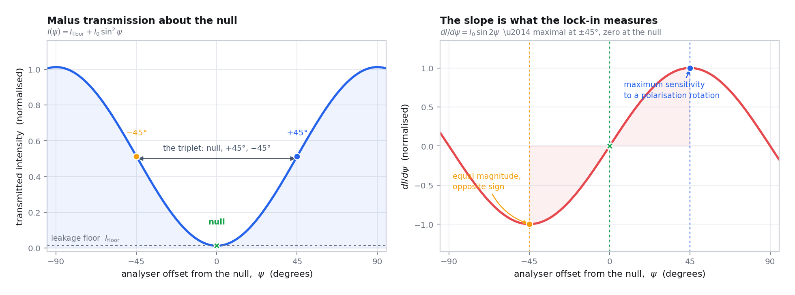
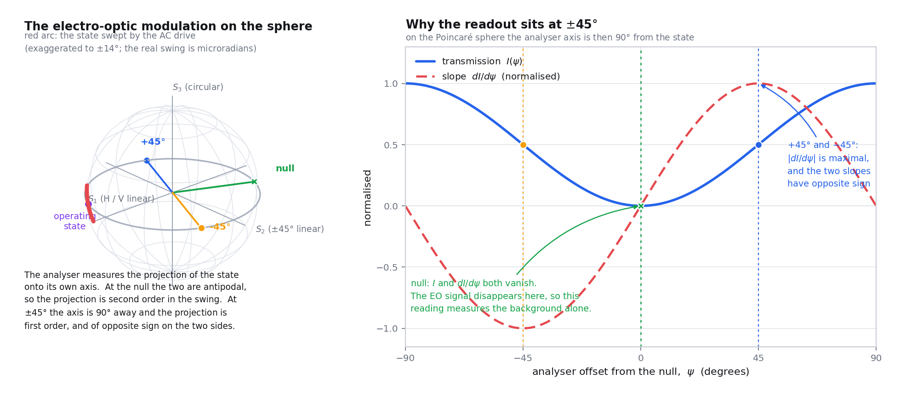
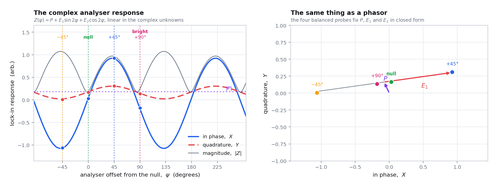

# The Null-Slope Sénarmont Readout

**What this page is for:** the heart of the instrument. How a microradian
polarisation rotation becomes a measurable voltage, where the Sénarmont
arrangement comes from, why the signal at the null vanishes to *second* order
while the signal at 45 degrees is first order, what the noise budget really
says about the best analyser offset, what the three readings of the triplet
are for, and the full chain from lock-in volts to a rotation and, only when
every gate passes, to $\lvert r_\mathrm{eff}\rvert$ with an uncertainty. Read
[02: Polarisation Formalism](02-polarisation.md) first.

> **Symbol.** From here on $\psi$ is the **analyser offset from that pixel's
> null**, matching the code. It is not the ellipse azimuth of the previous page.

**Contents**

| § | Topic |
| --- | --- |
| [1](#1-why-the-static-birefringence-must-be-compensated-first) | why the static birefringence must be compensated first |
| [2](#2-malus-law-in-the-compensated-frame) | Malus' law in the compensated frame |
| [3](#3-where-the-sénarmont-arrangement-comes-from) | where the Sénarmont arrangement comes from |
| [4](#4-what-the-qwp-does-geometrically) | what the QWP does geometrically |
| [5](#5-the-small-signal-expansion-and-why-the-null-is-second-order) | the small-signal expansion |
| [6](#6-why-the-analyser-sits-45-degrees-from-the-null) | why the analyser sits 45 degrees from the null |
| [7](#7-noise-and-the-real-optimum-operating-point) | noise, and the real optimum |
| [8](#8-the-modulation-on-the-sphere) | the modulation on the sphere |
| [9](#9-the-triplet-and-the-balanced-four-point-fit) | the triplet and the four-point fit |
| [10](#10-the-full-complex-model) | the full complex model |
| [11](#11-the-derivative-aligned-rotation) | the derivative-aligned rotation |
| [12](#12-from-lock-in-volts-to-physics) | from lock-in volts to physics |
| [13](#13-error-propagation-and-the-uncertainty-budget) | error propagation |

---

## 1. Why the static birefringence must be compensated first

The BTO film is birefringent with no field applied: it has a static retardance
$\Gamma_0$ and an eigenaxis $\theta_s$, both set by thickness, composition,
strain and domain state, and both different at every pixel and at every
incident polarisation. Light therefore leaves the film **elliptically
polarised**, which is fatal for a naive crossed-polariser measurement, because
**a linear analyser cannot extinguish an elliptical state.**

That is not a rule of thumb; it is
[02 §13](02-polarisation.md#13-orthogonality-is-antipodality). A linear
analyser's Stokes direction $\hat{\mathbf{a}}$ lies on the equator, and by the
projection law it extinguishes only the state at its antipode, which is also
equatorial and therefore linear. An elliptical state sits off the equator and
can never be antipodal to an equatorial point, so the transmitted intensity

$$
I \;=\; \tfrac{1}{2}S_0\left(1 + \hat{\mathbf{a}}\cdot\hat{\mathbf{s}}\right)
\;\ge\; \tfrac{1}{2}S_0\left(1 - \cos 2\chi\right)
\;=\; S_0\sin^2\chi
\tag{1}
$$

has an irreducible floor set by the ellipticity angle $\chi$. Even a modest
$\chi = 5^\circ$ leaves $\sin^2 5^\circ \approx 0.8\ \%$ of the full intensity
on the detector at best extinction, which can sit orders of magnitude above
the detector noise floor.

Why that matters is not aesthetic.

| Consequence | Mechanism |
| --- | --- |
| Noise without signal | leaked light is **unmodulated**, so it contributes shot noise and DC offset while contributing no first-order signal (§7) |
| The model stops applying | the $I(\psi) = I_\mathrm{floor} + I_0\sin^2\psi$ form of §2 and the slope normalisation built on it are valid only if the state reaching the analyser is linear |
| Pixels stop being comparable | the normalisation divides by a measured optical swing, so a pixel with a poor null has a different effective swing and its rotation is not comparable with its neighbours' |

A second, distinct cause of an irreducible floor is **depolarisation**. By
[02 §8](02-polarisation.md#8-degree-of-polarisation), an unpolarised fraction
$1-\mathrm{DOP}$ contributes $\tfrac{1}{2}(1-\mathrm{DOP})S_0$ whatever any
lossless optic does. The two are distinguishable in practice: an ellipticity
floor improves when the compensator is re-nulled, and a depolarisation floor
does not ([`../guide/troubleshooting.md`](../guide/troubleshooting.md)).

The acceptance threshold is **14.5 mV** at the detector
(`--null-check-max-mv`) with a **1.5 mV** continuation margin. Pixels above it
are still measured but are flagged and excluded from trusted seeds, peak
selection, HWP fitting and physics analysis. The gate for reporting
$r_\mathrm{eff}$ is stricter: null leakage $\le 5\,\%$ of the optical swing
(§12).

---

## 2. Malus' law in the compensated frame

With the static birefringence absorbed, the state reaching the analyser is
linear, so it lies on the equator and (1) becomes an exact cosine. Writing
$\psi$ for the analyser offset from the extinction point, and noting that a
physical analyser rotation of $\psi$ moves $\hat{\mathbf{a}}$ by $2\psi$ in
longitude,

$$
I(\psi) \;=\; \tfrac{1}{2}S_0\left[1 + \cos\left(180^\circ + 2\psi\right)\right]
\;=\; S_0\sin^2\psi ,
\tag{2}
$$

and adding the leakage floor that survives imperfect nulling,

$$
\boxed{\;
I(\psi) \;=\; I_\mathrm{floor} \;+\; I_0 \sin^{2}\psi .
\;}
\tag{3}
$$

At $\psi = 0$ the light is extinguished down to $I_\mathrm{floor}$; at
$\psi = 90^\circ$ it is fully transmitted. This is Malus' $\cos^2$ law referred
to the extinction point rather than to the transmission point, which is the
natural choice here because the extinction point is what the calibration
measures.

---

## 3. Where the Sénarmont arrangement comes from

The arrangement is named after Henri Hureau de Sénarmont, the nineteenth
century French mineralogist and crystallographer who used a quarter-wave plate
referred to the incident polarisation to read small retardances off a rotating
analyser [[30]](../references.md#ref-30). It is described in every standard
crystal-optics text [[11]](../references.md#ref-11), and the null-slope variant
used here, applied to thin-film electro-optics, follows Abel
[[31]](../references.md#ref-31), sections 3.3 to 3.4.

Its geometric origin is one sentence on the Poincaré sphere, and it is worth
deriving because the derivation also tells you exactly what the readout
measures.

**Setup.** Let $\hat{\mathbf{s}}_\mathrm{out}$ be the state leaving the sample,
in general elliptical, with azimuth $\psi_o$ and ellipticity angle $\chi_o$.
The quarter-wave plate applies a $90^\circ$ rotation
$\mathbf{R}_Q$ about an equatorial axis $\hat{\mathbf{n}}_Q$
([02 §12](02-polarisation.md#12-a-retarder-is-a-rotation-rodrigues-written-out)).
The analyser then measures the equatorial position of the result.

**The null condition.** Define
$\hat{\mathbf{m}} = \mathbf{R}_Q^{-1}\hat{\mathbf{e}}_3$, where
$\hat{\mathbf{e}}_3$ is the polar axis. For a $90^\circ$ rotation about an
equatorial $\hat{\mathbf{n}}_Q$, Rodrigues gives
$\hat{\mathbf{m}} = \hat{\mathbf{e}}_3\times\hat{\mathbf{n}}_Q$, which is
itself **equatorial**. The compensated state lands on the equator when
$\left(\mathbf{R}_Q\hat{\mathbf{s}}_\mathrm{out}\right)\cdot\hat{\mathbf{e}}_3
= 0$, that is when

$$
\hat{\mathbf{m}}\cdot\hat{\mathbf{s}}_\mathrm{out} \;=\; 0 .
\tag{4}
$$

Since $\hat{\mathbf{m}}$ is equatorial, (4) says the QWP must be rotated until
$\hat{\mathbf{m}}$ is $90^\circ$ of longitude away from the output state's own
azimuth. Such an orientation always exists, which is the geometric reason a
compensator can always be found.

**What is then measured.** Let $u$ be the longitude displacement of the
compensated state produced by a small perturbation
$\delta\hat{\mathbf{s}}_\mathrm{out}$ of the output state. Because
$\mathbf{R}_Q$ is a rigid rotation,

$$
u \;=\; \left(\hat{\mathbf{m}}\times\hat{\mathbf{s}}_\mathrm{out}\right)
\cdot \delta\hat{\mathbf{s}}_\mathrm{out} .
\tag{5}
$$

With (4), $\hat{\mathbf{m}}\times\hat{\mathbf{s}}_\mathrm{out}$ is the unit
**meridional** tangent at $\hat{\mathbf{s}}_\mathrm{out}$, pointing away from
the pole. So

$$
\boxed{\;
u \;=\; -\,\delta\!\left(2\chi_o\right),
\qquad\text{and the measured azimuth rotation is}\quad
\delta \;=\; \tfrac{1}{2}u \;=\; -\tfrac{1}{2}\delta\!\left(2\chi_o\right).
\;}
\tag{6}
$$

**A Sénarmont compensator converts a change of ellipticity into a change of
azimuth, one for one in the sphere coordinates.** That is the whole of it. The
analyser then reads azimuth with a first-order slope (§6), and a quantity that
would otherwise be invisible to any linear analyser becomes the easiest thing
in the world to measure.

> **Corollary, and it is an important one.** A linear analyser is blind at
> first order to a change of *ellipticity*, for any analyser angle: by (1) the
> intensity depends on $\hat{\mathbf{a}}\cdot\hat{\mathbf{s}}$ with
> $\hat{\mathbf{a}}$ equatorial, so only equatorial components of
> $\delta\hat{\mathbf{s}}$ are detected. Without the compensator the
> instrument would be measuring nothing at all at first order, not merely
> measuring it badly.

---

## 4. What the QWP does geometrically

**In Jones terms**, using the chain of
[02 §14](02-polarisation.md#14-the-jones-chain-of-this-instrument), the QWP
angle is chosen so that

$$
W\!\left(\tfrac{\pi}{2},\, q_\mathrm{null}\right)
W\!\left(\Gamma_0,\, \theta_s\right)
\mathbf{J}_\mathrm{in}
\;\propto\;
\begin{pmatrix}\cos\theta_\mathrm{out}\\ \sin\theta_\mathrm{out}\end{pmatrix},
\tag{7}
$$

that is, compensator times sample leaves a **real**, hence linear, Jones
vector. The analyser then goes to $\theta_\mathrm{out} + 90^\circ$ and the beam
extinguishes. The pair $(q_\mathrm{null}, a_\mathrm{null})$ is what the
calibration stores per pixel and per HWP angle.

**On the Poincaré sphere**, §3 gave the condition in one line. The sample
rotates the state about its own eigenaxis, lifting it off the equator by a
latitude $2\chi_o$; the QWP is a quarter-turn about an axis that can be carried
anywhere around the equator, and there is always an orientation whose
quarter-turn brings the state back **down onto the equator**. That is why a
*quarter*-wave plate is the right element: a quarter-turn is exactly enough to
reach the equator from any latitude, and no more than enough.

> **Why the null pair is not one number.** $\Gamma_0$ and $\theta_s$ vary with
> pixel *and* with incident polarisation, so the correct QWP angle does too.
> The software stores a $(q_\mathrm{null}, a_\mathrm{null})$ pair per HWP angle
> and re-verifies it at every pixel, with adaptive re-nulling when the check
> fails ([`../software/architecture.md`](../software/architecture.md)).

The compensator is only a compensator if it really is a quarter-wave plate at
1550 nm. A parallel-analyser QWP sweep measures that directly: for linear input
and a parallel analyser $I_\mathrm{min}/I_\mathrm{max} = \cos^2(\delta/2)$,
which `qwp_retardance_from_parallel_ratio()` inverts. A retardance outside
$90^\circ \pm 10^\circ$ blocks the $r_\mathrm{eff}$ report, because (6) is then
no longer the relation between what the sample did and what the analyser sees.

---

## 5. The small-signal expansion, and why the null is second order

The drive slides the operating point along the transmission curve of (3). With
$\delta(t)$ the instantaneous rotation,

$$
I(\psi, t) \;=\; I_\mathrm{floor} + I_0 \sin^2\!\left(\psi + \delta(t)\right).
\tag{8}
$$

Expanding to second order in $\delta$,

$$
\sin^2\!\left(\psi+\delta\right)
= \sin^2\psi
\;+\; \delta\,\sin 2\psi
\;+\; \delta^{2}\cos 2\psi
\;+\; \mathcal{O}\!\left(\delta^3\right),
\tag{9}
$$

so

$$
\boxed{\;
I(\psi,t) \;=\; \underbrace{I_\mathrm{floor} + I_0\sin^2\psi}_{\text{DC}}
\;+\; \underbrace{I_0\,\delta(t)\,\sin 2\psi}_{\text{first order}}
\;+\; \underbrace{I_0\,\delta(t)^2\cos 2\psi}_{\text{second order}}
\;+\;\dots
\;}
\tag{10}
$$

Now put $\delta(t) = \delta_\mathrm{ac}\cos\omega t$ and use
$\cos^2\omega t = \tfrac{1}{2}\left(1+\cos 2\omega t\right)$. The three
operating points behave completely differently.

| $\psi$ | $\sin 2\psi$ | $\cos 2\psi$ | Signal at $\omega$ | Signal at $2\omega$ |
| --- | --- | --- | --- | --- |
| $0$ (the null) | $0$ | $+1$ | **exactly zero** | $\tfrac{1}{2}I_0\delta_\mathrm{ac}^2$ |
| $+45^\circ$ | $+1$ | $0$ | $+I_0\delta_\mathrm{ac}$ | **exactly zero** |
| $-45^\circ$ | $-1$ | $0$ | $-I_0\delta_\mathrm{ac}$ | **exactly zero** |
| $90^\circ$ | $0$ | $-1$ | **exactly zero** | $-\tfrac{1}{2}I_0\delta_\mathrm{ac}^2$ |

Four results, all of which the instrument uses.

1. **The null is second order.** The first-order term carries the factor
   $\sin 2\psi$, which vanishes at $\psi = 0$. This is not an approximation:
   [02 §14](02-polarisation.md#14-the-jones-chain-of-this-instrument) proved it
   exactly from the triple product
   $\hat{\mathbf{s}}\cdot(\hat{\mathbf{n}}\times\hat{\mathbf{s}}) = 0$,
   independently of $\Gamma_0$, $\theta_s$ or the drive amplitude. **Whatever
   the lock-in reads at the null is therefore, by construction, not the
   first-order optical signal.**
2. **The second-order term vanishes at $\pm 45^\circ$**, because
   $\cos 2\psi = 0$ there. The quadrature points are not only the steepest
   points but also the points where the leading optical non-linearity
   disappears, so the response there is purely first order out to
   $\mathcal{O}(\delta^3)$. A lock-in at $2\omega$ parked at $\pm45^\circ$
   should see nothing, which is a free systematic check.
3. **Second-harmonic detection at the null is possible but hopeless.** The
   ratio of the $2\omega$ signal at the null to the $\omega$ signal at
   $45^\circ$ is $\tfrac{1}{2}\delta_\mathrm{ac}$. For a microradian rotation
   that is $5\times10^{-7}$, so the null-harmonic route is six to seven orders
   of magnitude weaker. This is why the instrument reads first order at
   $\pm45^\circ$ and treats the null purely as a background measurement.
4. **The sign reverses between $+45^\circ$ and $-45^\circ$**, because
   $\sin 2\psi$ is odd. §6 makes that the instrument's strongest self-check.

---

## 6. Why the analyser sits 45 degrees from the null

Differentiating (3),

$$
\Delta I \;\approx\; \frac{dI}{d\psi}\,\delta,
\qquad
\frac{dI}{d\psi} \;=\; I_0 \sin 2\psi .
\tag{11}
$$

*Figure 1. The operating point, in one picture.* The upper trace is
$I(\psi) = I_\mathrm{floor} + I_0\sin^2\psi$, the lower its derivative
$I_0\sin 2\psi$. The marked points at $\psi = \pm45^\circ$ sit where the
transmission is steepest and the derivative reaches $\pm I_0$: maximum
conversion of polarisation rotation into intensity change. Note where the
derivative is **zero**, at the null ($\psi = 0$) and at full brightness
($\psi = 90^\circ$). Sitting at either is the worst thing you can do, since a
first-order rotation then gives no first-order intensity change at all. Note
too that the derivative has *opposite sign* at $+45^\circ$ and $-45^\circ$;
that reversal is the instrument's strongest self-check.

Three consequences drive the entire software design.

**(1) Read out at $\psi = \pm45^\circ$.** $\lvert\sin 2\psi\rvert$ is maximal
there, so at fixed $\delta$ the first-order lock-in signal is maximal there.
§7 asks whether maximal *signal* is the same as maximal signal-to-noise, and
the answer is more interesting than it looks.

**(2) The sign flips between $+45^\circ$ and $-45^\circ$.** $\sin 2\psi$ is
odd, so a genuine optical rotation gives opposite-signed responses at the two
slope points, and anything that does *not* flip is not a polarisation
rotation. That covers capacitive or inductive pickup of the 30 kHz drive into
the detector cable, lock-in input or ground loop; residual laser amplitude
modulation at the drive frequency; and total-transmission modulation such as
electro-absorption or a thermal effect, which scales the whole curve instead
of sliding along it. The difference of the two readings rejects all of it as
common mode; their sum measures it. A failure raises `plus_minus_same_sign`,
and this "does it change sign?" test is the single most convincing piece of
evidence that you are measuring light and not crosstalk.

**(3) At the null the first-order optical signal vanishes.** From §5, whatever
the lock-in reads there is the contaminating background, and it is subtracted.

> **Be precise about what the null reading is.** It is tempting to call it "the
> pickup", and `pickup_mag_V` survives as a backwards-compatible alias. But an
> analyser-independent term can also contain genuine total-transmission
> modulation, residual laser modulation, residual dichroism, QWP retardance
> error or detector offsets, so the current code names it
> **`analyser_independent_mag_V`**, meaning "everything whose size does not
> depend on the analyser angle", rather than asserting a mechanism.

---

## 7. Noise, and the real optimum operating point

Maximum signal is not automatically maximum signal-to-noise, because at
$\psi = \pm45^\circ$ half the optical swing is on the detector and it brings
its shot noise with it. This section does the calculation properly, because
the answer justifies a design choice rather than merely agreeing with it.

### 7.1 The three noise terms

| Source | Scaling with the DC level $I(\psi)$ | Notes |
| --- | --- | --- |
| Detector and amplifier noise | independent of $I$ | Johnson noise of the transimpedance resistor, amplifier voltage and current noise, dark current [[35]](../references.md#ref-35) |
| Shot noise | $\propto \sqrt{I}$ | $i_n = \sqrt{2qI_\mathrm{ph}}$ per unit bandwidth [[34]](../references.md#ref-34) |
| Relative intensity noise | $\propto I$ | laser amplitude noise, and any common-mode modulation |

Writing the DC level in units of the swing, $I(\psi)/I_0 = f + \sin^2\psi$
where $f = I_\mathrm{floor}/I_0$ is the **leakage fraction**, the
signal-to-noise ratio at the drive frequency is

$$
\mathrm{SNR}(\psi) \;=\;
\frac{I_0\,\delta\,\lvert\sin 2\psi\rvert}
{\sqrt{\;\sigma_\mathrm{det}^2 \;+\; \kappa\left(f + \sin^2\psi\right) \;+\; \eta^2\left(f+\sin^2\psi\right)^2\;}} ,
\tag{12}
$$

with $\kappa$ setting the shot-noise scale and $\eta$ the relative intensity
noise. The three regimes give three different answers.

### 7.2 Detector-noise-limited: 45 degrees is optimal

If $\sigma_\mathrm{det}$ dominates, the denominator of (12) is constant and

$$
\mathrm{SNR} \;\propto\; \lvert\sin 2\psi\rvert,
\qquad \psi_\mathrm{opt} = \pm 45^\circ .
\tag{13}
$$

The maximum-slope point and the maximum-SNR point coincide.

### 7.3 Shot-noise-limited: the optimum moves toward the null

If shot noise dominates, maximise
$g(\psi) = \sin^2 2\psi/\left(f+\sin^2\psi\right)$. Substituting
$u = \sin^2\psi$ and using $\sin^2 2\psi = 4u(1-u)$,

$$
g(u) = \frac{4u(1-u)}{f+u},
\qquad
\frac{dg}{du} = 0 \;\Longrightarrow\; u^2 + 2fu - f = 0 ,
\tag{14}
$$

so

$$
\boxed{\;
\sin^2\psi_\mathrm{opt} \;=\; \sqrt{f^2+f}\;-\;f
\;\;\xrightarrow[f \ll 1]{}\;\; \sqrt{f} .
\;}
\tag{15}
$$

With a perfect null, $f \to 0$, the optimum runs all the way to $\psi \to 0$:
in the shot-noise limit you should sit as close to extinction as the leakage
allows. Real leakage stops that. Putting the instrument's own numbers into
(15), with the swing $A_\mathrm{opt}$ taken as 1 V so that the 14.5 mV
acceptance threshold and the 5 % gate become leakage fractions:

| Leakage $f$ | Source of the number | $\psi_\mathrm{opt}$ | $\mathrm{SNR}(\psi_\mathrm{opt})/\mathrm{SNR}(45^\circ)$ |
| --- | --- | --- | --- |
| $0.0145$ | the 14.5 mV null acceptance against a 1 V swing | $19.1^\circ$ | $1.27$ |
| $0.05$ | the $r_\mathrm{eff}$ leakage gate | $25.0^\circ$ | $1.19$ |
| $0.20$ | a poor null | $32.6^\circ$ | $1.08$ |

So even in a purely shot-noise-limited instrument, moving from $45^\circ$ to
the true optimum would buy between about 8 % and 27 % in signal-to-noise. **That is
not enough to justify it**, for four reasons that have nothing to do with
noise.

1. **The sign-reversal test is lost.** At $\pm45^\circ$ the two readings have
   equal magnitude and opposite sign, so their sum is a clean measure of the
   contamination and their difference a clean measure of the signal. At an
   asymmetric offset the decomposition is no longer balanced.
2. **The second-order term returns.** By §5 the $\cos 2\psi$ term vanishes only
   at $\pm45^\circ$. At $19^\circ$ it is $\cos 38^\circ = 0.79$ of full size.
3. **Sensitivity to null drift increases sharply.** Near the optimum of (15)
   the slope $\sin2\psi$ is changing fastest with $\psi$, so an error in the
   stored $a_\mathrm{null}$ translates into a proportionally larger error in
   the assumed slope. At $45^\circ$ the slope is stationary, and a
   $\pm1^\circ$ placement error costs only $1-\cos2^\circ \approx 0.06\ \%$.
4. **The optimum depends on $f$, which varies pixel to pixel.** Following it
   would mean a different operating point at every pixel, and therefore a
   different systematic at every pixel, across a chip whose entire purpose is
   cross-pixel comparison.

> **Conclusion.** $\pm45^\circ$ is chosen because it is the stationary point of
> the slope, because it is the point where the second-order term vanishes, and
> because it is the same point at every pixel. It is the *robust* optimum, and
> the noise penalty for preferring robustness is at most a few tens of percent.

### 7.4 Which regime is this instrument actually in?

Enough of the chain is fixed to estimate it
([`../experiment/instruments.md`](../experiment/instruments.md)). The detector
is a PDA30B2 at 10 dB gain into a high impedance, responsivity 0.875 A/W at
1550 nm, transimpedance $4.75\times10^3$ V/A
[[37]](../references.md#ref-37). The lock-in is a DSP7230 with a 500 ms time
constant and a 12 dB per octave output filter
[[36]](../references.md#ref-36); for a two-pole filter the equivalent noise
bandwidth is [[33]](../references.md#ref-33)

$$
B_\mathrm{eq} \;=\; \frac{1}{8\tau} \;=\; \frac{1}{8 \times 0.5\ \mathrm{s}} \;=\; 0.25\ \mathrm{Hz}.
\tag{16}
$$

Taking the illustrative 1 V swing, the DC level at $\psi = 45^\circ$ is about
0.5 V, so the photocurrent is $0.5/4750 = 105\ \mathrm{\mu A}$ and

$$
i_\mathrm{shot} = \sqrt{2qI_\mathrm{ph}} = 5.8\ \mathrm{pA}/\sqrt{\mathrm{Hz}},
\qquad
v_\mathrm{shot} = 27.6\ \mathrm{nV}/\sqrt{\mathrm{Hz}},
\tag{17}
$$

which in the 0.25 Hz noise bandwidth is about **14 nV RMS**. Against the
$1\ \mathrm{\mu V}$ signal of a microradian rotation
([02 §15.3](02-polarisation.md#15-a-worked-example-in-the-instruments-own-numbers)),
that is a per-point signal-to-noise ratio of order **70**.

> **Note.** Equation (17) is an order-of-magnitude estimate, not a
> specification. Whether the instrument is genuinely shot-noise limited depends
> on the detector's own noise at this gain, which must be taken from its
> datasheet and compared against (17) rather than assumed. The structural
> conclusion of §7.3 does not depend on which term wins: in the
> detector-limited regime $\pm45^\circ$ is exactly optimal, and in the
> shot-limited regime it is within a few tens of percent of optimal.

---

## 8. The modulation on the sphere

*Figure 2. What the drive actually does to the polarisation state.* **Q** is
the compensated, linear state reaching the analyser, on the equator (see
[02 Figure 2](02-polarisation.md#10-the-poincaré-sphere)). The 30 kHz drive
modulates the sample's retardance by $\Gamma_\mathrm{ac}$, rocking the state
along the short arc drawn through **Q**, exaggerated by many orders of
magnitude since the real excursion is microradians. The analyser's Stokes
direction $\hat{\mathbf{a}}$ is the antipode of **Q**, and the detected
intensity $\propto 1 + \hat{\mathbf{a}}\cdot\hat{\mathbf{s}}$ responds only to
the component of the arc *along* $\hat{\mathbf{a}}$. At the null the arc is
perpendicular to $\hat{\mathbf{a}}$, so the response is second order, which is
why the signal vanishes there. Rotating the analyser by $\pm45^\circ$ swings
$\hat{\mathbf{a}}$ by $\pm90^\circ$ of longitude, aligning it with the arc; the
two choices align with **opposite ends** of it, which is the sign reversal of
§6 seen geometrically.

---

## 9. The triplet, and the balanced four-point fit

Those three readings, null, exactly $+45^\circ$ and exactly $-45^\circ$, are
the **triplet**. Three lock-in acquisitions per incident polarisation buy four
things at once.

| Reading | What it contributes |
| --- | --- |
| null ($\psi = 0$) | the analyser-independent background phasor for subtraction, and the DC null level $V_\mathrm{null}$ used by the normalisation |
| $+45^\circ$ | a maximum-slope signed measurement, plus its DC level |
| $-45^\circ$ | the opposite-slope partner, giving common-mode rejection and the sign-opposition check, plus its DC level |

The three DC levels also give the **local Malus slope** directly, so no slow
analyser scan is needed to calibrate the conversion. The normalisation is
measured at the same moment and place as the signal, which is what makes the
fast map fast ([`../software/data-pipeline.md`](../software/data-pipeline.md)).

### 9.1 The exactly-determined triplet solution

The model to be solved is the one derived in §10,
$Z(\psi) = P + E_1\sin 2\psi + E_2\cos 2\psi$, with the DC channel obeying the
same functional form. Three probes and three unknowns leave **no residual
degrees of freedom**, so `joint_senarmont_triplet()` solves it in closed form
by elimination rather than by fitting:

$$
C_0 = \tfrac{1}{2}(V_{+} + V_{-}), \quad
C_s = \tfrac{1}{2}(V_{+} - V_{-}), \quad
C_c = V_{0} - C_0 ,
\tag{18}
$$
$$
P = \tfrac{1}{2}(Z_{+} + Z_{-}), \quad
E_1 = \tfrac{1}{2}(Z_{+} - Z_{-}), \quad
E_2 = Z_{0} - P .
\tag{19}
$$

This is a *verification calculation*, not a fit, so it reports no $R^2$. Its
quality indicators are the derivative-residual fraction of §11 and the DC
balance error $\lvert V_+ - V_-\rvert$ relative to the fringe half-swing.

### 9.2 The balanced four-point design

On the calibration pixel a fourth probe at $\psi = 90^\circ$ is added, so the
system becomes over-determined and can be fitted and scored. The design matrix
over the four probes, with rows
$\left[\,1,\ \sin 2\psi,\ \cos 2\psi\,\right]$, is

$$
\mathbf{A} \;=\;
\begin{pmatrix}
1 & 0 & 1 \\
1 & 1 & 0 \\
1 & -1 & 0 \\
1 & 0 & -1
\end{pmatrix}
\quad\text{for}\quad
\psi \in \left\{0^\circ,\ +45^\circ,\ -45^\circ,\ +90^\circ\right\}.
\tag{20}
$$

This design is **orthogonal**, which is the reason those four angles are the
ones chosen:

$$
\mathbf{A}^\mathsf{T}\mathbf{A} \;=\; \mathrm{diag}\left(4,\, 2,\, 2\right),
\tag{21}
$$

so the least-squares solution needs no matrix inversion at all:

$$
\boxed{\;
P = \tfrac{1}{4}\left(Z_0 + Z_+ + Z_- + Z_{90}\right), \quad
E_1 = \tfrac{1}{2}\left(Z_+ - Z_-\right), \quad
E_2 = \tfrac{1}{2}\left(Z_0 - Z_{90}\right).
\;}
\tag{22}
$$

Four probes and three parameters leave exactly **one** residual degree of
freedom, and the null space of $\mathbf{A}^\mathsf{T}$ is one-dimensional,
spanned by $\tfrac{1}{2}(1,-1,-1,1)$. The entire residual is therefore the
single **balance combination**

$$
\mathcal{R} \;=\; \tfrac{1}{2}\left(Z_0 - Z_+ - Z_- + Z_{90}\right),
\tag{23}
$$

which any data obeying the model must return as zero. It is the cleanest
possible consistency check: one complex number, with a known expected value of
zero and a known noise scale.

For noise $\sigma_Z$ that is independent and identical on each probe, the
covariance of the estimates follows from (21)
[[44]](../references.md#ref-44):

$$
\mathrm{Cov} \;=\; \sigma_Z^2\left(\mathbf{A}^\mathsf{T}\mathbf{A}\right)^{-1}
= \sigma_Z^2\,\mathrm{diag}\!\left(\tfrac{1}{4},\ \tfrac{1}{2},\ \tfrac{1}{2}\right),
\qquad
\sigma_{E_1} = \sigma_{E_2} = \frac{\sigma_Z}{\sqrt2}.
\tag{24}
$$

§13 turns (24) into an uncertainty on the reported rotation.

---

## 10. The full complex model

The lock-in returns a **phasor**, not a magnitude: in-phase $X$ and quadrature
$Y$. The phase carries the sign of the electro-optic response, which is what
tells you which way the domains point, so the code always records $X$ and $Y$
and averages in Cartesian space. Averaging magnitudes rectifies noise and
biases small signals upward; never do it
[[32]](../references.md#ref-32).

For an ideal rotating linear analyser and a linear detector, the most general
first-harmonic response is

$$
Z(\psi) \;=\; P \;+\; E_1 \sin 2\psi \;+\; E_2 \cos 2\psi ,
\tag{25}
$$

with $P, E_1, E_2$ all **complex**. The form is not arbitrary. Equation (10)
says the intensity modulation is $I_0\,\delta\,\sin 2\psi$ about an operating
point whose own placement may be in error by $\varphi/2$, and any
analyser-independent contamination adds a constant. Writing that physically
motivated model as
$Z(\psi) = P + \hat{e}A\sin\left(2\psi + \varphi\right)$, where $\hat{e}$ is
the unit electro-optic phasor direction, $A$ the amplitude and $\varphi$ the
null-placement error, and expanding the sine, gives exactly (25). The
advantage of (25) is that it is **linear in its unknowns**, so the fit is a
plain complex linear least squares over the design matrix
$[\,1,\ \sin 2\psi,\ \cos 2\psi\,]$: no non-linear optimiser, no starting
guess, no local minima [[43]](../references.md#ref-43).

### 10.1 Closed-form single-axis factorisation

`fit_sinusoid_response()`, with four or more analyser probes, recovers the
single-axis factorisation analytically. Since
$E_1^2 + E_2^2 = \left(\hat{e}A\right)^2$ regardless of $\varphi$,

$$
\hat{e} = e^{i\phi_e}, \qquad
\phi_e = \tfrac{1}{2}\,\mathrm{atan2}\!\left(\mathrm{Im}\left(E_1^2+E_2^2\right),\ \mathrm{Re}\left(E_1^2+E_2^2\right)\right),
\tag{26}
$$

and projecting onto that axis with $a = \mathrm{Re}(E_1\hat{e}^{*})$,
$b = \mathrm{Re}(E_2\hat{e}^{*})$ gives

$$
A = \sqrt{a^2 + b^2}, \qquad
\varphi = \mathrm{atan2}(b, a), \qquad
\psi^{*} = \frac{\pm 90^\circ - \varphi}{2}.
\tag{27}
$$

*Figure 3. The complex analyser response $Z(\psi) = P + E_1\sin2\psi + E_2\cos2\psi$.*
Both quadratures are plotted against analyser offset with the fitted model
through them. The **offset** of the pair away from zero is $P$, the
analyser-independent term, the part that does not oscillate with $\psi$. The
**oscillating part** is the electro-optic response: a sinusoid in $2\psi$, so
it completes a full cycle over $180^\circ$ of analyser rotation, with its
extrema $\psi^{*}$ at peak and anti-peak. In a well-nulled pixel those land
within a couple of degrees of $\pm45^\circ$; a large displacement means the
null-placement error $\varphi$ is large, that is, the analyser zero is stale.
The scatter about the curve is the lock-in noise floor for the chosen time
constant.

### 10.2 Diagnostics that matter more than $R^2$

| Diagnostic | Meaning | Use |
| --- | --- | --- |
| `quadrature_fraction` | electro-optic energy **off** the fitted single axis | a single scalar rotation must lie on one axis; a large value means two mechanisms with different temporal phases |
| `temporal_rank_fraction` | second singular value over first, for the $2\times2$ matrix of the real and imaginary parts of $(E_1, E_2)$ | tests directly whether $E_1$ and $E_2$ share a common temporal phase, that is, whether the single-axis factorisation is legitimate at all |
| `analyser_independent_mag_V` | $\lvert P\rvert$ | how much of the reading does not depend on the analyser |

The rank test is worth spelling out, because it is the sharpest statement of
what "one mechanism" means. Assemble

$$
\mathbf{T} \;=\;
\begin{pmatrix}
\mathrm{Re}\,E_1 & \mathrm{Re}\,E_2 \\
\mathrm{Im}\,E_1 & \mathrm{Im}\,E_2
\end{pmatrix}.
\tag{28}
$$

If $E_1$ and $E_2$ share a temporal phase, both columns are real multiples of
the same two-vector, so $\mathbf{T}$ has rank one and its second singular value
is zero [[45]](../references.md#ref-45). The reported
`temporal_rank_fraction` is $\sigma_2/\sigma_1$, and a value well above the
noise says the data contain two temporally distinct mechanisms and that no
single-axis factorisation of them is meaningful.

> **Note the epistemic discipline.** The unrestricted three-coefficient fit is
> done *first*; the single-axis factorisation is accepted only if the
> temporal-rank test says the data support it.

---

## 11. The derivative-aligned rotation

### 11.1 The DC fringe

The DC detector level is fitted independently over the same probes with

$$
D(\psi) \;=\; C_0 \;+\; C_c \cos 2\psi \;+\; C_s \sin 2\psi ,
\tag{29}
$$

exactly equivalent to $D(\psi) = V_\mathrm{min} + A\sin^2(\psi-\psi_0)$ but
linear in its coefficients. Inverting gives

$$
\psi_0 = \tfrac{1}{2}\mathrm{atan2}\left(-C_s,\, -C_c\right),
\qquad
\psi_\pm = \psi_0 \pm 45^\circ,
\qquad
V_{\mathrm{min},\mathrm{max}} = C_0 \mp \sqrt{C_c^2+C_s^2}.
\tag{30}
$$

Here $\psi_0$ is the fitted extinction point and $\psi_\pm$ the two
maximum-slope, or Sénarmont quadrature, points, where the normalised fringe
fraction is exactly $0.5$. Note for §13 that the half-swing is
$\sqrt{C_c^2+C_s^2} = A_\mathrm{opt}/2$.

### 11.2 Projecting the AC response onto the DC derivative

For an ideal scalar Sénarmont rotation the AC response is nothing but the DC
fringe being slid sideways:

$$
Z - P \;=\; \delta\psi \cdot \frac{dD}{d\psi},
\qquad
\frac{dD}{d\psi} = -2C_c\sin 2\psi + 2C_s\cos 2\psi .
\tag{31}
$$

Matching coefficients, $E_2 \leftrightarrow 2C_s$ and
$E_1 \leftrightarrow -2C_c$, and solving in the least-squares sense gives the
closed form implemented in `joint_senarmont_from_fits()`:

$$
\boxed{\;
\delta\psi \;=\; \frac{2C_s E_2 \;-\; 2C_c E_1}{4\left(C_c^2 + C_s^2\right)},
\qquad
\Gamma \;=\; 2\,\delta\psi .
\;}
\tag{32}
$$

Equation (32) is the projection of the vector $(E_1, E_2)$ onto the derivative
direction $\mathbf{d} = \left(-2C_c,\ 2C_s\right)$, normalised by
$\lvert\mathbf{d}\rvert^2$, which is why it is a least-squares solution and
not merely a ratio.

$\delta\psi$ is complex, and it is the physical rotation in radians RMS. The
optical throughput has already divided out, because the same $C_c, C_s$ that
scale the numerator also scale the denominator. Whatever part of $(E_1, E_2)$
is **orthogonal** to $\mathbf{d}$ cannot be a scalar rotation; it is retained
as `derivative_residual_fraction` and treated as contamination.

> **Why $\Gamma = 2\delta\psi$, and when.** §3 derived it: the compensator
> converts a change in the output state's ellipticity into an equal change of
> longitude, and longitude is twice azimuth, so a retardance change $\Gamma$
> between the sample's eigenaxes appears as an azimuth rotation of
> $\Gamma/2$. The step from "the sample's retardance changed by $\Gamma$" to
> "the output ellipticity changed by $\Gamma$" is exact only in the ideal
> Sénarmont configuration, with the incident polarisation at $45^\circ$ to the
> sample's own eigenaxis and a small static retardance. Outside that limit the
> conversion carries geometric factors derived in
> [04 §3](04-incident-polarisation.md#3-the-2theta-dependence-derived). This is
> why `geometry_confirmed` is an explicit human-set flag, not an assumption.

### 11.3 Why the operating angle comes from the DC fringe, never the AC extremum

The complex fit returns its own extrema $\psi^{*}$. **They are never
followed.** The operating angle is always the **DC** half-fringe,
$\psi_0 \pm 45^\circ$, because a raw lock-in maximum is not evidence of correct
optical bias: any analyser-independent contamination, whether pickup, laser
modulation or total-transmission modulation, shifts where $\lvert Z\rvert$
peaks without moving where the *optical slope* is steepest. Chasing the AC
extremum would let contamination steer the instrument, self-confirmingly,
because the contaminated point looks "strong".

The displacement between the two is used instead as a **diagnostic**,
`ac_extremum_shift_from_dc_quadrature_deg`. With
`derivative_residual_fraction` and the DC half-fringe tolerance (0.075
normalised) it reports how contaminated the reading is, rather than silently
moving the measurement onto the contamination.

---

## 12. From lock-in volts to physics

Raw lock-in volts are not a material property: they carry laser power, fibre
coupling, focus quality, detector gain, null depth and analyser placement,
every one of which drifts over a map. This chain removes all of them.

### Step 1: Malus normalisation

From the DC detector levels at the readout point and at the null,

$$
A_\mathrm{opt} \;=\; \frac{V_\mathrm{dc}(\psi) - V_\mathrm{null}}{\sin^{2}\psi},
\qquad
\frac{dV_\mathrm{dc}}{d\psi} \;=\; -A_\mathrm{opt}\sin 2\psi .
\tag{33}
$$

The complex lock-in response is divided first by the detector AC/DC gain ratio
$G_\mathrm{AC}/G_\mathrm{DC}$, converting the lock-in channel's volts into the
DC channel's equivalent volts, then by this derivative. The result is the
complex RMS **rotation** $\delta$ in radians: dimensionless and throughput
independent. Several slope rows combine by derivative-weighted least squares,

$$
\delta \;=\; \frac{\sum_k d_k Z_k}{\sum_k d_k^2},
\qquad d_k = \left.\frac{dV_\mathrm{dc}}{d\psi}\right|_{\psi_k},
\tag{34}
$$

which is the minimum-variance combination when the noise on each row is the
same [[44]](../references.md#ref-44).

`derive_rotation_observation()` admits a row only if all of these hold:

| Gate | Value | Rationale |
| --- | --- | --- |
| `slope_side` recognised | `plus45`, `minus45`, `learned_anchor`, `learned_opposite` | the row must be a defined slope point |
| no disqualifying flag | not `lockin_overload`, `lockin_range_exceeded`, `s9_operating_point_failed` | saturated or mis-biased rows are not data |
| QWP offset from null | $\le 3^\circ$ | compensation still valid, eq. (4) |
| analyser quadrature error | $\lvert\,\lvert\psi\rvert - 45^\circ\rvert \le 15^\circ$ | still near maximum slope |
| $\sin^2\psi$ | $\ge 0.02$ | never divide by a vanishing denominator in (33) |
| optical swing | $> 0$ | a negative swing means a broken null reference |
| background | a measured null phasor **or** genuinely opposing slopes | a single raw phasor cannot distinguish an optical response from pickup |

Each admitted row also yields
$\text{null leakage} = V_\mathrm{null}/\left(V_\mathrm{null} + A_\mathrm{opt}\right)$,
whose maximum over the group feeds the 5 % gate in Step 3.

> **On the minus sign.** §6 wrote the idealised slope as $+I_0\sin 2\psi$; the
> code carries $-A_\mathrm{opt}\sin 2\psi$, because the rotator encoder's sense
> of increasing $\psi$ is opposite to the idealised model's, exactly the sign
> discussed at
> [02 §14](02-polarisation.md#14-the-jones-chain-of-this-instrument). The two
> differ only by an overall sign, which propagates into the reported *phase* of
> $\delta$ and not into its magnitude, which is why the material result exposed
> by the module is $\lvert r_\mathrm{eff}\rvert$. Signs are always interpreted
> *relative* to another reading, the $\pm45^\circ$ pair or the saturation axis
> of a hysteresis loop, never absolutely.

> **This is the correct cross-pixel observable.** Because the optical and
> electronic chain is shared across pixels, normalised rotations are comparable
> from pixel to pixel, and hence across the compositional gradient, with no
> absolute calibration whatsoever. Raw microvolts are not.

### Step 2: voltage linearity

$\delta$ is fitted against the device RMS voltage, per HWP angle. For a
zero-offset sine,

$$
V_\mathrm{rms} \;=\; \frac{V_\mathrm{pp}}{2\sqrt{2}} ,
\tag{35}
$$

which is why "confirm sine drive" is an explicit checkbox: the conversion is
false for any other waveform and for any drive carrying a DC offset. With
three or more voltage levels the fit has a free intercept, itself informative
as an offset that does not scale with drive, and the gate is $R^2 \ge 0.98$.

Failing it means the response is not linear in field, so it is not purely a
Pockels effect ([01 §2](01-electro-optics.md#2-why-inversion-symmetry-matters)).
Candidates are a quadratic-electro-optic or electrostrictive contribution,
saturation, or a drive not reaching the device. With fewer than three levels
the slope is still computed but the status becomes
`calculated_linearity_unverified`.

### Step 3: the effective coefficient and its gates

For confirmed ideal Sénarmont geometry ($\Gamma = 2\delta$) and in-plane field
$E = \alpha V_\mathrm{device}/g$, inverting (17) of
[01](01-electro-optics.md#6-from-field-to-retardation) gives

$$
\boxed{\;
\lvert r_{\mathrm{eff}} \rvert
\;=\;
\frac{2\,\lambda\, g}{\pi\, n^{3}\, \alpha\, t}
\left\lvert \frac{d\delta_{\mathrm{rms}}}{dV_{\mathrm{device,rms}}} \right\rvert .
\;}
\tag{36}
$$

It is emitted **only** when every one of the following holds. If any fails,
the run records exactly which in `r_eff_status` and reports the rotation alone.

| Gate | Requirement | Why it is hard, and why it matters |
| --- | --- | --- |
| `geometry_confirmed` | explicitly set | the factor $\Gamma = 2\delta$ is geometry-dependent (§11.2) |
| `sine_drive_confirmed` | explicitly set | eq. (35) holds only for a zero-offset sine |
| `lab_angle_mapping_trusted` | not `False` | an untrusted $\theta_i$ mapping invalidates the angular physics |
| QWP retardance | within $90^\circ \pm 10^\circ$ | otherwise it is not a Sénarmont compensator (§4) |
| $\lambda$ | measured, in nm | enters linearly |
| $t$ (film thickness) | traceable, with an uncertainty | enters linearly |
| $g$ (electrode gap) | **measured**, not nominal | enters linearly |
| $\alpha$ (field correction) | FEM of *this* electrode geometry | not transferable between devices; the largest systematic [[29]](../references.md#ref-29) |
| $n$ | a parameter, not a constant (2.1 is a reasonable default) | enters as $n^3$ |
| $V_\mathrm{device}/V_\mathrm{source}$ | measured at 30 kHz with the device connected | cable and loading losses are real |
| $G_\mathrm{AC}/G_\mathrm{DC}$ | measured | if the detector's 30 kHz and DC transfers differ and you assume 1, everything scales wrongly |
| voltage linearity | $R^2 \ge 0.98$ with three or more levels | proves the response is linear electro-optic |
| null leakage | $\le 5\,\%$ | proves the Malus model of §2 applies |

> **Why the software would rather print nothing.** A plausible-looking
> $r_\mathrm{eff}$ built on an assumed $\alpha$ is worse than no number,
> because it will be quoted, compared with the literature, and believed.
> Refusing, and naming the missing input, is the honest behaviour.

Even when it is emitted, $\lvert r_\mathrm{eff}\rvert$ is a
**geometry-specific effective coefficient**, never an intrinsic tensor element:
see [01 §9](01-electro-optics.md#9-why-the-answer-is-always-an-effective-coefficient).

---

## 13. Error propagation and the uncertainty budget

### 13.1 From lock-in noise to a rotation uncertainty

Treat the DC coefficients $C_c, C_s$ as exact, which is justified because the
DC channel has a far larger signal-to-noise ratio than the lock-in channel,
and propagate the covariance (24) through the projection (32). Writing
$\mathbf{d} = (-2C_c,\ 2C_s)$ and $\mathbf{E} = (E_1, E_2)$, equation (32) is
$\delta\psi = \mathbf{d}\cdot\mathbf{E}/\lvert\mathbf{d}\rvert^2$, so

$$
\mathrm{Var}\left(\delta\psi\right)
= \frac{\mathbf{d}^\mathsf{T}\,\mathrm{Cov}(\mathbf{E})\,\mathbf{d}}{\lvert\mathbf{d}\rvert^4}
= \frac{\sigma_Z^2}{2\,\lvert\mathbf{d}\rvert^{2}} .
\tag{37}
$$

With $\lvert\mathbf{d}\rvert = 2\sqrt{C_c^2+C_s^2} = A_\mathrm{opt}$ from
(30),

$$
\boxed{\;
\sigma_{\delta} \;=\; \frac{\sigma_Z}{\sqrt{2}\;A_\mathrm{opt}} .
\;}
\tag{38}
$$

The same result holds for the exactly-determined triplet at a well-placed
null, where $C_s = 0$ by (30) and the propagation gives
$\sigma_\delta = \sigma_Z/\left(2\sqrt2\,\lvert C_c\rvert\right)$, identical to
(38).

Equation (38) is worth reading twice. **The rotation uncertainty is the lock-in
voltage noise divided by the optical swing**, and nothing else. It does not
depend on the drive amplitude, on the material, or on how large the signal is.
Doubling the light on the detector halves the rotation noise floor, which is
why focus quality and coupling are treated as first-class quantities by the
alignment routines ([`../software/motion-control.md`](../software/motion-control.md)).

Putting in §7.4's estimate, $\sigma_Z \approx 14$ nV and
$A_\mathrm{opt} = 1$ V,

$$
\sigma_\delta \;\approx\; 10\ \mathrm{nrad}\ \text{per acquisition},
$$

so a microradian rotation is measured to about 1 % per point before any
averaging.

### 13.2 From the rotation to the coefficient

Equation (36) is a product of powers, so the relative variances add in
quadrature with the exponents squared:

$$
\left(\frac{\sigma_{r}}{r}\right)^{2}
=
\left(\frac{\sigma_\lambda}{\lambda}\right)^{2}
+ \left(\frac{\sigma_g}{g}\right)^{2}
+ \left(\frac{\sigma_\alpha}{\alpha}\right)^{2}
+ \left(\frac{\sigma_t}{t}\right)^{2}
+ 9\left(\frac{\sigma_n}{n}\right)^{2}
+ \left(\frac{\sigma_m}{m}\right)^{2},
\tag{39}
$$

where $m = d\delta_\mathrm{rms}/dV_\mathrm{device,rms}$ is the fitted slope of
Step 2 and the factor 9 is the square of the exponent 3 on $n$. This is what
the software propagates, and it is worth noticing what it implies.

| Input | Exponent | Typical status | Comment |
| --- | --- | --- | --- |
| $\lambda$ | 1 | known to much better than 1 % | negligible |
| $g$ | 1 | measured optically | few percent |
| $t$ | 1 | traceable with an uncertainty | few to ten percent |
| $n$ | **3** | a parameter, not a measurement | a 2 % error in $n$ becomes 6 % in $r_\mathrm{eff}$ |
| $\alpha$ | 1 | FEM of this geometry | usually the largest single term |
| $m$ | 1 | fitted, with $R^2 \ge 0.98$ | statistical, and reducible by averaging |

The statistical term, the one that (38) governs, is usually the **smallest**
entry in this table. That is the real message of the whole page: the
instrument's precision is not what limits the accuracy of $r_\mathrm{eff}$.
Its systematics are, and above all $\alpha$. It is also why the normalised
rotation, which carries none of the systematic inputs, is the quantity used
for cross-pixel and cross-composition comparison.

---

## Further reading

| Topic | Start here |
| --- | --- |
| The Sénarmont arrangement | Sénarmont [[30]](../references.md#ref-30), and Born and Wolf [[11]](../references.md#ref-11) |
| Null-slope electro-optic metrology on thin films | Abel [[31]](../references.md#ref-31) |
| Single-point quadrature $r_\mathrm{eff}$ and the $\alpha$ factor | Picavet and co-workers [[29]](../references.md#ref-29) |
| The projection law and Mueller matrices | Goldstein [[13]](../references.md#ref-13) |
| Phase-sensitive detection and Cartesian averaging | Meade [[32]](../references.md#ref-32) |
| Time constant, filter slope and equivalent noise bandwidth | Scofield [[33]](../references.md#ref-33) |
| Shot noise and photodetector signal-to-noise | Saleh and Teich [[34]](../references.md#ref-34) |
| Amplifier and Johnson noise | Horowitz and Hill [[35]](../references.md#ref-35) |
| Linear least squares, covariance and residuals | Lawson and Hanson [[44]](../references.md#ref-44) |
| The singular value decomposition behind the rank test | Golub and Van Loan [[45]](../references.md#ref-45) |
| Instrument settings and their indices | DSP7230 manual [[36]](../references.md#ref-36), PDA30B2 [[37]](../references.md#ref-37) |
| The array and fitting libraries every equation here is evaluated in | NumPy [[47]](../references.md#ref-47), SciPy [[48]](../references.md#ref-48) |

Full bibliography: [`../references.md`](../references.md).

---

## Continue

- [04: Angular Dependence](04-incident-polarisation.md): sweeping the incident
  polarisation, and the physics test it provides.
- [05: Ferroelectric Switching](05-ferroelectrics.md): sweeping a DC bias instead.
- [`../experiment/instruments.md`](../experiment/instruments.md): the lock-in
  settings (500 ms time constant, 12 dB per octave, 200 µV RMS full scale, fixed
  for a whole map) that set the noise floor assumed here.
- [`../reference/data-schema.md`](../reference/data-schema.md) for the CSV
  columns, and [`../guide/troubleshooting.md`](../guide/troubleshooting.md) for
  what to do when a gate fails.

---

[← Polarisation formalism](02-polarisation.md) &nbsp;·&nbsp; [Documentation home](../index.md) &nbsp;·&nbsp; [Repository](../../README.md) &nbsp;·&nbsp; [Angular dependence →](04-incident-polarisation.md)

