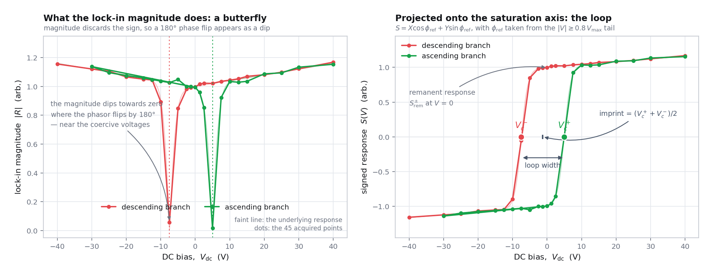

# Ferroelectric Switching in the Electro-Optic Domain

**What this page is for:** the Pockels response is odd in the spontaneous
polarisation, so sweeping a DC bias while measuring it produces a ferroelectric
hysteresis loop — measured optically, pixel by pixel. This page covers why we
pole before measuring anything, how the loop is constructed from a lock-in
phasor, every metric extracted from it, the classification taxonomy, and the
caveats that stop an electro-optic loop being mistaken for a P–E loop.

Assumes [01 — The Pockels Effect](01-electro-optics.md) and
[03 — The Null-Slope Sénarmont Readout](03-senarmont-readout.md).

---

## 1. BaTiO₃ is ferroelectric

Above its Curie temperature ($T_c \approx 120$ °C for bulk BaTiO₃) barium
titanate is cubic, point group $m\bar{3}m$ — **centrosymmetric**, and therefore
with no Pockels effect at all ([01 §2](01-electro-optics.md#2-why-inversion-symmetry-matters)).

Below $T_c$ the Ti⁴⁺ ion displaces off-centre within its oxygen octahedron and
the lattice distorts tetragonally, $c/a > 1$. Each unit cell acquires a
permanent electric dipole — a **spontaneous polarisation** $P_s$ along the $c$
axis — and the symmetry drops to tetragonal $4mm$: non-centrosymmetric, with
the large electro-optic tensor of
[01 §4](01-electro-optics.md#4-barium-titanate-point-group-4mm).

The ferroelectric distortion is therefore not incidental to the measurement.
**It is what makes the material Pockels-active at all**, which is why an
electro-optic measurement is a legitimate probe of the polar state.

Thin films are not bulk crystals: strain from the substrate, composition and
finite thickness all shift $T_c$, the tetragonality and the domain structure.
This is precisely why the chip carries a compositional gradient and why 100
pixels are mapped rather than one — see
[`../experiment/chip.md`](../experiment/chip.md).

---

## 2. Domains, and why they cancel

A ferroelectric does not adopt one uniform polarisation direction. It breaks
into **domains** — regions whose $P_s$ points along different symmetry-allowed
directions (in tetragonal BaTiO₃: $\pm a$, $\pm b$, $\pm c$) — because that
lowers the depolarisation and elastic energy.

The consequence that dominates this measurement:

> **The linear electro-optic response is odd in $P_s$.** A domain with $+P_s$
> and one with $-P_s$ give responses of equal magnitude and *opposite sign*.
> Within the optical spot they add coherently as phasors, so a multi-domain
> region **partially cancels**.

A film that is genuinely half up and half down measures close to zero, and you
would wrongly conclude the material is poor. The remedy is **poling**: hold a
DC bias large enough to align the domains, so the responses add instead of
cancelling. The software applies **+40 V** and keeps it on for the entire pixel
measurement, so the domain state does not drift between HWP angles.

The same oddness is what makes hysteresis visible at all (§4), and it is why
the *sign* of the lock-in phase is treated as data rather than as a nuisance
([03 §7](03-senarmont-readout.md#7-the-full-complex-model)).

---

## 3. Poling — and a free physics measurement

Poling is not instantaneous: domain walls have to nucleate and move, against a
pinning landscape of defects, strain fields and grain boundaries. So the
response *grows* during the poling dwell and then plateaus.

The software watches that happen. With the analyser parked at the null$+45^\circ$
slope point and a small AC dither applied, it samples the lock-in magnitude
every 10 s and stops when the response plateaus: a **60 s floor**, then
**3 consecutive intervals changing by less than 2 %**, with **at least 2 µV**
of signal, and a **180 s cap**. The fixed 180 s wait becomes an upper bound
instead of a cost paid at every pixel.

Those samples are not thrown away. They are written to `poling_kinetics.csv`
and fitted by `fit_poling_kinetics()` with a **stretched exponential**:

$$
M(t) \;=\; M_{\infty} \;-\; \left(M_{\infty} - M_{0}\right)
\exp\!\left[-\left(\frac{t}{\tau}\right)^{\beta}\right].
$$

*Figure 1 — poling kinetics at one pixel.* The points are the lock-in magnitude
sampled every 10 s during the DC poling dwell; the curve is the fitted
stretched exponential. The response rises from $M_0$ towards the asymptote
$M_\infty$ with time constant $\tau$. The **shape** is the interesting part: a
simple exponential ($\beta = 1$) would mean every switching event shares one
rate, whereas the flatter, longer-tailed approach drawn here is
$\beta < 1$ — a *distribution* of switching times. The adaptive controller
stops the dwell where the curve has visibly flattened, which is why the last
few points are nearly level.

| Parameter | Meaning | Why it is a compositional observable |
| --- | --- | --- |
| $\tau$ | poling (domain-alignment) time constant | how fast domains can be aligned at this composition |
| $\beta$ | stretching exponent | $\beta = 1$ is a single activation barrier; $\beta < 1$ means a **distribution** of switching times, i.e. disorder in the domain-wall pinning landscape. Smaller $\beta$ = broader disorder. |
| $M_\infty$, $M_0$ | asymptotic and initial response | how much of the response was recoverable by poling |

$\beta$ is genuinely informative: dispersive, creep-like kinetics are the
signature of a glassy pinning landscape, and it costs nothing to measure
because the data were being taken anyway to decide when to stop waiting.

---

## 4. The hysteresis measurement

Sweep the DC bias $+40 \to -40 \to +40$ V and measure the AC electro-optic
response at every step. Because the response is odd in $P_s$:

- at $+V_\mathrm{max}$ the domains are saturated one way and the phasor points
  in one direction;
- passing the negative coercive voltage $V_c^-$, the domains flip and the
  phasor **rotates by ~180°** while its magnitude passes through a minimum;
- at $-V_\mathrm{max}$ the domains are saturated the other way;
- coming back up they flip again at $V_c^+ \ne V_c^-$ — and *that difference is
  the hysteresis*.

The production sweep uses a 45-point centre-dense voltage grid (absolute levels
40, 30, 25, 20, 15, 12.5, 10, 7.5, 5, 2.5, 1.25 and 0 V) with a 30 s dwell per
point, about 39 s per point in wall-clock terms, roughly 29 minutes per loop.
At least two full cycles are run, because the first cycle after any history
(poling, storage) shows **wake-up** transients; the headline metrics come from
the **last** cycle and the first is retained so the cycle-to-cycle deltas can be
reported.

> **Why the AC probe is small and gated.** The hysteresis probe defaults to
> **4 Vpp**, not the 9 Vpp used for mapping, and the AC drive is switched
> **off** during every ramp and every poling dwell — enabled only inside the
> lock-in measurement window. The reason is that the AC drive is itself a
> field: a large continuous dither helps domains switch, smearing the coercive
> region and distorting the very loop you are trying to measure.

---

## 5. Butterfly versus signed loop

This is the single most common source of confusion in electro-optic hysteresis,
so it is worth being blunt about it.

| What you plot | What it looks like | Why |
| --- | --- | --- |
| $\lvert R\rvert$ vs $V_\mathrm{dc}$ (raw magnitude) | a **butterfly**: two wings with minima near $V_c^\pm$ | the magnitude discards the sign, so the 180° phase flip appears as a dip through zero |
| $S(V)$, the signed projection | the familiar **S-shaped ferroelectric loop** | the phasor is projected onto the saturation phase axis, recovering the sign |

*Figure 2 — the same sweep, unsigned and signed.* The upper panel is
$\lvert R\rvert(V_\mathrm{dc})$: two wings meeting at deep minima near the
coercive voltages, because at $V_c$ the two domain populations are equal and
their opposite-signed contributions cancel in the optical spot. How close those
minima come to zero is itself a measurement — complete cancellation means clean
180° switching, and a floor well above zero means some fraction never switches.
The lower panel is $S(V)$, the projection onto the saturation phase axis: the
same data, now with the sign restored, and immediately recognisable as a
ferroelectric loop. The horizontal offset of its two zero crossings from the
origin is the **imprint**; their separation is the **loop width**; the height at
$V = 0$ is the **remanence**. Both panels are needed — the butterfly minima
cross-check the coercive voltages that the signed loop's zero crossings define.

### The projection, exactly

Implemented in
[`pockels_hysteresis_analysis.py`](../../pockels/pockels_hysteresis_analysis.py):

$$
\phi_\mathrm{ref} = \text{phasor-weighted mean phase over the positive saturation tail } \left(\lvert V\rvert \ge 0.8\,V_\mathrm{max}\right),
$$

with the sign fixed so that $S(+V_\mathrm{max}) > 0$, and then

$$
S(V) = X\cos\phi_\mathrm{ref} + Y\sin\phi_\mathrm{ref}
\qquad\text{(the ferroelectric S-curve)},
$$
$$
Q(V) = -X\sin\phi_\mathrm{ref} + Y\cos\phi_\mathrm{ref}
\qquad\text{(the quadrature residual)} .
$$

"Phasor-weighted" is precise, not loose: the mean is taken over $X$ and $Y$
*first* and the phase from `atan2` of those means, so noisy small-magnitude
points cannot drag the reference axis around.

Where the chip sweep has already certified an electro-optic axis, that
calibrated phase is used instead and the saturation-derived value becomes a
cross-check; a disagreement larger than **15°** adds the
`calibration_phase_mismatch` modifier.

### The validity test

$Q$ is whatever did **not** lie on the saturation axis. For an ideal
single-mechanism response it should be noise. A growing $\lvert Q\rvert$ means
the projection is contaminated — pickup, thermal drift, a second mechanism with
a different temporal phase — so the validity metric is the **quadrature
fraction**

$$
\frac{\max\lvert Q\rvert}{\max\lvert S\rvert} ,
$$

and a loop exceeding **0.5** is classified `invalid_projection` and excluded.
This is the hysteresis-side analogue of the derivative-residual test in
[03 §8](03-senarmont-readout.md#8-the-derivative-aligned-rotation).

> **Old data are not stranded.** v1 CSVs that recorded only magnitude and phase
> are handled by reconstructing $X$ and $Y$, so every analysis on this page is
> retroactive.

---

## 6. The loop metrics

Computed per cycle by `loop_metrics_for_cycle()`, with headline values taken
from the last cycle. Points where the SMU compliance tripped, or where the
lock-in flagged invalid, are excluded everywhere. A branch with fewer than four
usable points is skipped.

<strong>Full metric table</strong> (click to expand)

| Metric | Definition | Physical reading |
| --- | --- | --- |
| `v_c_plus_V` / `v_c_minus_V` | interpolated zero crossing of $S$ on the ascending / descending branch (steepest crossing wins) | the two coercive voltages |
| `loop_width_V` | $V_c^{+} - V_c^{-}$ | hysteresis width |
| `imprint_V` | $(V_c^{+} + V_c^{-})/2$ | built-in / internal bias field — asymmetry about 0 V |
| `s_rem_pos_V` / `s_rem_neg_V` | $S$ interpolated at $V = 0$ on each branch | remanent electro-optic response |
| `s_sat_pos_V` / `s_sat_neg_V` | mean $S$ over each saturation tail | saturation response |
| `squareness_pos` / `squareness_neg` | $S_\mathrm{rem}/S_\mathrm{sat}$ per branch | loop squareness |
| `sat_asymmetry` | $\left(\lvert S_\mathrm{sat}^{+}\rvert - \lvert S_\mathrm{sat}^{-}\rvert\right)$ over their mean | electrode / interface asymmetry |
| `switchable_V` | $\left(S_\mathrm{sat}^{+} - S_\mathrm{sat}^{-}\right)/2$ | switchable response |
| `switchable_corrected_V` | the same after subtracting the fitted linear term | the pure hysteron amplitude |
| `frozen_V` | $\left(S_\mathrm{sat}^{+} + S_\mathrm{sat}^{-}\right)/2$ | non-switchable response plus residual common mode |
| `quad_eo_slope_V_per_V` | linear fit of $S$ within the saturation tails | field-induced (quadratic-electro-optic / electrostrictive) response |
| `quad_eo_ratio` | $\lvert\text{slope}\rvert\,V_\mathrm{max}$ over $\lvert$`switchable_corrected`$\rvert$ | paraelectric fraction / proximity to a phase boundary |
| `loop_area_V2` | $\left\lvert\oint S\,dV\right\rvert$ over the cycle | dissipation proxy |
| `loop_closure_V` | $\lvert S(\text{end}) - S(\text{start})\rvert$ at $+V_\mathrm{max}$ | repeatability and drift |
| `switching_slope_down` / `_up` | baseline-corrected $\lvert dS/dV\rvert$: peak position and height, FWHM, mean, $\sigma$, skewness | the **switching-field distribution** of each branch |
| `switching_sigma_V` | branch mean of $\sigma$ | disorder width of the coercive-field distribution |
| `switching_skewness` | branch mean of the skewness | asymmetry of that distribution |
| `nucleation_asymmetry` | difference of the two $dS/dV$ peak heights over their mean | branch-to-branch nucleation asymmetry |
| `butterfly_min_over_sat(_down/_up)` | $\min\lvert R\rvert$ over the branch, divided by its saturation-tail $\lvert R\rvert$ | **switching completeness**: $\approx 0$ is clean 180° cancellation, large means partial switching |
| `transition_width_25_75_V` | voltage span between the 25 % and 75 % crossings of $S$ | switching abruptness; for a tanh branch this equals $2\,\mathrm{atanh}(0.5)\,w \approx 1.10\,w$ |
| `phase_intermediate_fraction_down/_up` | fraction of points within the coercive window whose phase sits 45–135° off the reference axis | gradual multi-domain rotation versus an abrupt flip |
| `tanh_fit_down` / `_up` | $S = a + bV + S_s\tanh\!\left((V-V_c)/w\right)$ per branch, with errors and $R^2$ | model-based $V_c$ and width; the linear term $bV$ separates the reversible response from the hysteron amplitude $S_s$ |
| `leakage` | linear $I(V)$ fit over the saturation tails: conductance, $I$ at $\pm$saturation, $\max\lvert I\rvert$ | conduction through the film — defects, pinholes, damage |
| `quadrature_fraction` | $\max\lvert Q\rvert / \max\lvert S\rvert$ | projection validity (§5) |
| `p_dc` | mean and peak-to-peak DC transmission, plus the normalised fringe fraction against the certified null/bright references | electro-absorption and thermal cross-check; departure from the half-fringe raises `dc_quadrature_departure` |
| `cycle_to_cycle` | $\Delta$width and $\Delta$imprint between first and last cycle | wake-up |

Two of these deserve emphasis. **`switchable_corrected_V`** is the amplitude
after the reversible linear term has been removed, so it is the part that
genuinely switches rather than tail means inflated by a field-induced
contribution — it is the right quantity for cross-pixel comparison. And the
**switching-field distribution moments** are where the physics of disorder
lives: $\sigma$ is the width of the coercive-field distribution, and the
skewness says whether nucleation is biased towards low or high fields.

---

## 7. The loop-type taxonomy

`classify_loop()` is deterministic and threshold-documented; every threshold is
a module constant and is overridable per call. Classification runs on the last
cycle.

*Figure 3 — the classification gallery.* Each panel is a representative signed
loop $S(V)$ for one primary type, drawn on common axes so the shapes can be
compared directly. Reading left to right and top to bottom, the sequence runs
from the most ordered (a square loop with abrupt crossings and high remanence),
through progressively more slanted and rounded loops as the coercive-field
distribution broadens, to the qualitatively different cases: the constricted
**pinched** loop with its characteristic waist, the closed straight line of a
**linear** response, and the data-quality bins. The point of the gallery is that
these are *distinguishable by eye* as well as by threshold — if the classifier's
verdict does not match what you see, look at the loop before trusting the label.

| Primary type | Criterion (as implemented) | Material reading |
| --- | --- | --- |
| `ferroelectric_square` | zero crossings on both branches, width $\ge 2$ V, mean squareness $\ge 0.7$ | uniform, well-switching ferroelectric |
| `ferroelectric_slanted` | as above with squareness 0.3–0.7 | broad coercive-field distribution |
| `ferroelectric_rounded` | as above with squareness $< 0.3$ | strong disorder / graded switching |
| `pinched` | the opening profile $\Delta S(V) = S_\mathrm{down} - S_\mathrm{up}$ has $\ge 2$ humps with a dip below $0.5\times$ the smaller hump, and relative opening $\ge 0.15$ | defect pinning, internal-bias (defect-dipole) pairs, or antiferroelectric-like behaviour |
| `linear_no_hysteresis` | relative opening $< 0.15$, or width $< 2$ V | paraelectric-like, fully reversible response |
| `frozen_response` | response present but switchable $< 1$ µV | clamped or non-switchable |
| `partial_loop_unresolved` | hysteretic, but a coercive voltage lies outside $\pm V_\mathrm{max}$ | the sweep range is insufficient — widen it |
| `no_response` | $\max\lvert S\rvert < 1$ µV | dead pad, or no electro-optic response |
| `invalid_projection` | quadrature fraction $> 0.5$ | contaminated measurement — do not interpret |

Modifiers are applied on top of the primary type:

| Modifier | Trigger | Meaning |
| --- | --- | --- |
| `imprinted` | $\lvert\text{imprint}\rvert > \max(3\ \mathrm{V},\ 0.5\times\text{half-width})$ | built-in internal bias: asymmetric interfaces, trapped charge, a preferred domain state |
| `partially_frozen` | $\lvert\text{frozen}/\text{switchable}\rvert > 1$ | a large non-switchable fraction |
| `leaky` | conductance $> 10$ nS | conduction through the film |
| `drifting_loop` | closure over $\lvert\text{switchable}\rvert > 0.3$ | the loop does not close: drift or fatigue |
| `saturation_asymmetric` | $\lvert\text{sat asymmetry}\rvert > 0.3$ | asymmetric saturation between the two states |
| `calibration_phase_mismatch` | calibrated axis differs from the saturation-derived axis by $> 15^\circ$ | the certified phase reference may be stale |
| `dc_quadrature_departure` | $> 10\,\%$ of points outside the DC half-fringe tolerance, or a max error $> 0.15$ | the optical bias drifted during the sweep |

> Most of these labels are **real physics, not faults**. A pinched loop, an
> imprint or an incomplete butterfly minimum are results. The classifier exists
> so that they are recorded consistently across 100 pixels rather than judged by
> eye, one loop at a time.

---

## 8. Rate dependence — the caveat that bites people

Ferroelectric switching is **thermally activated and time-dependent**. Hold
each voltage for longer and more domains find time to switch, so the loop
narrows. Loop shape therefore depends on the per-step dwell, and the number you
extract is not a pure material constant.

> **Warning: keep one dwell and one voltage grid for a whole campaign.** Loops
> taken with different dwells are not comparable, and a "narrower loop" between
> two runs may be nothing but a longer wait. Anchor the campaign with
> quasi-static loops (30 s dwell) on a few reference pixels. If you want the
> rate dependence, measure it deliberately — dwell-dependence is a creep
> measurement in its own right, and an interesting one.

---

## 9. Coercive fields

Coercive **voltages** are what the instrument measures. Coercive **fields** are
what the literature quotes, and converting between them requires the same
electrode geometry as [01 §7](01-electro-optics.md#7-the-field-between-coplanar-electrodes):

$$
E_c \;=\; \frac{\alpha\, V_c}{g},
\qquad
1\ \mathrm{V/\mu m} = 10\ \mathrm{kV/cm}.
$$

`coercive_fields()` applies this to $V_c^{\pm}$, the loop width and the imprint,
reporting each in both V/µm and kV/cm. The measured gap and the FEM-derived
$\alpha$ must be supplied explicitly via `--gap-um` / `--alpha`; they are
**never guessed**, for exactly the reason given on
[01 §7](01-electro-optics.md#7-the-field-between-coplanar-electrodes) — $\alpha$
is a property of one electrode geometry, not of the material.

---

## 10. Domain reset (depoling)

To measure a **virgin** curve you must first erase the poling history, and
simply removing the bias does not do it — a poled ferroelectric stays poled.

`reset_domains_pulsed()` applies a bipolar pulse train whose envelope decays
exponentially from **40 V to 0.05 V over 30 amplitude steps, 200 cycles at
each** — about **12 000 field reversals** in roughly 30 s. The idea, following
the alternating-field erase used by Eltes *et al.*, is to walk the domain
configuration repeatedly through the coercive region with a steadily shrinking
amplitude, leaving it randomised rather than aligned.

Two implementation details matter physically:

- The voltage slew is limited to **50 V/ms** so that the capacitive current
  $i = C\,dV/dt$ stays well below the SMU's 1 mA compliance limit. A compliance
  trip mid-reset would leave the domain state in an unknown, partly poled
  condition — the opposite of the intent.
- The AC drive channel is switched **off** for the whole routine, so the probe
  field cannot interfere with the depoling pulses, and re-enabled afterwards.

The same routine doubles as a fatigue-cycling engine when you want to count
reversals deliberately.

---

## 11. An electro-optic loop is not a P–E loop

This caveat stands over everything on this page.

Both an electro-optic loop and a polarisation–electric-field (P–E) loop show
ferroelectric switching, but they **weight the sample differently**:

| | Electro-optic loop | P–E loop |
| --- | --- | --- |
| What is summed | the optical response of the material, weighted by **overlap with the optical mode** | the switched **charge**, integrated over the whole electroded area |
| Spatial sampling | the illuminated spot inside one electrode gap | the entire pad |
| Depth sampling | weighted by the optical field distribution | the full film thickness |

Consequently $V_c(\mathrm{EO})$ can legitimately differ from the electrical
coercive voltage, and the two need not agree even on a perfect sample. Report
these as **electro-optic loops**. Do not quote them as polarisation loops, and
do not convert between them.

What the electro-optic loop is *ideal* for is **cross-pixel comparison**: the
same optical and electronic chain, the same weighting, the same dwell, across a
compositional gradient. That is the measurement this instrument was built to
make.

---

## Continue

- [01 — The Pockels Effect](01-electro-optics.md): why the response is odd in
  $P_s$ in the first place.
- [04 — Angular Dependence](04-incident-polarisation.md): how the operating
  angle used for these loops is chosen.
- [`../experiment/instruments.md`](../experiment/instruments.md): the SMU4201
  (±40 V ceiling, 1 mA compliance, 5 V ramp chunks) that sources the bias.
- [`../guide/operating.md`](../guide/operating.md): running a hysteresis
  campaign, and the ~49 h budget for 100 pixels.
- [`../reference/data-schema.md`](../reference/data-schema.md): the
  `dc_hysteresis.csv` and `poling_kinetics.csv` schemas.

---

[← Angular dependence](04-incident-polarisation.md) &nbsp;·&nbsp; [Documentation home](../index.md) &nbsp;·&nbsp; [Repository](../../README.md) &nbsp;·&nbsp; [The experiment →](../experiment/index.md)

