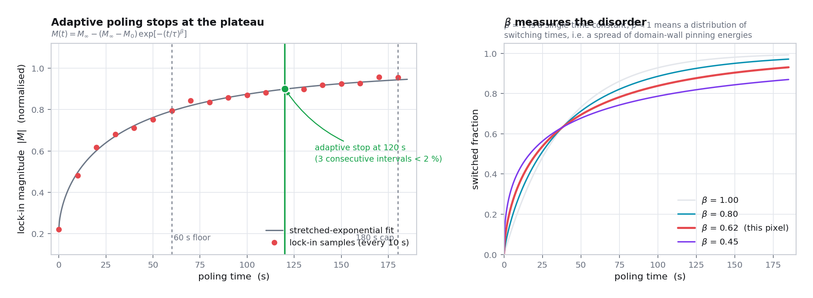
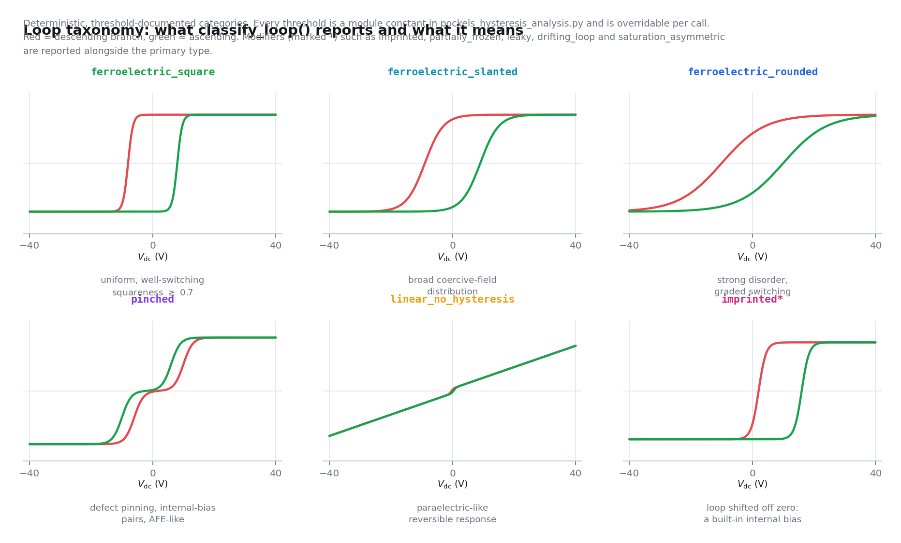
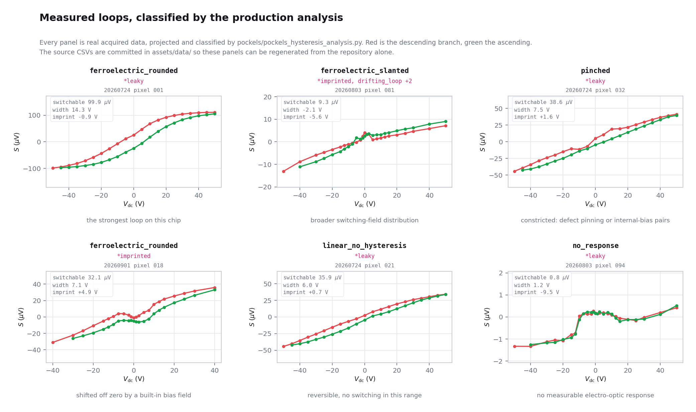

# Ferroelectric Switching in the Electro-Optic Domain

**What this page is for:** the Pockels response is odd in the spontaneous
polarisation, so sweeping a DC bias while measuring it produces a ferroelectric
hysteresis loop, measured optically, pixel by pixel. This page covers the
thermodynamics that makes the double well, why the measured coercive field is
orders of magnitude below the one that thermodynamics predicts, why we pole
before measuring anything, the switching kinetics behind the stretched
exponential, how the loop is constructed from a lock-in phasor, every metric
extracted from it, the classification taxonomy, and the caveats that stop an
electro-optic loop being mistaken for a polarisation loop.

Assumes [01: The Pockels Effect](01-electro-optics.md) and
[03: The Null-Slope Sénarmont Readout](03-senarmont-readout.md).

**Contents**

| § | Topic |
| --- | --- |
| [1](#1-barium-titanate-is-ferroelectric) | barium titanate is ferroelectric |
| [2](#2-domains-and-why-they-cancel) | domains, and why they cancel |
| [3](#3-landau-devonshire-the-double-well-and-the-intrinsic-coercive-field) | Landau-Devonshire and the double well |
| [4](#4-why-the-measured-coercive-field-is-far-below-the-intrinsic-one) | why the measured coercive field is so much smaller |
| [5](#5-poling-kinetics-kai-nls-and-the-stretched-exponential) | poling kinetics |
| [6](#6-the-hysteresis-measurement) | the hysteresis measurement |
| [7](#7-butterfly-versus-signed-loop) | butterfly versus signed loop |
| [8](#8-the-loop-metrics) | the loop metrics |
| [9](#9-rate-dependence-the-caveat-that-bites-people) | rate dependence |
| [10](#10-the-loop-type-taxonomy) | the loop-type taxonomy |
| [11](#11-domain-reset-depoling) | domain reset |
| [12](#12-an-electro-optic-loop-is-not-a-polarisation-loop) | not a polarisation loop |

---

## 1. Barium titanate is ferroelectric

Above its Curie temperature ($T_c \approx 120$ °C for bulk BaTiO₃) barium
titanate is cubic, point group $m\bar{3}m$, which is **centrosymmetric** and
therefore has no Pockels effect at all
([01 §2](01-electro-optics.md#2-why-inversion-symmetry-matters)).

Below $T_c$ the Ti⁴⁺ ion displaces off-centre within its oxygen octahedron and
the lattice distorts tetragonally, $c/a > 1$. Each unit cell acquires a
permanent electric dipole, a **spontaneous polarisation** $P_s$ along the $c$
axis, and the symmetry drops to tetragonal $4mm$: non-centrosymmetric, with
the large electro-optic tensor of
[01 §4](01-electro-optics.md#4-barium-titanate-point-group-4mm)
[[24]](../references.md#ref-24).

The ferroelectric distortion is therefore not incidental to the measurement.
**It is what makes the material Pockels-active at all**, and the connection is
quantitative rather than merely qualitative: in an oxygen-octahedra perovskite
the linear coefficients are the quadratic ones biased by the spontaneous
polarisation [[6]](../references.md#ref-6),

$$
r \;\simeq\; 2\,g\,\varepsilon_0\left(\varepsilon_r - 1\right) P_s \;\propto\; P_s ,
\tag{1}
$$

where $g$ is the quadratic (polarisation-optic) coefficient. Equation (1) is
the licence for everything on this page: **an electro-optic measurement is a
linear probe of $P_s$.**

Thin films are not bulk crystals: strain from the substrate, composition and
finite thickness all shift $T_c$, the tetragonality and the domain structure
[[25]](../references.md#ref-25). This is precisely why the chip carries a
compositional gradient and why 100 pixels are mapped rather than one: see
[`../experiment/chip.md`](../experiment/chip.md).

---

## 2. Domains, and why they cancel

A ferroelectric does not adopt one uniform polarisation direction. It breaks
into **domains**, regions whose $P_s$ points along different symmetry-allowed
directions (in tetragonal BaTiO₃: $\pm a$, $\pm b$, $\pm c$), because that
lowers the depolarisation and elastic energy [[26]](../references.md#ref-26).

The consequence that dominates this measurement follows directly from (1):

> **The linear electro-optic response is odd in $P_s$.** A domain with $+P_s$
> and one with $-P_s$ give responses of equal magnitude and *opposite sign*.
> Within the optical spot they add coherently as phasors, so a multi-domain
> region **partially cancels**.

A film that is genuinely half up and half down measures close to zero, and you
would wrongly conclude the material is poor. The remedy is **poling**: hold a
DC bias large enough to align the domains, so the responses add instead of
cancelling. The software applies **+40 V** and keeps it on for the entire pixel
measurement, so the domain state does not drift between HWP angles.

The same oddness is what makes hysteresis visible at all (§6), and it is why
the *sign* of the lock-in phase is treated as data rather than as a nuisance
([03 §10](03-senarmont-readout.md#10-the-full-complex-model)).

---

## 3. Landau-Devonshire: the double well and the intrinsic coercive field

The thermodynamics is worth writing down, because it produces a number that is
spectacularly wrong, and the reason it is wrong is the physics of §4.

### 3.1 The free energy

Devonshire's expansion of the free energy density of barium titanate in powers
of the polarisation [[16]](../references.md#ref-16), for a uniaxial
ferroelectric with order parameter $P$ along the polar axis and an applied
field $E$ along it, is

$$
\boxed{\;
F(P, E, T) \;=\; \tfrac{1}{2}a(T)\,P^2 \;+\; \tfrac{1}{4}b\,P^4 \;+\; \tfrac{1}{6}c\,P^6 \;-\; E\,P ,
\qquad a(T) = a_0\left(T - T_0\right),
\;}
\tag{2}
$$

with $a_0 > 0$. Symmetry forbids odd powers, because $F$ must be invariant
under $P \to -P$ at $E = 0$. The sign of $b$ decides the character of the
transition.

| $b$ | Transition | Behaviour |
| --- | --- | --- |
| $b > 0$ | second order | $P_s$ grows continuously from zero at $T_0$; the $c$ term is not needed |
| $b < 0$, $c > 0$ | **first order** | $P_s$ jumps discontinuously at a $T_c$ above $T_0$, with thermal hysteresis |

Barium titanate's cubic to tetragonal transition is first order
[[24]](../references.md#ref-24), which is why the transition shows thermal
hysteresis and why $T_c \neq T_0$.

### 3.2 The double well

Set $E = 0$ and, for clarity, take the second-order case $b>0$, $c=0$.
Minimising (2),

$$
\frac{\partial F}{\partial P} = aP + bP^3 = 0
\quad\Longrightarrow\quad
P_s^2 = -\frac{a}{b} = \frac{a_0\left(T_0-T\right)}{b}
\quad\text{for } T < T_0 ,
\tag{3}
$$

so $P_s \propto \left(T_0-T\right)^{1/2}$: two degenerate minima at $\pm P_s$,
separated by a maximum at $P=0$. The barrier height is

$$
\Delta F \;=\; F(0) - F(\pm P_s) \;=\; \frac{a^2}{4b} \;=\; \tfrac{1}{4}\lvert a\rvert P_s^2 .
\tag{4}
$$

Differentiating twice gives the inverse susceptibility
$\chi^{-1} = \partial^2 F/\partial P^2 = a + 3bP^2$. Above $T_0$ with $P=0$
this is the Curie-Weiss law, $\chi = 1/\left[a_0(T-T_0)\right]$; below $T_0$ at
$P = P_s$ it is $\chi^{-1} = -2a = 2\lvert a\rvert$, a relation used in §3.3.

### 3.3 The field-biased well, and the intrinsic coercive field

The $-EP$ term tilts the double well. One minimum deepens, the other shallows,
and at a critical field the shallow minimum disappears entirely: the state has
nowhere to sit and must switch. That critical field is the **intrinsic** or
thermodynamic coercive field, and it is found by requiring that the first and
second derivatives vanish together:

$$
aP + bP^3 = E
\qquad\text{and}\qquad
a + 3bP^2 = 0
\quad\Longrightarrow\quad
P^{*} = \frac{P_s}{\sqrt3} .
\tag{5}
$$

Substituting back,

$$
\boxed{\;
E_c^{\mathrm{int}} \;=\; \frac{2}{3\sqrt3}\,\lvert a\rvert\,P_s
\;=\; \frac{P_s}{3\sqrt3\,\chi} \;\approx\; 0.19\,\frac{P_s}{\varepsilon_0\varepsilon_r}.
\;}
\tag{6}
$$

Now put numbers in. Taking $P_s$ of order $0.25\ \mathrm{C\,m^{-2}}$ and
$\varepsilon_r$ of order $10^2$ along the polar axis
[[24]](../references.md#ref-24), (6) gives

$$
E_c^{\mathrm{int}} \;\sim\; 10^{7}\ \mathrm{V\,m^{-1}}
\;=\; \text{tens of volts per micrometre}.
$$

Across the instrument's $7\ \mathrm{\mu m}$ gap that would require hundreds of
volts. The SMU ceiling is $\pm 40$ V
([`../experiment/instruments.md`](../experiment/instruments.md)), and loops are
nevertheless observed. Something is badly wrong with (6) as a prediction, and
§4 says what.

---

## 4. Why the measured coercive field is far below the intrinsic one

### 4.1 The discrepancy

Measured coercive fields in barium titanate are of order
$10^5\ \mathrm{V\,m^{-1}}$, two to three orders of magnitude below (6). This
gap has been understood since Landauer pointed it out
[[18]](../references.md#ref-18), and the resolution is not a correction to (2)
but a rejection of the assumption hidden in it.

**Equation (6) assumes the entire sample reverses at once, uniformly.** That is
the only process the homogeneous free energy (2) knows about. Real switching
does not work that way.

### 4.2 Nucleation and growth

Switching proceeds in three stages [[17]](../references.md#ref-17),
[[26]](../references.md#ref-26):

| Stage | What happens | Why it is cheap |
| --- | --- | --- |
| **Nucleation** | a small reverse domain appears, preferentially at an electrode interface, a surface, a grain boundary or a defect | the nucleus is local, so only a small volume pays the barrier, and local field concentration and pre-existing defect dipoles lower it further |
| **Forward growth** | the nucleus grows through the thickness | fast, once nucleated |
| **Sideways motion** | domain walls sweep laterally through the film | the wall is thin, so the energy cost is an area term, not a volume term |

Because nucleation is *local* and *thermally activated*, it happens at fields
far below the homogeneous instability of (6). The measured coercive field is
therefore not a property of the lattice at all. It is a property of the defect
and interface landscape, and that is why it varies from pixel to pixel across a
compositional gradient, which is the whole point of mapping it.

Merz's empirical law for the sideways wall velocity
[[17]](../references.md#ref-17),

$$
v(E) \;=\; v_\infty\,\exp\!\left(-\frac{E_a}{E}\right),
\qquad
t_s(E) \;\propto\; \frac{1}{v} \;=\; t_0\,\exp\!\left(\frac{E_a}{E}\right),
\tag{7}
$$

with $E_a$ an activation field, is the quantitative form of "thermally
activated", and §9 turns it into the rate dependence of the measured loop.

> **The practical consequence.** A coercive voltage measured here is a
> *switching threshold at a stated dwell time*, not a thermodynamic constant.
> It is comparable across pixels of the same chip measured the same way, and it
> is not comparable against a single-crystal literature value.

### 4.3 From coercive voltages to coercive fields

Coercive **voltages** are what the instrument measures. Coercive **fields** are
what the literature quotes, and converting between them requires the same
electrode geometry as
[01 §8](01-electro-optics.md#8-the-field-between-coplanar-electrodes):

$$
E_c \;=\; \frac{\alpha\, V_c}{g},
\qquad
1\ \mathrm{V/\mu m} = 10\ \mathrm{kV/cm}.
\tag{8}
$$

`coercive_fields()` applies this to $V_c^{\pm}$, the loop width and the
imprint, reporting each in both V/µm and kV/cm. The measured gap and the
FEM-derived $\alpha$ must be supplied explicitly via `--gap-um` and `--alpha`;
they are **never guessed**, for exactly the reason given on
[01 §8](01-electro-optics.md#8-the-field-between-coplanar-electrodes), namely
that $\alpha$ is a property of one electrode geometry and not of the material.

---

## 5. Poling kinetics: KAI, NLS and the stretched exponential

### 5.1 Why poling takes time, and why that is a measurement

Poling is not instantaneous: domain walls have to nucleate and move, against a
pinning landscape of defects, strain fields and grain boundaries (§4). So the
response *grows* during the poling dwell and then plateaus.

The software watches that happen. With the analyser parked at the
null$+45^\circ$ slope point and a small AC dither applied, it samples the
lock-in magnitude every 10 s and stops when the response plateaus: a **60 s
floor**, then **3 consecutive intervals changing by less than 2 %**, with **at
least 2 µV** of signal, and a **180 s cap**. The fixed 180 s wait becomes an
upper bound instead of a cost paid at every pixel.

Those samples are not thrown away. They are written to `poling_kinetics.csv`
and fitted by `fit_poling_kinetics()` with a **stretched exponential**:

$$
\boxed{\;
M(t) \;=\; M_{\infty} \;-\; \left(M_{\infty} - M_{0}\right)
\exp\!\left[-\left(\frac{t}{\tau}\right)^{\beta}\right].
\;}
\tag{9}
$$

### 5.2 Where equation (9) comes from: the KAI model

Equation (9) is not an empirical convenience. It is the functional form of the
Kolmogorov, Avrami and Ishibashi description of switching
[[19]](../references.md#ref-19), [[20]](../references.md#ref-20).

The argument runs as follows. Suppose reverse domains nucleate and grow, and
let $V_\mathrm{ext}(t)$ be the **extended volume**, the volume they would
occupy if they could pass freely through one another. For nuclei that appear
at $t=0$ and grow at constant velocity in $d$ dimensions,
$V_\mathrm{ext} \propto t^{d}$. The probability that a given point has *not*
been reached is then Poissonian in the extended volume, so the unswitched
fraction is $\exp\left(-V_\mathrm{ext}\right)$ and the switched fraction is

$$
q(t) \;=\; 1 \;-\; \exp\!\left[-\left(\frac{t}{t_0}\right)^{d}\right].
\tag{10}
$$

Writing $M(t) = M_0 + \left(M_\infty - M_0\right)q(t)$ reproduces (9) exactly,
with $\beta$ in the role of $d$.

| Geometry | KAI exponent $d$ |
| --- | --- |
| Fixed number of nuclei, growth along one dimension | 1 |
| Fixed nuclei, two-dimensional growth | 2 |
| Fixed nuclei, three-dimensional growth | 3 |
| Continuous nucleation with $n$-dimensional growth | $n+1$ |

In the KAI picture $\beta$ is therefore an **effective dimensionality**, at
least one and typically between 1 and 3.

### 5.3 Why $\beta < 1$ means something different

Measured thin-film exponents are routinely fractional and often **below one**,
which the KAI table cannot produce. The interpretation then changes completely,
and the change is exact rather than a matter of taste.

For $0 < \beta \le 1$ the stretched exponential is **completely monotone**, so
by Bernstein's theorem it can be written as a positive superposition of simple
exponentials:

$$
\exp\!\left[-\left(\frac{t}{\tau}\right)^{\beta}\right]
\;=\; \int_0^\infty \rho_\beta(u)\, e^{-u\,t/\tau}\,\mathrm{d}u,
\qquad \rho_\beta(u) \ge 0 .
\tag{11}
$$

This is the Kohlrausch, Williams and Watts function
[[22]](../references.md#ref-22), the canonical signature of a **distribution of
relaxation times**. For $\beta = 1$ the distribution collapses to a delta
function at a single rate; as $\beta$ falls the distribution broadens. For
$\beta > 1$ no such representation exists, and the observation must be
explained by cooperative growth, that is, by a KAI dimensionality.

$$
\boxed{\;
\beta < 1 \;\Longleftrightarrow\; \text{a distribution of switching rates};
\qquad
\beta > 1 \;\Longrightarrow\; \text{cooperative growth, not a distribution}.
\;}
\tag{12}
$$

That is exactly the picture of **nucleation-limited switching**
[[21]](../references.md#ref-21): the film behaves as a mosaic of regions that
switch independently, each with its own local nucleation barrier set by its own
defects, and the measured curve is their superposition.

One further consequence is worth recording, because it is easy to misread the
fitted $\tau$. The **mean** switching time of the KWW function is not $\tau$:

$$
\left\langle t \right\rangle \;=\; \frac{\tau}{\beta}\,\Gamma\!\left(\frac{1}{\beta}\right),
\tag{13}
$$

with $\Gamma$ the gamma function.

| $\beta$ | $\left\langle t \right\rangle / \tau$ | Reading |
| --- | --- | --- |
| $1.0$ | $1.00$ | single rate |
| $0.7$ | $1.27$ | mild disorder |
| $0.5$ | $2.00$ | broad distribution |
| $0.3$ | $9.26$ | strongly dispersive, creep-like |

### 5.4 The figure and the parameter table

*Figure 1. Poling kinetics at one pixel.* The points are the lock-in magnitude
sampled every 10 s during the DC poling dwell; the curve is the fitted
stretched exponential of (9). The response rises from $M_0$ towards the
asymptote $M_\infty$ with time constant $\tau$. The **shape** is the
interesting part: a simple exponential ($\beta = 1$) would mean every switching
event shares one rate, whereas the flatter, longer-tailed approach drawn here
is $\beta < 1$, a *distribution* of switching times by (12). The adaptive
controller stops the dwell where the curve has visibly flattened, which is why
the last few points are nearly level.

| Parameter | Meaning | Why it is a compositional observable |
| --- | --- | --- |
| $\tau$ | poling (domain-alignment) time constant | how fast domains can be aligned at this composition; the mean time is (13), not $\tau$ |
| $\beta$ | stretching exponent | by (12), $\beta = 1$ is a single activation barrier and $\beta < 1$ a **distribution** of switching times, that is, disorder in the domain-wall pinning landscape. Smaller $\beta$ means broader disorder. |
| $M_\infty$, $M_0$ | asymptotic and initial response | how much of the response was recoverable by poling |

$\beta$ is genuinely informative: dispersive, creep-like kinetics are the
signature of a glassy pinning landscape [[21]](../references.md#ref-21),
[[26]](../references.md#ref-26), and it costs nothing to measure because the
data were being taken anyway to decide when to stop waiting.

---

## 6. The hysteresis measurement

Sweep the DC bias $+40$ V to $-40$ V and back, and measure the AC
electro-optic response at every step. Because the response is odd in $P_s$ by
(1):

- at $+V_\mathrm{max}$ the domains are saturated one way and the phasor points
  in one direction;
- passing the negative coercive voltage $V_c^-$, the domains flip and the
  phasor **rotates by about 180°** while its magnitude passes through a
  minimum;
- at $-V_\mathrm{max}$ the domains are saturated the other way;
- coming back up they flip again at $V_c^+ \ne V_c^-$, and *that difference is
  the hysteresis*.

The production sweep uses a 45-point centre-dense voltage grid (absolute levels
40, 30, 25, 20, 15, 12.5, 10, 7.5, 5, 2.5, 1.25 and 0 V) with a 30 s dwell per
point, about 39 s per point in wall-clock terms, roughly 29 minutes per loop.
The default is one cycle (`--hyst-cycles 1`, `DEFAULT_HYSTERESIS_CYCLES` in
the GUI module), and the 29 minutes, the 45 points and the 49 h budget for 100
pixels in the operating guide are all one-cycle figures. With `--hyst-cycles`
set to two or more, the headline metrics come from the **last** cycle and the
first is retained so the cycle-to-cycle deltas can be reported, because the
first cycle after any history (poling, storage) shows **wake-up** transients
[[25]](../references.md#ref-25).

> **Why the AC probe is small and gated.** The hysteresis probe defaults to
> **4 Vpp**, not the 9 Vpp used for mapping, and the AC drive is switched
> **off** during every ramp and every poling dwell, enabled only inside the
> lock-in measurement window. The reason is that the AC drive is itself a
> field: by (7) the switching time falls exponentially with field, so a large
> continuous dither helps domains switch, smearing the coercive region and
> narrowing the very loop you are trying to measure.

---

## 7. Butterfly versus signed loop

This is the single most common source of confusion in electro-optic hysteresis,
so it is worth being blunt about it.

| What you plot | What it looks like | Why |
| --- | --- | --- |
| $\lvert R\rvert$ vs $V_\mathrm{dc}$ (raw magnitude) | a **butterfly**: two wings with minima near $V_c^\pm$ | the magnitude discards the sign, so the 180° phase flip appears as a dip through zero |
| $S(V)$, the signed projection | the familiar **S-shaped ferroelectric loop** | the phasor is projected onto the saturation phase axis, recovering the sign |

It is the same rectification that turns a two-fold angular response into a
four-lobed polar plot
([04 §4](04-incident-polarisation.md#4-harmonic-2-for-the-signed-response-harmonic-4-for-its-magnitude)),
and the remedy is the same: keep the phasor.

*Figure 2. The same sweep, unsigned and signed. This is real acquired data, not
an illustration.* Both panels come from one pixel of a July 2026 run, and the
projection, the metrics and the classification printed beside them were produced
by running
[`pockels_hysteresis_analysis.py`](../../pockels/pockels_hysteresis_analysis.py)
over the committed CSV in
[`assets/data/`](../../assets/data/). The left panel is
$\lvert R\rvert(V_\mathrm{dc})$: two wings meeting at deep minima near the
coercive voltages, because at $V_c$ the two domain populations are equal and
their opposite-signed contributions cancel in the optical spot. How close those
minima come to zero is itself a measurement: complete cancellation means clean
180° switching, and a floor well above zero means some fraction never switches.
The right panel is $S(V)$, the projection onto the saturation phase axis: the
same data, now with the sign restored, and immediately recognisable as a
ferroelectric loop. The horizontal offset of its two zero crossings from the
origin is the **imprint**; their separation is the **loop width**; the height at
$V = 0$ is the **remanence**. Both panels are needed, because the butterfly
minima cross-check the coercive voltages that the signed loop's zero crossings
define.

> **Note.** This sweep was acquired on a $\pm50$ V trajectory, before the
> $\pm40$ V ceiling became the production limit. The trajectory is recorded in
> the file's own header, which is why the figure can state it.

### 7.1 The projection, exactly

Implemented in
[`pockels_hysteresis_analysis.py`](../../pockels/pockels_hysteresis_analysis.py):

$$
\phi_\mathrm{ref} = \text{phasor-weighted mean phase over the positive saturation tail } \left(\lvert V\rvert \ge 0.8\,V_\mathrm{max}\right),
\tag{14}
$$

with the sign fixed so that $S(+V_\mathrm{max}) > 0$, and then

$$
S(V) = X\cos\phi_\mathrm{ref} + Y\sin\phi_\mathrm{ref}
\qquad\text{(the ferroelectric S-curve)},
\tag{15}
$$
$$
Q(V) = -X\sin\phi_\mathrm{ref} + Y\cos\phi_\mathrm{ref}
\qquad\text{(the quadrature residual)} .
\tag{16}
$$

"Phasor-weighted" is precise, not loose: the mean is taken over $X$ and $Y$
*first* and the phase from `atan2` of those means, so noisy small-magnitude
points cannot drag the reference axis around.

Where the chip sweep has already certified an electro-optic axis, that
calibrated phase is used instead and the saturation-derived value becomes a
cross-check; a disagreement larger than **15°** adds the
`calibration_phase_mismatch` modifier.

### 7.2 The validity test

$Q$ is whatever did **not** lie on the saturation axis. For an ideal
single-mechanism response it should be noise. A growing $\lvert Q\rvert$ means
the projection is contaminated by pickup, thermal drift, or a second mechanism
with a different temporal phase, so the validity metric is the **quadrature
fraction**

$$
\frac{\max\lvert Q\rvert}{\max\lvert S\rvert} ,
\tag{17}
$$

and a loop exceeding **0.5** is classified `invalid_projection` and excluded.
This is the hysteresis-side analogue of the derivative-residual test in
[03 §11](03-senarmont-readout.md#11-the-derivative-aligned-rotation) and of the
temporal-rank test in
[03 §10.2](03-senarmont-readout.md#102-diagnostics-that-matter-more-than-r2).

> **Old data are not stranded.** v1 CSVs that recorded only magnitude and phase
> are handled by reconstructing $X$ and $Y$, so every analysis on this page is
> retroactive.

---

## 8. The loop metrics

Computed per cycle by `loop_metrics_for_cycle()`, with headline values taken
from the last cycle. Points where the SMU compliance tripped, or where the
lock-in flagged invalid, are excluded everywhere. A branch with fewer than four
usable points is skipped.

The derivative $dS/dV$ of a branch deserves a word before the table. In the
Preisach picture [[23]](../references.md#ref-23) a ferroelectric is an ensemble
of independent two-state elements, each with its own switching field, so a
branch of the loop is the **cumulative distribution** of switching fields and
its derivative is the **density**. That is why the moments of $dS/dV$ are
reported and why they mean something: the width is the spread of local
coercive fields across the illuminated volume, and the skewness says whether
nucleation is biased towards low or high fields.

<strong>Full metric table</strong> (click to expand)

| Metric | Definition | Physical reading |
| --- | --- | --- |
| `v_c_plus_V` / `v_c_minus_V` | interpolated zero crossing of $S$ on the ascending or descending branch (steepest crossing wins) | the two coercive voltages |
| `loop_width_V` | $V_c^{+} - V_c^{-}$ | hysteresis width |
| `imprint_V` | $(V_c^{+} + V_c^{-})/2$ | built-in or internal bias field: asymmetry about 0 V [[26]](../references.md#ref-26) |
| `s_rem_pos_V` / `s_rem_neg_V` | $S$ interpolated at $V = 0$ on each branch | remanent electro-optic response |
| `s_sat_pos_V` / `s_sat_neg_V` | mean $S$ over each saturation tail | saturation response |
| `squareness_pos` / `squareness_neg` | $S_\mathrm{rem}/S_\mathrm{sat}$ per branch | loop squareness |
| `sat_asymmetry` | $\left(\lvert S_\mathrm{sat}^{+}\rvert - \lvert S_\mathrm{sat}^{-}\rvert\right)$ over their mean | electrode or interface asymmetry |
| `switchable_V` | $\left(S_\mathrm{sat}^{+} - S_\mathrm{sat}^{-}\right)/2$ | switchable response |
| `switchable_corrected_V` | the same after subtracting the fitted linear term | the pure hysteron amplitude |
| `frozen_V` | $\left(S_\mathrm{sat}^{+} + S_\mathrm{sat}^{-}\right)/2$ | non-switchable response plus residual common mode |
| `quad_eo_slope_V_per_V` | linear fit of $S$ within the saturation tails | field-induced (quadratic-electro-optic or electrostrictive) response; see §12.2 |
| `quad_eo_ratio` | $\lvert\text{slope}\rvert\,V_\mathrm{max}$ over $\lvert$`switchable_corrected`$\rvert$ | by §12.2 this is $\approx \chi E_\mathrm{max}/P_s$, the fractional field-induced change of the polarisation: a paraelectric fraction, and a proximity measure for a phase boundary |
| `loop_area_V2` | $\left\lvert\oint S\,dV\right\rvert$ over the cycle | dissipation proxy |
| `loop_closure_V` | $\lvert S(\text{end}) - S(\text{start})\rvert$ at $+V_\mathrm{max}$ | repeatability and drift |
| `switching_slope_down` / `_up` | baseline-corrected $\lvert dS/dV\rvert$: peak position and height, FWHM, mean, $\sigma$, skewness | the **switching-field distribution** of each branch [[23]](../references.md#ref-23) |
| `switching_sigma_V` | branch mean of $\sigma$ | disorder width of the coercive-field distribution |
| `switching_skewness` | branch mean of the skewness | asymmetry of that distribution |
| `nucleation_asymmetry` | difference of the two $dS/dV$ peak heights over their mean | branch-to-branch nucleation asymmetry |
| `butterfly_min_over_sat(_down/_up)` | $\min\lvert R\rvert$ over the branch, divided by its saturation-tail $\lvert R\rvert$ | **switching completeness**: near zero is clean 180° cancellation, large means partial switching |
| `transition_width_25_75_V` | voltage span between the 25 % and 75 % crossings of $S$ | switching abruptness; for a tanh branch this equals $2\,\mathrm{atanh}(0.5)\,w \approx 1.10\,w$ |
| `phase_intermediate_fraction_down/_up` | fraction of points within the coercive window whose phase sits 45° to 135° off the reference axis | gradual multi-domain rotation versus an abrupt flip |
| `tanh_fit_down` / `_up` | $S = a + bV + S_s\tanh\!\left((V-V_c)/w\right)$ per branch, with errors and $R^2$ | model-based $V_c$ and width; the linear term $bV$ separates the reversible response from the hysteron amplitude $S_s$ |
| `leakage` | linear $I(V)$ fit over the saturation tails: conductance, $I$ at each saturation, $\max\lvert I\rvert$ | conduction through the film: defects, pinholes, damage |
| `quadrature_fraction` | $\max\lvert Q\rvert / \max\lvert S\rvert$ | projection validity (§7.2) |
| `p_dc` | mean and peak-to-peak DC transmission, plus the normalised fringe fraction against the certified null and bright references | electro-absorption and thermal cross-check; departure from the half-fringe raises `dc_quadrature_departure` |
| `cycle_to_cycle` | change in width and imprint between first and last cycle | wake-up [[25]](../references.md#ref-25) |

Two of these deserve emphasis. **`switchable_corrected_V`** is the amplitude
after the reversible linear term has been removed, so it is the part that
genuinely switches rather than tail means inflated by a field-induced
contribution; it is the right quantity for cross-pixel comparison. And the
**switching-field distribution moments** are where the physics of disorder
lives, for the Preisach reason given above.

---

## 9. Rate dependence, the caveat that bites people

Ferroelectric switching is **thermally activated and time-dependent** (§4).
Hold each voltage for longer and more domains find time to switch, so the loop
narrows. That is not a vague warning; (7) makes it quantitative. A branch
closes where the switching time equals the dwell time, $t_s(E_c) = t_\mathrm{dwell}$,
so

$$
\boxed{\;
E_c\!\left(t_\mathrm{dwell}\right) \;\approx\; \frac{E_a}{\ln\left(t_\mathrm{dwell}/t_0\right)} .
\;}
\tag{18}
$$

Two things follow. The dependence is **logarithmic**, so it is weak: doubling
the dwell changes $E_c$ by a few percent, not by a factor. But it is also
**unbounded and never saturates**, so there is no dwell long enough to reach a
"true" quasi-static loop, and no loop measured at finite speed is a
thermodynamic quantity.

> **Warning: keep one dwell and one voltage grid for a whole campaign.** Loops
> taken with different dwells are not comparable, and a "narrower loop" between
> two runs may be nothing but a longer wait. Anchor the campaign with
> quasi-static loops (30 s dwell) on a few reference pixels. If you want the
> rate dependence, measure it deliberately: by (18) a plot of $E_c$ against
> $1/\ln t_\mathrm{dwell}$ should be a straight line whose slope is the
> activation field $E_a$, and that is a creep measurement in its own right, and
> an interesting one [[25]](../references.md#ref-25).

---

## 10. The loop-type taxonomy

`classify_loop()` is deterministic and threshold-documented; every threshold is
a module constant and is overridable per call. Classification runs on the last
cycle.

*Figure 3. The classification gallery.* Each panel is a representative signed
loop $S(V)$ for one primary type, drawn on common axes so the shapes can be
compared directly. Reading left to right and top to bottom, the sequence runs
from the most ordered (a square loop with abrupt crossings and high remanence),
through progressively more slanted and rounded loops as the coercive-field
distribution of §8 broadens, to the qualitatively different cases: the
constricted **pinched** loop with its characteristic waist, the closed straight
line of a **linear** response, and the data-quality bins. The point of the
gallery is that these are *distinguishable by eye* as well as by threshold; if
the classifier's verdict does not match what you see, look at the loop before
trusting the label.

Figure 3 is drawn from the idealised shapes, so that each category is shown in
its pure form. Figure 4 is what the same categories look like on a real chip.

*Figure 4. Six measured loops, classified by the production analysis.* Every
panel is acquired data, projected and labelled by the same code path that runs
during a campaign, with the switchable amplitude, loop width and imprint taken
from its metrics file. Two things are worth noticing against Figure 3. First,
real loops are rounded rather than square: the coercive-field distribution on
this material is broad, so `ferroelectric_rounded` is the common verdict and
`ferroelectric_square` is rare. Second, the modifiers do most of the work in
practice. `leaky` appears on almost every pixel of these chips, and `imprinted`
picks out exactly the pixels whose zero crossings are displaced from the origin.
The `linear_no_hysteresis` panel is the useful cautionary case: its amplitude is
large, comparable to the switching pixels, and only the *relative opening*
criterion separates it from them. Amplitude alone would have misclassified it.

| Primary type | Criterion (as implemented) | Material reading |
| --- | --- | --- |
| `ferroelectric_square` | zero crossings on both branches, width $\ge 2$ V, mean squareness $\ge 0.7$ | uniform, well-switching ferroelectric |
| `ferroelectric_slanted` | as above with squareness 0.3 to 0.7 | broad coercive-field distribution |
| `ferroelectric_rounded` | as above with squareness $< 0.3$ | strong disorder or graded switching |
| `pinched` | the opening profile $\Delta S(V) = S_\mathrm{down} - S_\mathrm{up}$ has two or more humps with a dip below $0.5\times$ the smaller hump, and relative opening $\ge 0.15$ | defect pinning, internal-bias (defect-dipole) pairs, or antiferroelectric-like behaviour [[26]](../references.md#ref-26) |
| `linear_no_hysteresis` | relative opening $< 0.15$, or width $< 2$ V | paraelectric-like, fully reversible response |
| `frozen_response` | response present but switchable $< 1$ µV | clamped or non-switchable |
| `partial_loop_unresolved` | hysteretic, but a coercive voltage lies outside $\pm V_\mathrm{max}$ | the sweep range is insufficient, so widen it |
| `no_response` | $\max\lvert S\rvert < 1$ µV | dead pad, or no electro-optic response |
| `invalid_projection` | quadrature fraction $> 0.5$ | contaminated measurement, so do not interpret |

Modifiers are applied on top of the primary type:

| Modifier | Trigger | Meaning |
| --- | --- | --- |
| `imprinted` | $\lvert\text{imprint}\rvert > \max(3\ \mathrm{V},\ 0.5\times\text{half-width})$ | built-in internal bias: asymmetric interfaces, trapped charge, a preferred domain state |
| `partially_frozen` | $\lvert\text{frozen}/\text{switchable}\rvert > 1$ | a large non-switchable fraction |
| `leaky` | conductance $> 10$ nS | conduction through the film |
| `drifting_loop` | closure over $\lvert\text{switchable}\rvert > 0.3$ | the loop does not close: drift or fatigue |
| `saturation_asymmetric` | $\lvert\text{sat asymmetry}\rvert > 0.3$ | asymmetric saturation between the two states |
| `calibration_phase_mismatch` | calibrated axis differs from the saturation-derived axis by $> 15^\circ$ | the certified phase reference may be stale |
| `dc_quadrature_departure` | more than 10 % of points outside the DC half-fringe tolerance, or a max error $> 0.15$ | the optical bias drifted during the sweep |

> Most of these labels are **real physics, not faults**. A pinched loop, an
> imprint or an incomplete butterfly minimum are results
> [[25]](../references.md#ref-25). The classifier exists so that they are
> recorded consistently across 100 pixels rather than judged by eye, one loop
> at a time.

---

## 11. Domain reset (depoling)

To measure a **virgin** curve you must first erase the poling history, and
simply removing the bias does not do it: a poled ferroelectric stays poled,
because by §4 the reverse state is separated from the poled one by a
nucleation barrier, not by a vanishing energy difference.

`reset_domains_pulsed()` applies a bipolar pulse train whose envelope decays
exponentially from **40 V to 0.05 V over 30 amplitude steps, 200 cycles at
each**, about **12 000 field reversals** in roughly 30 s. The idea, following
the alternating-field erase used by Eltes and co-workers
[[28]](../references.md#ref-28), is to walk the domain configuration repeatedly
through the coercive region with a steadily shrinking amplitude, leaving it
randomised rather than aligned. It is the ferroelectric analogue of degaussing,
and it works for the same reason: each reversal randomises a slightly smaller
subset of the switching-field distribution of §8, and the ones with the
smallest thresholds are randomised last.

Two implementation details matter physically.

- The voltage slew is limited to **50 V/ms** so that the capacitive current
  $i = C\,dV/dt$ stays well below the SMU's 1 mA compliance limit. A compliance
  trip mid-reset would leave the domain state in an unknown, partly poled
  condition, which is the opposite of the intent.
- The AC drive channel is switched **off** for the whole routine, so the probe
  field cannot interfere with the depoling pulses, and re-enabled afterwards.

The same routine doubles as a fatigue-cycling engine when you want to count
reversals deliberately.

---

## 12. An electro-optic loop is not a polarisation loop

This caveat stands over everything on this page.

### 12.1 The two measurements weight the sample differently

Both an electro-optic loop and a polarisation against field loop show
ferroelectric switching, but they integrate different things. The electro-optic
signal is, from (1),

$$
S(V) \;\propto\; \int w(\mathbf{r})\; \Pi(\mathbf{r})\; P_s\!\left(\mathbf{r}; V\right)\,\mathrm{d}^3r ,
\tag{19}
$$

where $w(\mathbf{r})$ is the normalised optical intensity distribution and
$\Pi(\mathbf{r})$ is the local tensor projection factor of
[01 §5.3](01-electro-optics.md#53-which-components-can-be-seen-at-normal-incidence),
which depends on the local crystal orientation. The electrical measurement
instead integrates the switched charge over the whole electroded area,

$$
Q(V) \;=\; \int_{A} \Delta P\!\left(\mathbf{r}; V\right)\,\mathrm{d}A .
\tag{20}
$$

| | Electro-optic loop, eq. (19) | Polarisation loop, eq. (20) |
| --- | --- | --- |
| What is summed | local polarisation, weighted by **optical intensity** and by **tensor projection** | switched **charge**, unweighted |
| Spatial sampling | the illuminated spot inside one electrode gap | the entire pad |
| Depth sampling | weighted by the optical field distribution | the full film thickness |
| Orientation sensitivity | domains whose polar axis projects poorly contribute little, even though they switch | every switched dipole contributes its full charge |
| Sign | measured directly, from the phasor | inferred from the integrated current |
| Leakage current | does not contribute; measured separately | adds directly to the integrated charge and must be subtracted |

Consequently $V_c(\mathrm{EO})$ can legitimately differ from the electrical
coercive voltage, and the two need not agree even on a perfect sample. Report
these as **electro-optic loops**. Do not quote them as polarisation loops, and
do not convert between them.

### 12.2 What the saturation-tail slope is measuring

The tails of the loop are not flat, and (1) says why. In the saturated state
the polarisation is not fixed at $P_s$; the DC bias adds a field-induced part,

$$
P(V) \;=\; P_s \;+\; \chi\,E_\mathrm{dc}(V),
\qquad \chi = \varepsilon_0\left(\varepsilon_r - 1\right),
\tag{21}
$$

and since $r \propto P$ by (1), the measured response inherits a term linear in
the bias:

$$
S(V) \;=\; \underbrace{K\,\chi\,P_s}_{\text{switchable}} \;+\; \underbrace{K\,\chi^{2}\,E_\mathrm{dc}(V)}_{\text{field-induced}},
\qquad E_\mathrm{dc} = \frac{\alpha V}{g}.
\tag{22}
$$

So `quad_eo_slope_V_per_V` is the **quadratic electro-optic response evaluated
about the biased state**, and it scales as $\chi^2$, that is, as the square of
the dielectric susceptibility. Taking the ratio of the two terms in (22) at
$V = V_\mathrm{max}$ gives

$$
\texttt{quad\_eo\_ratio} \;\approx\; \frac{\chi\,E_\mathrm{max}}{P_s},
\tag{23}
$$

the fractional field-induced change of the polarisation at full bias. A large
value means either a large susceptibility or a small remanent polarisation,
both of which indicate proximity to a phase boundary or a substantially
paraelectric volume fraction. This is also why the software subtracts the
linear term before reporting `switchable_corrected_V`: without that
subtraction, a highly polarisable but weakly ferroelectric pixel would be
scored as a strong switcher.

### 12.3 What the electro-optic loop is ideal for

Cross-pixel comparison. The same optical and electronic chain, the same
weighting $w(\mathbf{r})$, the same dwell, the same grid, across a
compositional gradient, with the normalised rotation of
[03 §12](03-senarmont-readout.md#12-from-lock-in-volts-to-physics) as the
observable and none of the absolute inputs required. That is the measurement
this instrument was built to make.

---

## Further reading

| Topic | Start here |
| --- | --- |
| Ferroelectricity, the tetragonal distortion, domains | Lines and Glass [[24]](../references.md#ref-24) |
| The free-energy expansion of §3 | Devonshire [[16]](../references.md#ref-16) |
| Why the measured coercive field is so small | Landauer [[18]](../references.md#ref-18) |
| Domain-wall velocity and the empirical switching laws | Merz [[17]](../references.md#ref-17) |
| The extended-volume argument behind eq. (10) | Avrami and Kolmogorov [[19]](../references.md#ref-19) |
| The switching-kinetics model itself | Ishibashi and Takagi [[20]](../references.md#ref-20) |
| Nucleation-limited switching in thin films | Tagantsev and co-workers [[21]](../references.md#ref-21) |
| The stretched exponential and distributions of relaxation times | Williams and Watts [[22]](../references.md#ref-22) |
| Hysterons and switching-field distributions | Preisach [[23]](../references.md#ref-23) |
| Imprint, fatigue, wake-up and rate dependence | Damjanovic [[25]](../references.md#ref-25) |
| Domain-wall pinning, defect dipoles, pinched loops | Tagantsev, Cross and Fousek [[26]](../references.md#ref-26) |
| Why $r \propto P_s$ in a perovskite | DiDomenico and Wemple [[6]](../references.md#ref-6) |
| Alternating-field erase | Eltes and co-workers [[28]](../references.md#ref-28) |

Full bibliography: [`../references.md`](../references.md).

---

## Continue

- [01: The Pockels Effect](01-electro-optics.md): why the response is odd in
  $P_s$ in the first place.
- [04: Angular Dependence](04-incident-polarisation.md): how the operating
  angle used for these loops is chosen.
- [`../experiment/instruments.md`](../experiment/instruments.md): the SMU4201
  (±40 V ceiling, 1 mA compliance, 5 V ramp chunks) that sources the bias.
- [`../guide/operating.md`](../guide/operating.md): running a hysteresis
  campaign, and the budget of about 49 h for 100 pixels.
- [`../reference/data-schema.md`](../reference/data-schema.md): the
  `dc_hysteresis.csv` and `poling_kinetics.csv` schemas.

---

[← Angular dependence](04-incident-polarisation.md) &nbsp;·&nbsp; [Documentation home](../index.md) &nbsp;·&nbsp; [Repository](../../README.md) &nbsp;·&nbsp; [The material →](06-material.md)

