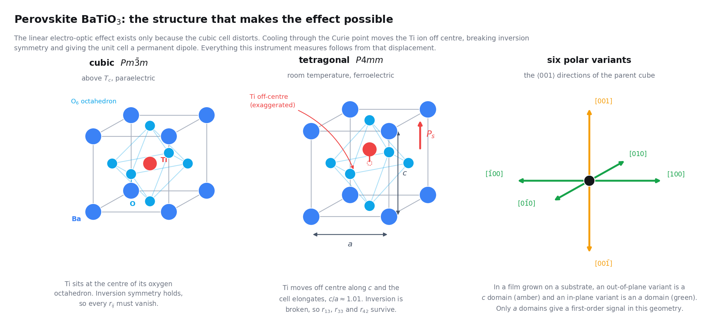
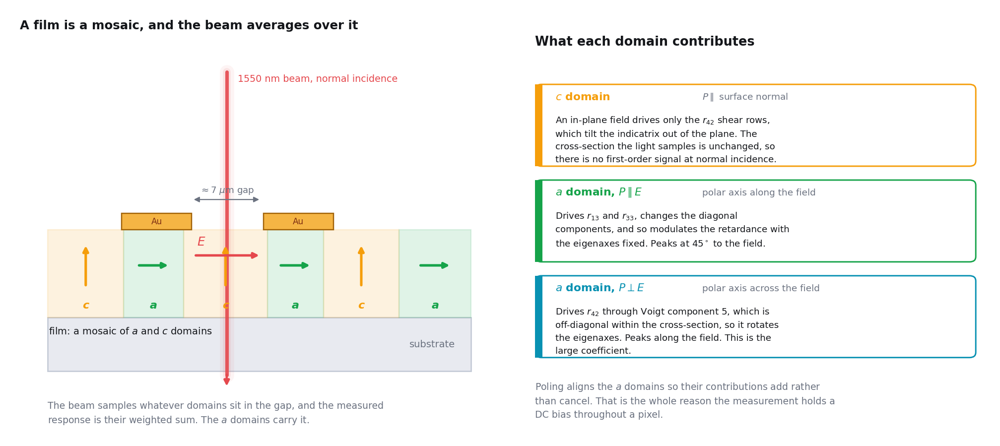
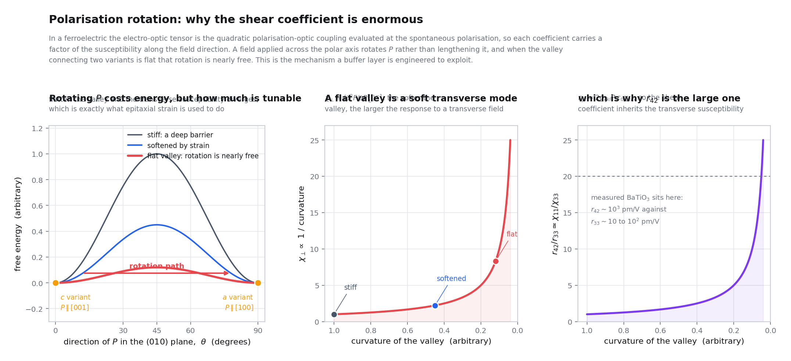
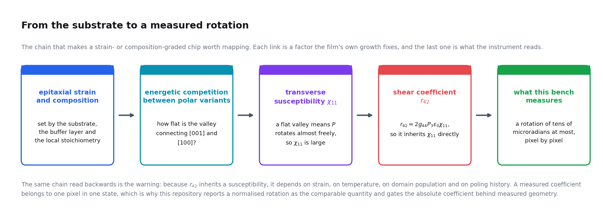
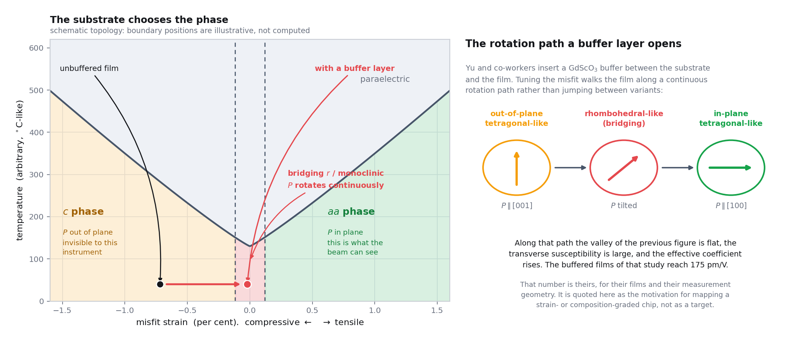

# The Material: perovskite BaTiO₃, strain, and polarisation rotation

**What this page is for:** every other page in this section takes the
electro-optic tensor of [01](01-electro-optics.md) as given; this page asks
what *sets* it. It derives why the shear coefficient $r_{42}$ is of order
$10^3$ pm/V while the axial coefficients are of order $10^2$ pm/V, and says
what a grower can change to make it larger. The answer, compressed, is that
$r_{42}$ is not really an optical quantity: it is *the ease with which the
polarisation vector can be rotated*, expressed in optical units, and epitaxial
strain is the knob that sets it. Assumes
[01: The Pockels Effect](01-electro-optics.md) for the $4mm$ tensor and for
which components are visible at normal incidence, and
[05: Ferroelectric Switching](05-ferroelectrics.md) for the Landau-Devonshire
free energy, domains and switching. It repeats neither.

> **A warning about one phrase.** Everywhere else in this documentation
> *polarisation rotation* means the optical quantity $\delta$, the rotation of
> the plane of polarisation of the light. On this page, and in the literature
> it draws on, it means the rotation of the **spontaneous electric polarisation
> vector** $\mathbf{P}_s$ of the crystal. The two are connected only through
> the tensor, and where a sentence could be read either way the object is
> named.

**Contents**

| § | Topic |
| --- | --- |
| [1](#1-why-a-page-about-the-material) | why a page about the material |
| [2](#2-the-perovskite-structure) | the perovskite structure |
| [3](#3-the-phase-sequence-is-a-rotation-staircase) | the phase sequence |
| [4](#4-domains-and-which-ones-this-instrument-can-see) | domains, and which ones we can see |
| [5](#5-where-the-electro-optic-coefficients-come-from) | where the coefficients come from |
| [6](#6-polarisation-rotation-and-why-the-shear-coefficient-is-large) | polarisation rotation |
| [7](#7-strain-and-what-a-buffer-layer-does) | strain and the buffer layer |
| [8](#8-what-this-means-for-the-measurement-on-this-bench) | what this means on this bench |

---

## 1. Why a page about the material

[01 §4](01-electro-optics.md#4-barium-titanate-point-group-4mm) asserts that
$r_{42} \sim 10^3$ pm/V while $r_{13}$ and $r_{33}$ are one to two orders of
magnitude smaller, and cites a measurement for it. That asymmetry is the reason
the chip uses coplanar electrodes, the reason a half-wave plate is swept, and
the reason barium titanate is worth the trouble. It deserves a derivation, and
§5 and §6 give one. Three statements come out of it. First, $r_{42}$ is large
because the **transverse** dielectric susceptibility is large, and that is
large because rotating $\mathbf{P}_s$ away from the polar axis costs almost
nothing. Second, because the mechanism is a near-degeneracy between competing
polar phases, the coefficient is **fragile**: it depends on temperature,
strain, composition and history, all of which vary across a chip. Third, a map
of the response across a gradient is therefore not a map of a material
constant. It reads how close each pixel sits to a phase boundary, and the
strongest pixels are the ones closest to one.

---

## 2. The perovskite structure

### 2.1 The cell and the octahedral network

Barium titanate is an ABO₃ perovskite: in the cubic phase, space group
$Pm\bar{3}m$, Ba²⁺ sits at the cube corners with twelve oxygen neighbours,
Ti⁴⁺ at the body centre inside an octahedron of six oxygens, and the oxygens at
the face centres. The useful way to see it is not as a cube with things inside
but as a **corner-shared network of TiO₆ octahedra**, with the large Ba²⁺ ions
filling the cavities it leaves. Every oxygen is shared between exactly two
octahedra, so the network is rigid against shear but has two soft degrees of
freedom: the octahedra can **tilt** as rigid units about the shared corners,
and the B cation can **displace** off the centre of its cage. Barium titanate
chooses the second. Its cubic lattice parameter is close to $4.00$ Å, which
makes the misfit arithmetic of §7 easy to do in your head.

*Figure 1. From the cubic cell to the six polar variants.* The left panel is
the cubic ABO₃ cell with the octahedron drawn around the titanium: positive and
negative charge centres coincide, so by
[01 §2](01-electro-optics.md#2-why-inversion-symmetry-matters) there is no
Pockels effect. The middle panel is the tetragonal distortion, the titanium
moved off centre along one cube edge by of order $0.1$ Å and the cell elongated
to $c/a \approx 1.01$, drawn exaggerated because at true scale it is a few
percent of a bond length. The right panel is the consequence: six cube-edge
directions to choose from, so six energetically identical **polar variants**.
This page is about the energy landscape connecting those six arrows.

### 2.2 The tolerance factor, and why barium titanate not calcium titanate

Goldschmidt's tolerance factor [[53]](../references.md#ref-53) asks whether the
A cation fits the cavity a given octahedral network leaves for it:

$$
t \;=\; \frac{r_\mathrm{A} + r_\mathrm{O}}{\sqrt{2}\,\left(r_\mathrm{B} + r_\mathrm{O}\right)} ,
\tag{1}
$$

with $r_\mathrm{A}$, $r_\mathrm{B}$, $r_\mathrm{O}$ the ionic radii. The
$\sqrt{2}$ is pure geometry: in the ideal cell the A to O distance is
$a/\sqrt2$ and the B to O distance $a/2$, so $t = 1$ exactly when one lattice
parameter satisfies both contacts.

| $t$ | What the network does | Example |
| --- | --- | --- |
| $t < 1$ | the A cation is too small, so the octahedra **tilt** to close the cavity; this antiferrodistortive tilting competes with the polar instability | CaTiO₃ |
| $t \approx 1$ | neither distortion is strongly favoured, and the material sits on a knife edge | SrTiO₃, an incipient ferroelectric |
| $t > 1$ | the A cation is too large, the network is stretched, and the B cation has **room to rattle**: off-centring wins | **BaTiO₃** |

With the standard twelve- and six-coordinate radii, barium titanate has
$t \approx 1.06$. That one number is why the Ti⁴⁺ displaces rather than the
octahedra tilting, and so why BaTiO₃ is a displacive ferroelectric while
CaTiO₃, chemically its near neighbour, is not.

### 2.3 Why the displacement happens at all

A rigid-ion picture does not give a ferroelectric. Two large energies compete
and very nearly cancel: the **long-range dipolar** energy, lowered by
off-centring because aligned dipoles attract along their axis, and the
**short-range repulsion** between the closed shells of the titanium and the
oxygens, raised by off-centring because the titanium is pushed towards three of
its six neighbours. In a purely ionic model the repulsion wins and the cubic
structure is stable. Cohen's first-principles result
[[54]](../references.md#ref-54) is that it does not win, because the Ti 3d and
O 2p states **hybridise**: the bonding is covalent, it is strengthened by the
off-centring, and it softens the repulsion enough to tip the cancellation the
other way. The chemistry literature calls this a **second-order (pseudo)
Jahn-Teller** effect, the empty $d^{0}$ manifold of the B cation mixing with
the filled O 2p states under a symmetry-lowering displacement. It is no
accident that essentially every displacive ferroelectric perovskite has a
$d^{0}$ B cation, Ti⁴⁺, Nb⁵⁺, Ta⁵⁺ or W⁶⁺: a partly filled $d$ shell removes
the empty states the mechanism needs.

> **The number to carry forward.** Because the polar distortion is the residue
> of a near-cancellation between two much larger energies, its energy scale is
> **tiny**: millielectronvolts per formula unit, against electronvolts for the
> bonding that holds the network together [[54]](../references.md#ref-54). A
> strain of a fraction of a percent, or a few tens of degrees, is therefore
> enough to reorder the polar states. Everything in §6 and §7 follows.

### 2.4 The tetragonal distortion, in numbers

| Quantity | Room-temperature bulk value | Comment |
| --- | --- | --- |
| $a$ | $\approx 3.99$ Å | in-plane cell edge |
| $c$ | $\approx 4.04$ Å | polar axis |
| $c/a$ | $\approx 1.01$ | the spontaneous strain: about 1 %, small but ferroelastically decisive (§4) |
| Ti off-centring | of order $0.1$ Å | relative to the oxygen cage |
| $P_s$ | $\approx 0.26\ \mathrm{C\,m^{-2}}$ | the value used in every estimate below |

These are bulk single-crystal values [[24]](../references.md#ref-24). A film is
not a bulk crystal: the substrate fixes the in-plane parameter, so $a$, $c/a$,
$P_s$ and the transition temperatures all shift, which is §7.

---

## 3. The phase sequence is a rotation staircase

On cooling, bulk barium titanate passes through three ferroelectric phases
[[24]](../references.md#ref-24):

| Phase | Bulk range | Point group | Polar axis | Variants |
| --- | --- | --- | --- | --- |
| cubic | above $\approx 120$ °C | $m\bar{3}m$ | none, paraelectric | 1 |
| **tetragonal** | $\approx 5$ to $\approx 120$ °C | $4mm$ | $\langle 001\rangle$, cube edge | 6 |
| orthorhombic | $\approx -90$ to $\approx 5$ °C | $mm2$ | $\langle 011\rangle$, face diagonal | 12 |
| rhombohedral | below $\approx -90$ °C | $3m$ | $\langle 111\rangle$, body diagonal | 8 |

Only the tetragonal phase is relevant to a room-temperature bench, and its
$4mm$ symmetry gives the tensor of
[01 §4](01-electro-optics.md#4-barium-titanate-point-group-4mm). But the
*sequence* is the important physics.

> **Read it as a staircase of rotations, not as three unrelated transitions.**
> The magnitude of $\mathbf{P}_s$ changes relatively little from one phase to
> the next. What changes is its **direction**: $[001]$, then $[011]$, then
> $[111]$, which are $45^\circ$ and then $35.3^\circ$ apart, $54.7^\circ$ in
> total. Barium titanate's own phase diagram is a sequence of steps of the
> polarisation vector around the unit sphere, which is why it is the archetypal
> polarisation-rotation material.

**The anisotropy energy is therefore small by construction:** if three
orientations of $\mathbf{P}_s$ can each be the ground state within a window of
about 200 °C, the differences between them are of order $k_\mathrm{B}$ times a
few hundred kelvin, which is millielectronvolts per formula unit. §6 turns that
into a susceptibility. **And room temperature is a coincidence worth knowing
about:** the tetragonal to orthorhombic transition sits near $5$ °C, so a bench
at $20$ °C is only about $15$ K above a transition at which the polarisation
*rotates*. The transverse permittivity $\varepsilon_{11}$ rises steeply on
approach to it, which is why room-temperature barium titanate has
$\varepsilon_{11}$ of a few thousand while $\varepsilon_{33}$ is of order
$10^2$, and §5 shows that this single ratio is what makes $r_{42}$ large. So
room-temperature BaTiO₃ has an enormous shear coefficient largely because room
temperature happens to sit just above a polarisation-rotation transition: not a
deep property of the compound but a property of where you stand on its phase
diagram, which is why a buffer layer can move it (§7). The corollary for this
bench is that the measurement should be temperature-sensitive for ordinary
laboratory swings, and strongly so near a boundary, which is why temperature
appears in the list at
[01 §9](01-electro-optics.md#9-why-the-answer-is-always-an-effective-coefficient).

**These are bulk values and films differ.** Epitaxial strain shifts transition
temperatures by hundreds of degrees in the extreme cases
[[59]](../references.md#ref-59), suppresses some phases and stabilises others
bulk BaTiO₃ never shows. Use the table to see what phases are available to be
competed for, not to predict a film's phase.

---

## 4. Domains, and which ones this instrument can see

[05 §2](05-ferroelectrics.md#2-domains-and-why-they-cancel) establishes why
domains matter: the response is odd in $P_s$, so oppositely polarised regions
cancel within the optical spot, and that is why we pole. This section supplies
the crystallography that argument assumes and connects it to the visibility
table of
[01 §5.3](01-electro-optics.md#53-which-components-can-be-seen-at-normal-incidence).

### 4.1 Two kinds of wall, and only one of them is elastic

| Wall | Angle between the two $\mathbf{P}_s$ | Spontaneous strain across it | Consequence |
| --- | --- | --- | --- |
| **180°** | exactly $180^\circ$ | none: both variants share the same $c$ axis | purely ferroelectric, elastically invisible, a few unit cells thick, highly mobile, and it **cancels the electro-optic response completely** |
| **90°** | $2\arctan(a/c) \approx 89.4^\circ$, not exactly $90^\circ$ | yes: the long axis of one variant meets the short axis of the other | **ferroelastic**: moving the wall changes the shape of the crystal, so it couples to stress, to the substrate and to the misfit strain |

The $89.4^\circ$ is not pedantry. The wall must be a coherent twin, so the two
lattices have to match across it, which they can only do on a $\{101\}$-type
plane with the polarisations splayed by exactly $2\arctan(a/c)$; with
$a/c \approx 1/1.011$ that is $89.37^\circ$. A twinned region therefore shows
up in diffraction as a small splitting rather than a clean right angle, and its
surface is tilted by roughly half a degree.

The ferroelastic character of the 90° wall is the hinge between the two halves
of this page. **A 180° wall does not care about strain; a 90° wall is made of
strain.** So the substrate, through the misfit, selects the 90° wall population
and therefore how much of the film has its polar axis in the plane: that is how
§7 controls what §4.2 can see. It also refines the poling argument, since a DC
bias that switches 180° walls is cheap and fast, whereas one that moves 90°
walls must change the shape of a clamped film and is slow and partially
irreversible. A pixel with an anomalously small stretching exponent $\beta$, or
one that does not return to its starting response after a depoling reset, is a
candidate for ferroelastic wall motion rather than simple 180° switching
[[25]](../references.md#ref-25), [[26]](../references.md#ref-26); the
instrument does not currently distinguish the two.

### 4.2 The visibility rule

In a $(001)$-oriented epitaxial film the six variants sort into **$c$ domains**
(polar axis along the surface normal, two variants) and **$a$ domains** (polar
axis in the film plane, four variants). Combining that with the
normal-incidence table of
[01 §5.3](01-electro-optics.md#53-which-components-can-be-seen-at-normal-incidence):

| Domain | In-plane field relative to its polar axis | Driven mechanism | Visible at normal incidence? |
| --- | --- | --- | --- |
| $c$ domain | necessarily perpendicular to $c$ | **rotation**: the field tilts $\mathbf{P}_s$ out of the normal, giving $\Delta B_5 = r_{42}E_1$ | **No.** That shear lies out of the section plane, so there is no first-order signal |
| $a$ domain | across its in-plane $c$ | **rotation**: $\Delta B_5 = r_{42}E_1$, with the field along $x_1$ and the light along $x_2$ as in [01 §5.2](01-electro-optics.md#52-the-eigenvalue-problem-for-the-induced-axes) | **Yes**, as an in-plane eigenaxis rotation $\rho$, or, where the static birefringence is small, as the induced retarder of [04 eq. (8a)](04-incident-polarisation.md#32-the-two-mechanisms-differentiated) |
| $a$ domain | along its in-plane $c$ | **extension**: $\Delta B_1 = r_{13}E$, $\Delta B_3 = r_{33}E$ | **Yes**, as a change in retardance through the $r_c$ combination |

The first row deserves to be stated sharply:

> **The coplanar electrode geometry is exactly the geometry that drives
> polarisation rotation in a $c$-axis film, and normal incidence is exactly the
> geometry that cannot see it.** The rotation of $\mathbf{P}_s$ genuinely
> happens; the resulting indicatrix shear simply points out of the plane the
> light samples. Everything measured on a $c$-dominated film therefore comes
> from the parts that are not $c$ domains: the $a$ fraction, tilted grains,
> strain gradients, the bridging monoclinic states of §7, and the spread of ray
> directions in a focused beam.

A pixel with a large normalised rotation therefore reports jointly that its
material response is large **and** that its texture lets that response project
onto this geometry. Separating the two is the identifiability problem of
[04 §6](04-incident-polarisation.md#6-why-an-angular-scan-alone-is-degenerate).

*Figure 2. $a$ and $c$ domains, the field, and what the light sees.* The panel
is a cross-section through a film on its substrate, with the coplanar
electrodes at the surface and the in-plane field lines running between them as
in [01 §8](01-electro-optics.md#8-the-field-between-coplanar-electrodes). The
$c$ domains carry their polarisation arrows along the normal and the $a$
domains carry theirs in the plane, separated by the inclined $\{101\}$ twin
walls of §4.1, which is why the boundaries are drawn near $45^\circ$ rather
than vertically. The beam enters along the normal, so the plane it samples is
the film plane, and the shading marks what that plane contains: the $a$ domains
contribute at first order, the $c$ domains nothing, however hard the field
tilts their polarisation.

---

## 5. Where the electro-optic coefficients come from

This is the quantitative core of the page. The claim to be established is that
the factor of twenty between the shear and axial coefficients of
[01 §4](01-electro-optics.md#4-barium-titanate-point-group-4mm) is essentially
the **transverse to longitudinal dielectric susceptibility ratio** of the
crystal, and nothing more exotic.

### 5.1 The primitive object is the quadratic coefficient

A ferroelectric does not have an independent linear electro-optic tensor. What
it has is a **polarisation-optic** coupling, quadratic in the polarisation and
so allowed in any symmetry because it is even under $\mathbf{P}\to-\mathbf{P}$
[[6]](../references.md#ref-6):

$$
\Delta B_{ij} \;=\; \sum_{k,l} g_{ijkl}\, P_k P_l ,
\tag{2}
$$

with $B_{ij}$ the impermeability tensor of
[01 §1](01-electro-optics.md#1-the-index-ellipsoid), $P_k$ the total
polarisation, and $g_{ijkl}$ the quadratic polarisation-optic tensor in units
of $\mathrm{m^4\,C^{-2}}$. It is symmetric in its first index pair because $B$
is, and in its second because $P_kP_l$ is.

Two properties of $g$ do the work, and both are the opposite of what one might
guess. **$g$ is not large and not anomalous:** its components are of order
$10^{-1}\ \mathrm{m^4\,C^{-2}}$ in essentially every perovskite oxide
[[6]](../references.md#ref-6), [[7]](../references.md#ref-7), being an
electronic, closed-shell polarisability quantity. And **$g$ is not strongly
anisotropic:** its shear and axial components differ by factors of order unity.
So $g$ cannot be the source of the asymmetry between $r_{42}$ and $r_{33}$, and
(2) says where it does come from.

### 5.2 Biasing the quadratic coupling with $\mathbf{P}_s$

Split the polarisation into a spontaneous and a field-induced part,
$\mathbf{P} = \mathbf{P}_s + \Delta\mathbf{P}$, and substitute into (2):

$$
\Delta B_{ij} \;=\;
\underbrace{\sum_{k,l} g_{ijkl}P_{s,k}P_{s,l}}_{\text{static: the birefringence } \Gamma_0}
\;+\; \underbrace{2\sum_{k,l} g_{ijkl}\,\Delta P_k\,P_{s,l}}_{\text{linear in the field}}
\;+\; \mathcal{O}\!\left(\Delta P^2\right).
\tag{3}
$$

The factor of 2 on the cross term is exact: $g_{ijkl} = g_{ijlk}$ makes the two
cross terms equal. The first term is not a nuisance either. It **is** the
static retardance $\Gamma_0$ that every pixel carries, that the Sénarmont
compensator nulls out, and that sets the relative weight of the two mechanisms
in
[04 §3.2](04-incident-polarisation.md#32-the-two-mechanisms-differentiated):
birefringence and electro-optic response are one coupling at two orders.

Now identify $\Delta P_k$. In the principal frame of the susceptibility a field
component $E_k$ induces

$$
\Delta P_k \;=\; \varepsilon_0\,\chi_{kk}\,E_k \qquad \text{(no sum on } k\text{)},
\tag{4}
$$

with $\chi_{kk}$ the low-frequency dielectric susceptibility along $k$, related
to the relative permittivity by $\chi_{kk} = \varepsilon_{kk} - 1 \approx
\varepsilon_{kk}$ whenever $\varepsilon_{kk} \gg 1$, which here is always.
Putting (4) into (3) and comparing with the definition
$\Delta B_{ij} = \sum_k r_{ijk}E_k$ of
[01 §2](01-electro-optics.md#2-why-inversion-symmetry-matters):

$$
\boxed{\;
r_{ijk} \;\simeq\; 2\,\varepsilon_0\,\chi_{kk}\sum_{l} g_{ijkl}\,P_{s,l}
\qquad \text{(no sum on } k\text{)} .
\;}
\tag{5}
$$

Equation (5) is the quantitative form of the claim made without proof on
[01 §2](01-electro-optics.md#2-why-inversion-symmetry-matters) and
[05 §1](05-ferroelectrics.md#1-barium-titanate-is-ferroelectric) that
$r \propto P_s$, and it says more than that: the linear coefficient is a
**product of three factors**.

| Factor | What it is | How much it varies between perovskites |
| --- | --- | --- |
| $g_{ijkl}$ | electronic polarisation-optic coupling | little: order $10^{-1}\ \mathrm{m^4\,C^{-2}}$ throughout |
| $P_{s,l}$ | spontaneous polarisation | a factor of a few |
| $\varepsilon_0\chi_{kk}$ | dielectric susceptibility **along the applied field** | **orders of magnitude**, and direction-dependent |

The last row is the story. $r_{ijk}$ inherits the anisotropy of the
**dielectric** response, so a crystal whose dielectric response is wildly
anisotropic has a wildly anisotropic electro-optic tensor.

### 5.3 The two coefficients, written out

Put the polar axis along $x_3$, so $\mathbf{P}_s = (0,0,P_s)$, and use the
tetragonal equivalence of $x_1$ and $x_2$ to write
$\chi_{11} = \chi_{22} \equiv \chi_\perp$ and $\chi_{33} \equiv \chi_\parallel$.

**The axial coefficient $r_{33}$** is $r_{333}$ in tensor indices: both the
ellipsoid deformation and the field lie along the polar axis. Only $l=3$
survives the sum in (5), so

$$
r_{33} \;\simeq\; 2\,\varepsilon_0\,g_{3333}\,\chi_\parallel\, P_s .
\tag{6}
$$

**The shear coefficient $r_{42}$** is $r_{232}$: Voigt index $m=4$ is the pair
$(ij) = (23)$ and the field index is $k = 2$, so the field is *perpendicular*
to the polar axis and the indicatrix is sheared in the plane containing it.
Again only $l=3$ survives,

$$
r_{42} \;\simeq\; 2\,\varepsilon_0\,g_{2323}\,\chi_\perp\, P_s .
\tag{7}
$$

> **Factors of two, again.** (6) and (7) are written in **tensor** components
> of $g$ deliberately. The Voigt name $g_{44}$ differs from $g_{2323}$ by a
> factor of 1 or 2 according to whether the Voigt polarisation product is
> defined as $P_2P_3$ or $2P_2P_3$, exactly the trap flagged for the
> elasto-optic tensor in
> [01 §3](01-electro-optics.md#3-voigt-contracted-notation). Tensor components
> make the ratio below unambiguous; any absolute number lifted from a table of
> $g_{mn}$ must have its convention checked first.

### 5.4 The ratio, and why it is the susceptibility ratio

Divide (7) by (6). Every common factor cancels, including $P_s$ and
$\varepsilon_0$:

$$
\boxed{\;
\frac{r_{42}}{r_{33}} \;\simeq\;
\underbrace{\frac{g_{2323}}{g_{3333}}}_{\text{order unity}}
\;\times\;
\underbrace{\frac{\chi_{11}}{\chi_{33}}}_{\text{order } 10 \text{ to } 10^2}
\;=\; \frac{g_{2323}}{g_{3333}}\,\cdot\,\frac{\chi_\perp}{\chi_\parallel}.
\;}
\tag{8}
$$

**The shear coefficient is large because the transverse susceptibility is
large.** That is the whole content of the asymmetry in
[01 §4](01-electro-optics.md#4-barium-titanate-point-group-4mm), and it is a
statement about the dielectric response of the crystal rather than about its
optics.

Put numbers in. With room-temperature bulk values, $\varepsilon_{11}$ of a few
thousand and $\varepsilon_{33}$ of order $10^2$ [[7]](../references.md#ref-7),
[[24]](../references.md#ref-24), the susceptibility ratio is of order 30; with
a $g$ ratio of order a half, (8) predicts $r_{42}/r_{33}$ of order 15 against a
measured ratio of order 20 [[7]](../references.md#ref-7). For an argument with
no free parameters that is as good as it needs to be. The absolute magnitudes
come out too, taking $g \sim 10^{-1}\ \mathrm{m^4\,C^{-2}}$ and
$P_s \approx 0.26\ \mathrm{C\,m^{-2}}$:

| | $\varepsilon_0\chi$ used | Estimate from (6) or (7) | Measured, single crystal |
| --- | --- | --- | --- |
| $r_{33}$, axial | $\approx 1.2\times10^{-9}\ \mathrm{F\,m^{-1}}$, that is $\varepsilon_{33}\approx 1.3\times10^{2}$ | $\approx 9\times10^{-11}$ m/V, so $\approx 90$ pm/V | order $10^2$ pm/V |
| $r_{42}$, shear | $\approx 3.5\times10^{-8}\ \mathrm{F\,m^{-1}}$, that is $\varepsilon_{11}\approx 4\times10^{3}$ | $\approx 9\times10^{-10}$ m/V, so $\approx 900$ pm/V | order $10^3$ pm/V |

Both land within a factor of two of the measured single-crystal values
[[7]](../references.md#ref-7), from nothing but a permittivity, a spontaneous
polarisation and a quadratic coefficient of the size every perovskite has.
**The order $10^3$ pm/V asserted in
[01 §4](01-electro-optics.md#4-barium-titanate-point-group-4mm) is therefore
derived, not quoted.** What remains to be explained is the input, not the
output: why is $\varepsilon_{11}$ thirty times $\varepsilon_{33}$?

---

## 6. Polarisation rotation, and why the shear coefficient is large

### 6.1 Rotating $\mathbf{P}$ costs less than stretching it

In a well-formed ferroelectric the free energy is stiff along the polar axis
and soft across it, and the two stiffnesses have different origins. **Along**
$\mathbf{P}_s$ the restoring force is the curvature of the Landau-Devonshire
double well at its minimum
([05 §3](05-ferroelectrics.md#3-landau-devonshire-the-double-well-and-the-intrinsic-coercive-field)),
the full ferroelectric energy scale: changing $|\mathbf{P}|$ means climbing
that well, and that is **polarisation extension**. **Across** $\mathbf{P}_s$
the restoring force is only the **anisotropy**, the small energy difference
between pointing along $[001]$ and pointing elsewhere, which §3 argued is
millielectronvolts per formula unit: changing the *direction* of $\mathbf{P}$
at fixed magnitude means walking round the bottom of the well, and that is
**polarisation rotation** [[55]](../references.md#ref-55).

*Figure 3. The free energy as a function of the direction of $\mathbf{P}$.* The
surface is drawn over the directions of the polarisation vector at fixed
magnitude, so position is orientation and height is energy. The deep wells are
the tetragonal variants on the cube-edge directions of Figure 1, but the figure
is really about the **valley** connecting them, through the face-diagonal and
body-diagonal directions where the orthorhombic and rhombohedral variants live.
The valley floor is far shallower than the wells are deep, because the two are
different energies: well depth is the ferroelectric condensation energy, valley
depth only the anisotropy. The marked rotation path is what a transverse field
does: it does not lift $\mathbf{P}$ out of the well, it walks it along the
valley floor, and the flatter the floor the further it walks.

### 6.2 The transverse susceptibility of a rotating polarisation

Let $\vartheta$ be the angle by which $\mathbf{P}_s$ has been tilted away from
the polar axis $x_3$ at fixed magnitude $P_s$, and expand the anisotropy energy
density about the well bottom:

$$
F_\mathrm{aniso}(\vartheta) \;=\; \tfrac{1}{2}\,\kappa\,\vartheta^{2} \;+\; \dots ,
\tag{9}
$$

where $\kappa$, in $\mathrm{J\,m^{-3}}$ per square radian, is the **rotational
stiffness**: the curvature of the valley floor of Figure 3, and the only
material parameter this argument needs. A transverse field $E_1$ couples to the
transverse component $P_1 = P_s\sin\vartheta \approx P_s\vartheta$, adding
$-E_1P_s\vartheta$ to the energy. Minimising,

$$
\frac{\partial}{\partial\vartheta}\left[\tfrac12\kappa\vartheta^2 - E_1P_s\vartheta\right] = 0
\qquad\Longrightarrow\qquad
\vartheta \;=\; \frac{P_s E_1}{\kappa},
\tag{10}
$$

so the induced transverse polarisation, and hence the transverse
susceptibility, are

$$
\Delta P_1 \;=\; P_s\vartheta \;=\; \frac{P_s^{2}}{\kappa}E_1
\qquad\Longrightarrow\qquad
\boxed{\;\varepsilon_0\chi_\perp \;=\; \frac{\partial P_1}{\partial E_1} \;=\; \frac{P_s^{2}}{\kappa} .\;}
\tag{11}
$$

Equation (11) is the heart of the mechanism: the transverse susceptibility is
the square of the spontaneous polarisation divided by the rotational stiffness,
so it **diverges as the valley flattens**. Nothing about the electrons changes;
what changes is that the crystal has stopped caring which way its polarisation
points.

### 6.3 Feeding it back into the coefficient

Substituting (11) into (7) eliminates the susceptibility entirely:

$$
\boxed{\;
r_{42} \;\simeq\; \frac{2\,g_{2323}\,P_s^{3}}{\kappa} .
\;}
\tag{12}
$$

The shear electro-optic coefficient is the cube of the spontaneous
polarisation, divided by the stiffness of the landscape against rotating it,
times an electronic coupling that barely varies between materials. Three things
follow.

| Consequence of (12) | Why |
| --- | --- |
| **$r_{42}$ has no upper bound set by the optics** | it is limited by $\kappa$, a thermodynamic quantity, and $\kappa$ can in principle be driven towards zero by tuning temperature, strain or composition to a degeneracy between polar phases |
| **$\kappa$ dominates the variation, despite the cube** | across any accessible composition range $P_s$ varies by tens of percent, while $\kappa$, a small difference between large energies, can vary by an order of magnitude. §8 turns this into a statement about the chip map |
| **A large $r_{42}$ and a large permittivity share one origin** | the soft rotation mode that makes the coefficient large also makes $\varepsilon_r$ large, which is the caveat attached to the $n^3r/\varepsilon_r$ figure of merit in [01 §4](01-electro-optics.md#4-barium-titanate-point-group-4mm) |

### 6.4 How flat is flat? The numbers

Run (11) backwards, using the measured room-temperature $\varepsilon_{11}$ to
extract the stiffness the crystal actually has. With
$\varepsilon_0\chi_\perp \approx 3.5\times10^{-8}\ \mathrm{F\,m^{-1}}$ and
$P_s \approx 0.26\ \mathrm{C\,m^{-2}}$,

$$
\kappa \;=\; \frac{P_s^2}{\varepsilon_0\chi_\perp}
\;\approx\; \frac{0.068}{3.5\times10^{-8}}
\;\approx\; 2\times10^{6}\ \mathrm{J\,m^{-3}} \text{ per } \mathrm{rad}^2 .
\tag{13}
$$

Read that as an anisotropy energy. The $[001]$ and $[111]$ directions are
$\vartheta_0 = 54.7^\circ = 0.955$ rad apart, so a harmonic reading of (9) puts
the barrier between them at
$\Delta F_\mathrm{aniso} \approx \tfrac{1}{2}\kappa\vartheta_0^{2} \approx
9\times10^{5}\ \mathrm{J\,m^{-3}}$, and with a unit cell volume near
$6.4\times10^{-29}\ \mathrm{m^3}$ that is

$$
\Delta F_\mathrm{aniso} \;\approx\; 6\times10^{-23}\ \mathrm{J}
\text{ per formula unit} \;\approx\; 0.4\ \mathrm{meV} .
\tag{14}
$$

The same arithmetic on the double well of
[05 §3](05-ferroelectrics.md#3-landau-devonshire-the-double-well-and-the-intrinsic-coercive-field),
using $\varepsilon_{33}$ instead, gives a condensation energy of roughly
$3$ meV per formula unit. So:

> **The energy that decides *whether* barium titanate is polar is about
> $3$ meV per formula unit; the energy that decides *which way* its
> polarisation points is about $0.4$ meV.** The landscape is within an order of
> magnitude of being rotationally degenerate at room temperature, with no
> engineering at all. The measured transverse permittivity of §5.4 and the
> first-principles picture of a perovskite energy surface
> [[54]](../references.md#ref-54) agree on that, from two directions.

The harmonic reading of (9) out to $54.7^\circ$ is crude, so (14) is an
order-of-magnitude statement and not a fitted constant. The conclusion survives
a factor of two or three, because the point is a ratio between energy scales
that differ by nearly an order of magnitude.

### 6.5 Rotation against extension, as a general split

The split runs through more than the electro-optic tensor
[[60]](../references.md#ref-60), and it is the same division that separates the
rows of the $4mm$ tensor in
[01 §5.1](01-electro-optics.md#51-the-indicatrix-in-a-purely-in-plane-field):

| | Extension | Rotation |
| --- | --- | --- |
| What the field does | changes $\lvert\mathbf{P}\rvert$ | changes the direction of $\mathbf{P}$ |
| Field relative to $\mathbf{P}_s$ | parallel | perpendicular |
| Restoring energy | the ferroelectric double well | the anisotropy only |
| Susceptibility | $\chi_\parallel$, small | $\chi_\perp = P_s^2/\varepsilon_0\kappa$, large |
| Electro-optic coefficients | $r_{13}$, $r_{33}$ | $r_{42}$ |
| Piezoelectric analogue | $d_{33}$ | $d_{15}$, several times larger in BaTiO₃ |
| How to enhance it | raise $P_s$ | flatten the valley: approach a phase boundary |

The rotation column is why the ultrahigh-response single-crystal
piezoelectrics work, and Fu and Cohen identified the mechanism for exactly that
case [[55]](../references.md#ref-55). The signature that settled it was the
discovery of **low-symmetry monoclinic phases** near morphotropic phase
boundaries [[56]](../references.md#ref-56): a monoclinic phase is precisely a
state in which the polarisation has stopped being locked to a high-symmetry
direction and has taken up residence along the valley floor, so finding one is
direct structural evidence that the valley is flat. Keep that in mind for §7,
where a monoclinic phase is the designed endpoint.

*Figure 4. The chain from the landscape to the coefficient.* The figure follows
§5 and §6 left to right: from the valley floor of Figure 3, parameterised by
its curvature $\kappa$; into the transverse susceptibility through (11), the
step where a flattening valley becomes a diverging permittivity; and into
$r_{42}$ through (7), a plain proportionality. The plotted ratio is (8),
$r_{42}/r_{33}$ against $\chi_{11}/\chi_{33}$, a straight line of slope
$g_{2323}/g_{3333}$ with the room-temperature bulk value of barium titanate
marked on it. It is drawn as a line rather than a point because a film is not
obliged to sit where bulk BaTiO₃ sits; §7 is about moving right along it.

---

## 7. Strain, and what a buffer layer does

§6 says the lever is $\kappa$. This section says how a grower pulls it.

### 7.1 A clamped film is at fixed strain, not fixed stress

A film bonded to a substrate thousands of times thicker cannot choose its own
in-plane lattice parameter, so the control variable is the **misfit strain**
$u_m = (a_s - a_0)/a_0$, with $a_s$ the in-plane parameter imposed by the
substrate or buffer and $a_0$ that of the free-standing film, so $u_m < 0$ is
compression. Because the film is held at fixed strain rather than fixed stress,
the bulk Landau potential of
[05 §3](05-ferroelectrics.md#3-landau-devonshire-the-double-well-and-the-intrinsic-coercive-field)
is the wrong thermodynamic potential; Pertsev, Zembilgotov and Tagantsev
[[57]](../references.md#ref-57) built the right one by a partial Legendre
transform making $u_m$ the independent variable. The output is a
**misfit-strain against temperature phase diagram**, the most useful map in
epitaxial ferroelectrics. For BaTiO₃ its structure is:

| Region | Polarisation | Where |
| --- | --- | --- |
| **$c$ phase** | out of plane only, $P_3 \ne 0$ | compressive misfit: a short in-plane cell favours the long axis standing up |
| **$r$ phase**, monoclinic | **both**: $P_3 \ne 0$ and an in-plane component | the bridging region between the other two |
| in-plane phase, $a$ or $aa$ | in plane only, $P_3 = 0$ | tensile misfit: a stretched in-plane cell favours the long axis lying down |

The bridging region is the important one, and it is Figure 3 realised as a
growth parameter: going from compressive to tensile misfit does not flip the
polarisation abruptly from out of plane to in plane, it **rotates** it
continuously through the monoclinic $r$ phase, where the polarisation is not
locked to a symmetry direction, so by §6 its $\kappa$ is smallest and its
$\chi_\perp$ largest.

> **Two honest caveats.** The position of these boundaries depends sensitively
> on the Landau coefficients used, and the BaTiO₃ diagram has been revised as
> better potentials became available [[58]](../references.md#ref-58), so treat
> it as a topology and not as a set of coordinates. And the single-domain
> diagram ignores polydomain states, which are usually what actually forms, and
> which relax misfit by twinning (§4.1) instead of by straining.

Strain is a strong lever because the numbers are large: the elastic energy of
one percent of biaxial strain in a perovskite is of order
$10^{6}\ \mathrm{J\,m^{-3}}$, which §6.4 showed is the *entire* anisotropy
energy scale. A strain a grower applies routinely is therefore comparable to
the energy difference between competing polar phases. Choi and co-workers
[[59]](../references.md#ref-59) showed the extreme version: about one percent
of biaxial compression on BaTiO₃ raises the Curie temperature by several
hundred degrees and substantially increases the remanent polarisation.

*Figure 5. The misfit-strain phase diagram, and the buffer layer as a
horizontal move.* The axes are misfit strain and temperature, following
[[57]](../references.md#ref-57). The upper region is paraelectric; below it the
diagram divides into the out-of-plane polar $c$ region on the compressive side,
the in-plane polar region on the tensile side, and the monoclinic $r$ region
bridging them, where the polarisation carries both components and is free to
rotate. The markers on the room-temperature line are the point: a film grown
directly on a small-parameter substrate sits deep in the $c$ region, and a
buffer layer with a larger in-plane parameter moves it right, into the bridging
region. The chemistry has not changed; which phases compete has, and by (12)
that is what sets $r_{42}$.

### 7.2 The buffer layer, and the cited result

Yu and co-workers [[61]](../references.md#ref-61) make that traverse
deliberately. They grow BaTiO₃ epitaxial films on LSAT and insert a **GdScO₃
buffer layer** between substrate and film. The buffer has the larger pseudocubic
in-plane parameter, so it moves the film right on Figure 5, and because the
degree of relaxation depends on the buffer as well as on the film, it tunes the
**phase constitution** rather than simply imposing one homogeneous strain. What
they report is the traverse itself: a continuous **polarisation rotation path**
running from an out-of-plane tetragonal-like phase, through an intermediate
rhombohedral-like phase, to an in-plane tetragonal-like phase. That is the
rotation of §6 driven by growth rather than by an applied field, along the same
path drawn on Figure 3. The buffered films reach an **effective electro-optic
coefficient of 175 pm/V**, against the unbuffered films.

> **Read that number carefully.** 175 pm/V is *their* effective coefficient,
> for *their* films, in *their* measurement geometry. It is not a tensor
> element of BaTiO₃, it is not a number this instrument has measured, and by
> [01 §9](01-electro-optics.md#9-why-the-answer-is-always-an-effective-coefficient)
> it is not directly comparable with any $r_\mathrm{eff}$ reported here. What
> transfers is the **mechanism** and the **direction of the effect**: move a
> film along the rotation path and the electro-optic response rises.

They then go further, and this is the part that matters most to a chip built
around a gradient. Using a thermodynamic theory of the optical properties they
*design* a large low-temperature response by engineering the energetic
competition between ferroelectric phases, arriving at a low-symmetry
**monoclinic** phase with a very large electro-optic response. Read through §6,
that is not a search for a good phase but a search for a good **degeneracy**:
by (12) it is the flatness of the valley, not the identity of the phase, that
sets the coefficient, and by [[56]](../references.md#ref-56) a stable monoclinic
phase is the structural signature of a flat valley.

---

## 8. What this means for the measurement on this bench

### 8.1 Why the response varies so much across one chip

From (12), $r_{42} \simeq 2g_{2323}P_s^3/\kappa$. Across a compositional or
strain gradient $g_{2323}$ barely moves, $P_s$ moves by tens of percent (a
factor of two or so once cubed), and $\kappa$ can move by an order of magnitude
or more, being a small *difference* between large energies. The pixel-to-pixel
spread in the normalised rotation should therefore be dominated by the
rotational stiffness, and a factor of ten across a chip is a physical result
rather than a measurement artefact. The map is **not** a linear readout of
composition: it reads proximity to a phase boundary, a sharply peaked function
of composition. A pixel with an anomalously large response is one whose valley
is flat, which is to say a pixel near a boundary, so the map is a
**phase-boundary finder**, a more useful object than a table of coefficients.
It also predicts that the same pixels will be the most temperature-sensitive
(§3), the most history-sensitive (§4.1) and the most likely to show large
field-induced non-switching contributions
([05 §12.2](05-ferroelectrics.md#122-what-the-saturation-tail-slope-is-measuring)).
Two entries in the list at
[01 §9](01-electro-optics.md#9-why-the-answer-is-always-an-effective-coefficient)
now have mechanisms rather than labels attached: *texture* is the $a$ to $c$
domain fraction of §4.2, set by the substrate during growth, and *poling
history* is the 90° wall population of §4.1, which does not necessarily return
to where it started. Neither is a property of the compound, so neither
transfers between chips.

### 8.2 Telling a rotation-dominated pixel from an extension-dominated one

This is the measurement that would make the material argument testable on this
bench, and the honest answer is that **the instrument cannot currently do it**.
The obstruction is the counting argument of
[04 §6](04-incident-polarisation.md#6-why-an-angular-scan-alone-is-degenerate):
an incident-polarisation scan returns two geometrically meaningful numbers
against five parameters, and although the axial amplitude $a$ and the shear
amplitude $s$ sit exactly in quadrature
([04 §3.2](04-incident-polarisation.md#32-the-two-mechanisms-differentiated)),
they trade off against $\theta_f$ and $\Gamma_0$ inside the three-parameter
degeneracy. A large fitted amplitude is not evidence for rotation, and
**sweeping the half-wave plate more finely does not help**, because more angles
only measure the same two numbers better. What would close it, in increasing
order of cost:

| Step | What it does | Cost |
| --- | --- | --- |
| **Invert the null pair for $(\Gamma_0, \theta_f)$** | the quarter-wave plate and analyser null angles are already recorded per pixel and per HWP angle, and they fix the output state and hence the static retarder, as set out in [04 §6.2](04-incident-polarisation.md#62-what-would-close-it). Removes two of the three excess parameters | analysis only, on data already on disk |
| **Correlate against `quad_eo_ratio`** | by [05 §12.2](05-ferroelectrics.md#122-what-the-saturation-tail-slope-is-measuring) the saturation-tail slope estimates $\chi E_\mathrm{max}/P_s$, and for an in-plane field on an out-of-plane polar axis that $\chi$ **is** the transverse susceptibility of §6. A correlation between the mapped response and `quad_eo_ratio` would be evidence that $1/\kappa$ drives both, the central claim of §6.3. Untested here | a scatter plot |
| **A second electrode orientation** | field along an in-plane polar axis drives extension, across it drives rotation (§4.2), so two orientations on one pixel separate the mechanisms by construction rather than by fitting, and supply $\theta_E$ | a mask change |
| **Temperature** | $\chi_\perp$ peaks at a rotation transition and $\chi_\parallel$ does not, so a scan through the tetragonal to orthorhombic region separates them by temperature dependence alone | a new instrument: the bench has no temperature control |
| **Structure** | none of the above fixes the crystal axes, and whether a monoclinic phase is present is a structural question optics cannot settle [[26]](../references.md#ref-26), [[61]](../references.md#ref-61) | diffraction, off this bench |

The conclusion matches
[04 §6](04-incident-polarisation.md#6-why-an-angular-scan-alone-is-degenerate)
by a different route, and is worth restating in material language: this
instrument measures very well *how strongly, and along which direction*, each
pixel responds. Saying *why* a pixel responds strongly is a statement about
$\kappa$, and $\kappa$ is not in the data yet.

---

## Further reading

| Topic | Start here |
| --- | --- |
| The tolerance factor and perovskite structural chemistry | Goldschmidt [[53]](../references.md#ref-53) |
| Why the polar distortion happens, and the flat energy surface | Cohen [[54]](../references.md#ref-54) |
| Phase sequence, tetragonality, domains, bulk properties | Lines and Glass [[24]](../references.md#ref-24) |
| The polarisation rotation mechanism itself | Fu and Cohen [[55]](../references.md#ref-55) |
| Monoclinic phases as the structural signature of a flat valley | Noheda and co-workers [[56]](../references.md#ref-56) |
| Rotation against extension as a general organising split | Damjanovic [[60]](../references.md#ref-60) |
| The quadratic coupling biased by $P_s$, equation (5) | DiDomenico and Wemple [[6]](../references.md#ref-6) |
| Measured BaTiO₃ dielectric and electro-optic tensors | Zgonik and co-workers [[7]](../references.md#ref-7) |
| Misfit-strain phase diagrams of epitaxial films | Pertsev, Zembilgotov and Tagantsev [[57]](../references.md#ref-57) |
| The revised BaTiO₃ temperature-strain diagram | Li and Chen [[58]](../references.md#ref-58) |
| What one percent of strain does to a real BaTiO₃ film | Choi and co-workers [[59]](../references.md#ref-59) |
| Buffer-layer-controlled rotation paths, and 175 pm/V | Yu and co-workers [[61]](../references.md#ref-61) |
| Ferroelastic walls, twinning and domain engineering | Tagantsev, Cross and Fousek [[26]](../references.md#ref-26) |

Full bibliography: [`../references.md`](../references.md).

---

## Continue

- [01: The Pockels Effect](01-electro-optics.md): the $4mm$ tensor whose
  asymmetry this page derives, and the visibility table §4.2 uses.
- [04: Angular Dependence](04-incident-polarisation.md): the counting argument
  for why an angular scan alone cannot separate rotation from extension.
- [05: Ferroelectric Switching](05-ferroelectrics.md): the double well, the
  domains and the switching kinetics this page supplies the crystallography
  for.
- [`../experiment/chip.md`](../experiment/chip.md): the compositional gradient
  and the electrode geometry §8 is about.
- [`../reference/glossary.md`](../reference/glossary.md): every symbol used
  here, with its units.

---

[← Ferroelectric switching](05-ferroelectrics.md) &nbsp;·&nbsp; [Documentation home](../index.md) &nbsp;·&nbsp; [Repository](../../README.md) &nbsp;·&nbsp; [Theory of the instrument →](07-instrument-theory.md)

